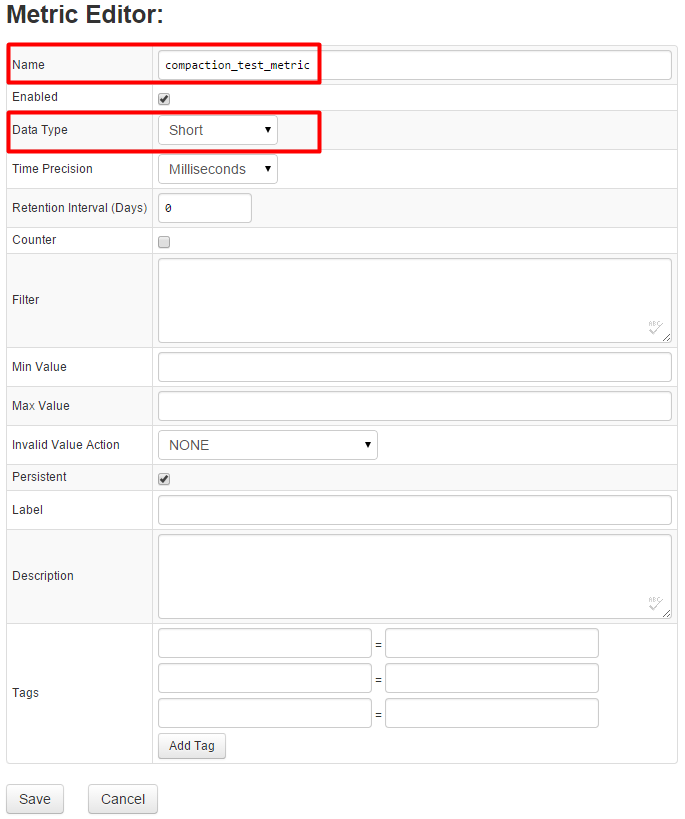

# Compaction Test


The purpose of this guide is to compute ATSD storage efficiency for a
custom dataset in order to identify optimal compression and data
encoding settings and produce sizing estimates. Please note that
compression and encoding options are supported only in the ATSD Standard and
Enterprise Edition.

> Note: it is recommended that this test be performed on a test ATSD
instance, not a production instance.

Open the Metrics page found on the main menu. Click the CREATE button on the
bottom of the page to create new `metrics` that you are planning to load
into ATSD with the correct data type (short, integer, long, float, double or decimal, 
depending on the type of data you would like to store).

> Note: the default data type is float. This step is not necessary if
you will be writing data with the float data type.



Stop ATSD:

```sh
 /opt/atsd/bin/atsd-tsd.sh stop                                           
```

Data in ATSD is stored in the `atsd_d` table.

Setup the ATSD compression. The command depends on installed version of
ATSD:

ATSD Community Edition:

```sh
 /opt/atsd/hbase/bin/hbase shell                                          
     disable 'atsd_d'                                                     
     alter 'atsd_d', {NAME => 'r', DATA_BLOCK_ENCODING => 'PREFIX'}       
     enable 'atsd_d'                                                      
     describe 'atsd_d'                                                    
 exit                                                                     
```

ATSD Standard/Enterprise Edition:

```sh
 /opt/atsd/hbase/bin/hbase shell                                          
     disable 'atsd_d'                                                     
     alter 'atsd_d', {NAME => 'r', COMPRESSION => 'GZ'}                   
     enable 'atsd_d'                                                      
     describe 'atsd_d'                                                    
 exit                                                                     
```

Record the initial table size:

```sh
 /opt/atsd/hadoop/bin/hadoop fs -dus /hbase/atsd_d  >> atsd_d_size.out    
```

Start ATSD:

```sh
 /opt/atsd/bin/atsd-tsd.sh start                                          
```

Load your data for the created `metrics` into ATSD using one of the
available methods: [API, CSV/nmon Parser, Axibase Collector or 3rd party
tools](http://axibase.com/products/axibase-time-series-database/writing-data/ "Writing Data").

Perform compaction using the following URL:

```sh
 http://atsd_server:8088/compaction?all=true&historical=true              
```

The compaction process can take a few minutes to be completed. You can
track its progress with the following command:

```sh
 tail -f /opt/atsd/atsd/logs/atsd.log | grep 'Compaction completed'
```

Example output of a successful compaction:

```java
 22:02:32,100;INFO;applicationScheduler-5;com.axibase.tsd.service.compact 
 ion.CompactionRowKeyCallback;Compaction completed, 1390 rows processed   
```

After compaction has been fully completed, stop ATSD:

```sh
 /opt/atsd/bin/atsd-tsd.sh stop                                           
```

Perform `major_compaction` and record the size:

```sh
 /opt/atsd/hbase/bin/hbase shell                                          
     major_compact 'atsd_d'                                               
     flush 'atsd_d'                                                       
     exit                                                                 
 /opt/atsd/hadoop/bin/hadoop fs -dus /hbase/atsd_d  >> atsd_d_size.out    
```

Now the size of ‘atsd\_d’ table in bytes is recorded in the
`atsd_d_size.out` file.

For example:

```sh
 hdfs://localhost:8020/hbase/atsd_d      910                              
 hdfs://localhost:8020/hbase/atsd_d      6398012                          
```

Based on the results, you can determine the original size of the
uploaded data and the amount of disk space the data uses after
compaction. The difference between the original size and the final size
can be divided by the amount of data points loaded into ATSD to receive
bytes per sample (storage efficiency).
