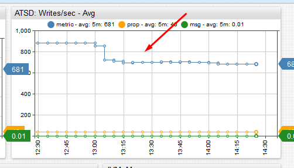

Metric Persistence Filter
=========================

Metric Persistence Filter field in metric editor is used to discard
inserts based on a filter expression, similar to the filter expressions
found in the Rule Engine Editor.

Below is a use case example of how the Metric Persistence Filter can be
used.

To see which metrics have the most amount of inserts navigate to Admin
-\> Receive Statistics:

The Tags link provides a list of unique tags for the given metric and
often it is not worth storing many short-lived processes:

To stop storing the short-lived processes, create a collection
containing filter expressions (collections can be found under the Admin
tab -\> Named Collections):

Finally, apply the Filter to the metric in order to ignore processes
matching any of those expressions:

`!likeAny(tags.command, collection('ignore-collector-process-commands'))`

Supported Functions:

-   Collection: `list(String value);`
-   Collection: `list(String value, String delimiter);`
-   Collection: `collection(String name);`
-   Boolean: `likeAll(Object message, Collection values);`
-   Boolean: `likeAny(Object message, Collection values);`
-   Expressions like: `tags.id NOT IN ('a', 'b', 'c')` are supported

As a result the amount of short-lived processes being stored is
substantially reduced without modifying collector scripts:

