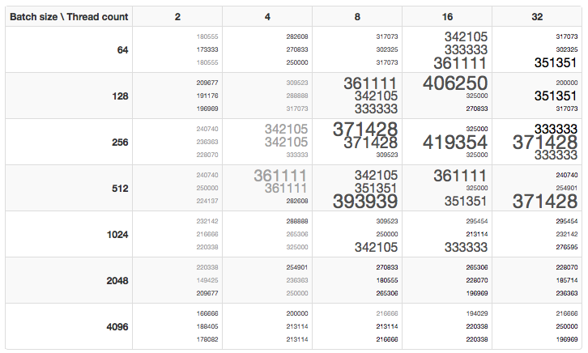
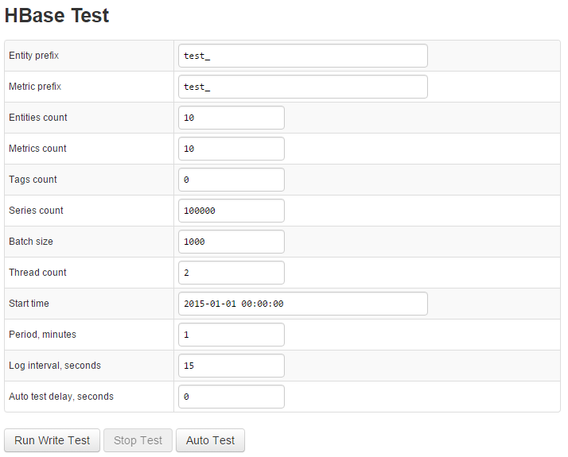

# Monitoring metrics : HBase Write Test


HBase Write Test can be run directly from the ATSD UI under Admin -\>
HBase Test.

Direct url: `atsd_server:8088/admin/hbase-test`

HBase Write Test allows to:

-   Analyze the data being ingested, e.g. number of unique
    metric/entity/tag combinations, and run a write throughput test
-   Launch Auto Test to view a matrix of throughput statistics for
    different batch size and thread count combinations
-   Apply test results to modify default configuration parameters in
    ATSD server.properties file:

```properties
 series.batch.size = 1024                                                 
 series.queue.pool.size = 4                                               
```

Auto Test Example Results:



| Field | Description |
| --- | --- |
| Entity prefix | Entity name prefix |
| Metric prefix | Metric name prefix |
| Entities count | Number of entities that will be written |
| Metrics count | Number of metrics that will be written |
| Tags count | Number of tags that will be assigned to each series.Tag count should represent a realistic number of tags that are normally assigned to your series for the results to be accurate. |
| Series count | Total number of series that will be stored. |
| Batch size | Size of each test batch. |
| Thread count | Number of threads used for each test. |
| Start time | Start timestamp with which the generated series will be written. |
| Period, minutes | Period will be added to the Start Time timestamp with each iteration. |
| Log interval, seconds | Interval between log outputs. |
| Auto test delay, seconds | Delay between finishing one test and starting the next test in Auto Test mode. |


