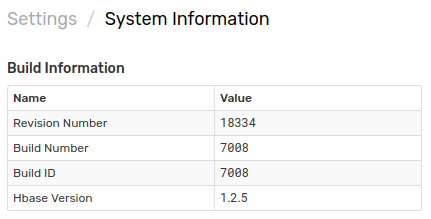

# Manual Update

### Login into Axibase Time Series Database Server

```sh
su axibase
```

### Download the Latest ATSD Build Files

Select an archive to download based on **HBase Version** displayed on the **Admin: System Information** page.

* [hbase 0.94.x](http://axibase.com/public/atsd_ce_update_latest.htm)

* [hbase 1.0.3](https://www.axibase.com/public/atsd_ee_hbase_1.0.3.tar.gz)

* [hbase 1.2.2](https://www.axibase.com/public/atsd_ee_hbase_1.2.2.tar.gz)

The archive will contain the latest ATSD release with the revision number included in the file name, for example `atsd_15500.tar.gz`.

Copy the archive to the ATSD server.

### Unpack the Archive

```sh
tar xzf atsd.tar.gz
```

### View Files in the Archive

```sh
cd target
ls
atsd-executable.jar
atsd.jar
```

### Stop ATSD

```sh
/opt/atsd/bin/atsd-all.sh stop
```

### Copy JAR Files

```sh
cp atsd.jar /opt/atsd/hbase/lib
```

```sh
cp atsd-executable.jar /opt/atsd/atsd/bin
```

### Start ATSD

```sh
/opt/atsd/bin/atsd-all.sh start
```

It may take up to 15 minutes for the database to initialize.

### Login into ATSD user interface

```sh
https://atsd_host:8443/
```

* Open the **Admin: System Information** page.
* Verify that the Revision Number has been updated.


