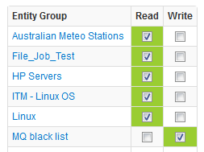
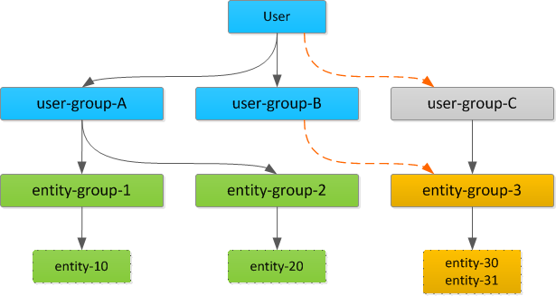

# User Authorization

Axibase Time Series Database implements Role Based Access Control (RBAC)
and Entity Permissions (EP) to restrict user access to protected
information.

## Role Based Access Control

Authenticated users are allowed to access protected resources based on
their role.\
 The role specifies which URLs and HTTP methods the user can access.
Each user can be assigned multiple roles.

### Available API roles:

-   ROLE\_API\_DATA\_READ – Query Data API to read series, properties,
    messages, alerts from the database.
-   ROLE\_API\_DATA\_WRITE – Submit Data API requests to insert series,
    properties, messages into the database.
-   ROLE\_API\_META\_READ – Query Meta Data API to read metric, entity,
    and entity group settings.
-   ROLE\_API\_META\_WRITE – Submit Meta Data API requests to change
    metric and entity settings.\
     API requests to change entity groups or add/remove their members
    require ROLE\_ENTITY\_GROUP\_ADMIN role.

### Available User Interface roles:

-   ROLE\_USER – View information on all pages except
    Configuration, Entity Group, and Admin pages.\
     Includes ROLE\_API\_DATA\_READ and ROLE\_API\_META\_READ.
-   ROLE\_EDITOR – View and edit information on all pages except Admin
    and Entity Group pages.\
     Includes ROLE\_USER.
-   ROLE\_ENTITY\_GROUP\_ADMIN – Edit entity groups.\
     Includes ROLE\_USER.
-   ROLE\_ADMIN – View and edit information on all pages.\
     Includes all roles.

## Entity Permissions

Permissions to read and write data are granted to User Groups at the
Entity Group level.

In order to read data for an entity the user must have
ROLE\_API\_DATA\_READ role. In addition, one of the user’s User Groups
must be granted a Read permission to an Entity Group containing the
entity.

In order to write data for an entity the user must have
ROLE\_API\_DATA\_WRITE role. In addition, one of the user’s User Groups
must be granted a Write permission to an Entity Group containing the
entity.

Effective user permissions are calculated as a union of all User Groups
permissions to which the user belongs.

*In the following diagram, to read data for entity-30 the user must be
either added to user-group-C as a member or entity-group-3 must be
assigned to user-group-B or user-group-A.*

### All Entities Permissions

In addition to specific Entity Group permissions user groups can be
granted a special ‘All Entities: Read’ or ‘All Entities: Write’
permission which allows reading or writing data to any entity, including
entities that do not belong to any Entity Group. Users inherit ‘All
Entities’ permissions from User Groups to which they belong.

### Inserting Data for New Entities

Since non-existent entities cannot be assigned to a group, ‘All
Entities: Write’ permission is required to create entities either in the
user interface or by inserting data via API.\
 User with ROLE\_API\_DATA\_WRITE role but without ‘All Entities: Write’
permission will be able to insert data only for existing entities.

### Wildcard Requests

Users without ‘All Entities: Read’ permission are allowed to query Data
API using wildcards as part of entity name as well as execute SQL
queries without entity name conditions. In both cases, the results will
be filtered based on user’s effective permissions therefore different
users may see different results for the same API request or SQL query
depending on their entity permissions.

## Implementation Notes

-   User’s role, group membership, and entity permissions are cached
    while the session is active or until it times out. In order to apply
    changes, the user must re-login into the application.
