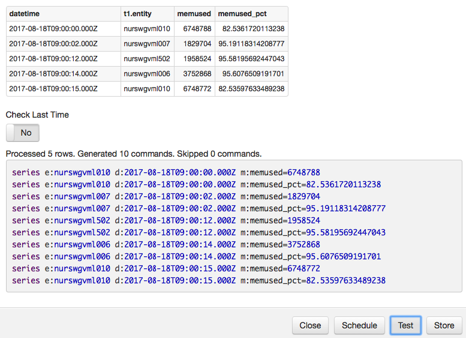
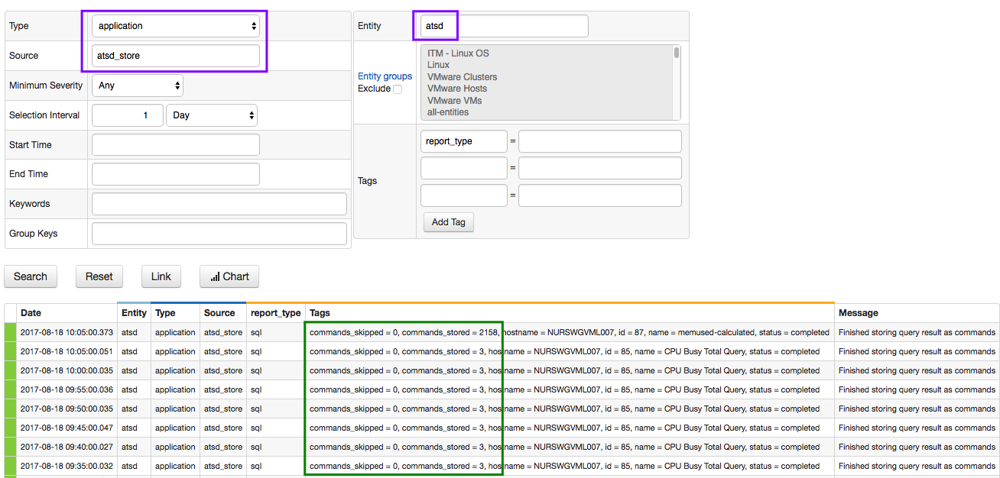

# SQL Scheduled Store

## Overview

The **Store** option in scheduled SQL queries enables writing the results of the query back into the database.

## Use Cases

* Create derived series that are frequently accesses but require expensive processing and calculations from the underlying data.
* Create cleansed series by discarding invalid values and interpolating sample values in missing interval gaps.
* Create normalized series by replacing synonyms, for example by storing data for `tag.country=China` and `tag.country=Republic of China` in one derived series.
* Store temporal aggregations for long-term retention based on detailed data that is subject to pruning after a certain expiration date.
* Implement multi-stage data processing that cannot be programmed using the existing SQL syntax, for example, nested aggregations `AVG(SUM(value))` or moving averages.

### Mapping

Each row in the result set is converted into one or multiple derived series based on column names and data types.

After entity, datetime, and tag columns are mapped based on names, the remaining numeric columns are classified as metric name columns.

```sql
SELECT datetime, 'DC-1' AS "entity",  AVG(value) AS "temperature_daily_avg", PERCENTILE(90, value) AS "temperature_daily_perc_90"
  -- mapped to datetime, entity, metric with name = temperature_daily_avg, metric with name = temperature_daily_perc_90
  FROM temperature
WHERE datetime >= CURRENT_MONTH
  GROUP BY PERIOD(1 DAY)
```

Rows containing multiple numeric columns produce a corresponding number of series commands.

```ls
| datetime             | entity | temperature_daily_avg | temperature_daily_perc_90 |
|----------------------|--------|-----------------------|---------------------------|
| 2017-08-01T00:00:00Z | DC-1   | 21.01                 | 27.17                     |
| 2017-08-02T00:00:00Z | DC-1   | 22.20                 | 28.24                     |
```

The result set is converted into series commands and stored in the database:

```ls
series e:dc-1 d:2017-08-01T00:00:00Z m:temperature_daily_avg=21.01 m:temperature_daily_perc_90=27.17
series e:dc-1 d:2017-08-02T00:00:00Z m:temperature_daily_avg=22.20 m:temperature_daily_perc_90=28.24
```

### Column Requirements

The columns are mapped to command fields based on the column name and the data type.
Column aliases can be defined to ensure that the query results meet the following requirements.

#### Required Columns

| **Name** | **Data Type** | **Occurrence** | **Description** |
|---|---|---|---|
| datetime | string | `0-1` | The date of the record in the ISO-8601 format (1).|
| time | long | `0-1` | The date of the record in UNIX milliseconds (1). |
| entity | string | `1` | Name of the entity under which the new series will be stored. |
| - any - | numeric | `1-*` | Metric name for the stored series (2). |

* (1) Only one of the date columns, `datetime` or `time`, must be present in the results.
* (2) The column is classified as 'metric' if it has a numeric datatype and does not match the rules applicable to the other column types.

#### Optional Series Tag Columns

| **Name** | **Data Type** | **Occurrence** | **Description** |
|---|---|---|---|
| tags.{name} | string | `0-*` | Series tag for the stored series. <br>Column name contains tag name after `tags.`. Cell value contains tag value.|
| tags | string | `0-*` | Series tags for the stored series, serialized as key=value separated by semi-colon. <br>Cell value contains tag names and values.|

#### Optional Metadata Tag Columns

| **Name** | **Data Type** | **Occurrence** | **Description** |
|---|---|---|---|
| metric.tags.{name} | string | `0-*` | Metric tag for each of the metrics in the row. <br>Column name contains metric tag name after `tags.`. Cell value contains metric tag value.|
| metric.tags | string | `0-*` | Metric tags for each of the metrics in the row, serialized as key=value separated by semi-colon. <br>Cell value contains metric tag names and values.|
| entity.tags.{name} | string | `0-*` | Entity tag for the entity in the row. <br>Column name contains entity tag name after `tags.`. Cell value contains entity tag value.|
| entity.tags | string | `0-*` | Entity tags for the entity in the row, serialized as key=value separated by semi-colon. <br>Cell value contains entity tag names and values.|


### Table Names

The table prefix included in the fully qualified column names is ignored when classifying the columns.

The name of the column is resolved as `entity` in both cases below:

```sql
SELECT t1.entity ... FROM "my-table" t1
SELECT entity ... FROM "my-table"
```

### Metadata Commands

Columns with starting with 'entity.tags.' and 'metric.tags.' generate corresponding metadata commands `entity` and `metric`.


```sql
SELECT datetime, 'dc-1' AS "entity",  'SVL' as "entity.tags.location", AVG(value) AS "temperature_daily_avg"
  -- mapped to datetime, entity, entity.tag with name = location, metric with name = temperature_daily_avg
  FROM temperature
WHERE datetime >= CURRENT_MONTH
  GROUP BY PERIOD(1 DAY)
```

```ls
| datetime             | entity | entity.tags.location | temperature_daily_perc_90 |
|----------------------|--------|----------------------|---------------------------|
| 2017-08-01T00:00:00Z | DC-1   | SVL                  | 27.17                     |
| 2017-08-02T00:00:00Z | DC-1   | SVL                  | 28.24                     |
```

Produced commands:

```ls
entity e:dc-1 t:location=SVL
series e:dc-1 d:2017-08-01T00:00:00Z m:temperature_daily_perc_90=27.17
series e:dc-1 d:2017-08-02T00:00:00Z m:temperature_daily_perc_90=28.24
```

### Duplicates

Since the query may create series commands for dates that were already inserted, the **Check Last Time** option provides a way to control how duplicates are handled.

If **Check Last Time** is enabled, the series command is inserted if its datetime is greater than the timestamp of the previously stored values for the given series key.

### Validation

To create and test a query that complies with [requirements](#column-requirements), execute the query in the SQL console and click the **Store** button. Click **Test** to review the produced commands and to resolve any errors.



### Monitoring

The results of scheduled SQL jobs with the **Store** option can be monitored by processing messages with `type=Application`, `source=atsd_export` and `report_type=sql`.


