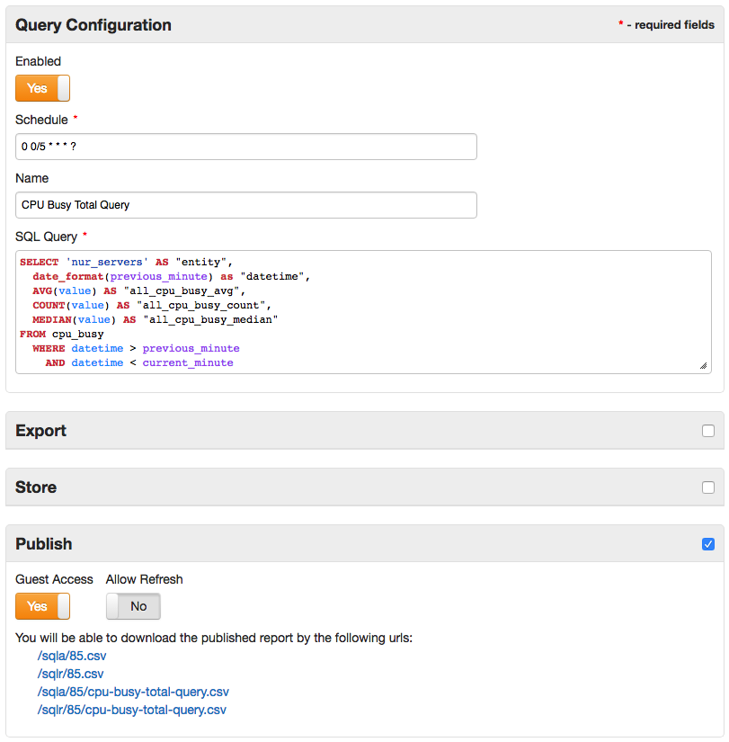
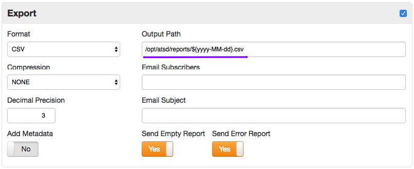
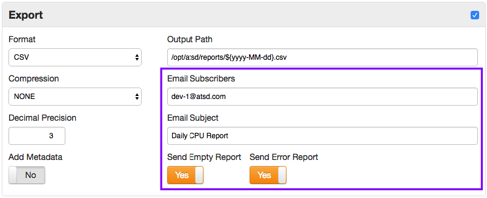

# SQL Scheduler

## Overview

SQL Scheduler allows for SQL query results to be distributed to users in CSV, Excel, or JSON format.

## Sample Configuration



## Query

The scheduler executes a `SELECT` query specified according to the ATSD [SQL syntax](README.md).

## Authorization

The scheduled SQL queries are executed with **administrative** permissions and no records are excluded from the result set unlike the ad-hoc queries, which are filtered based on the user's [entity read permissions](../../administration/user-authorization.md#entity-permissions).

## Schedule

The scheduling frequency is controlled with the `Schedule` field containing a [`cron` expression](scheduled-sql-cron.md) that determines when the task should be executed.

## Formats

* CSV
* JSON
* Excel (xlsx)

CSV files can be optionally archived with zip or gzip compression.

### Sample Reports

* [sql-report.csv](examples/sql-report.csv)
* [sql-report.json](examples/sql-report.json)
* [sql-report.xlsx](examples/sql-report.xlsx)

## Decimal Precision

To round numeric values, set decimal precision to the desired number of fractional digits.
`0` means that no fractional digits will be displayed.
`-1` means that no rounding will be applied and numbers will be displayed with their original precision.

## Export Options

The report file can be written to a file on the local file system, sent to email subscribers, or published as a link.

### File System

The store reports on disk, enable the **Export** section and specify a output path.



Specify absolute path including the file name.

If the parent directory in the specified path doesn't exist, it will be automatically created.
The file extension should match the export format. For example, if the format is EXCEL, the Output Path should end with ".xlsx".

Output Path may contain date placeholders so that files or their parent directories are grouped by day or month.

Example: `/opt/report/daily/${yyyy-MM-dd}.csv`

An expression like `/opt/report/daily/${yyyy-MM-dd}.csv` creates the following file `/opt/report/daily/2017-06-10.csv` when executed.

The date placeholder may include the following calendar units:

* yyyy - 4-digit year
* yy - 2-digit year
* MM - 2-digit numeric month
* dd - day of month
* HH - hour of the day in 24-hour format
* ss - seconds
* SSS - milliseconds

### Email

To distribute report files via email, enable the **Export** section and specify email subject and one or multiple email addresses, separated by comma or space.



The `Send Empty Report` and `Send Error Report` settings control whether the report should be emailed in case of an empty result or an error.

The `Send Empty Report` option in particular, when disabled, can be used for alerting purposes whereas the report is sent only if unexpected/abnormal results were found by the query.

### Link

To make the report available for downloading by end-users, enable the **Publish** section. The report contain rows that were prepared by the server when the task was last executed.


To allow users to download updated results each time they click on the link, enable the `Allow Refresh` option. When enabled and if the url contains a `?refresh=true` parameter, the report is rebuilt by the database for each download request.

```
https://atsd_host:8443.co/sqlr/85/cpu-busy-total-query.csv?refresh=true
```

To make links accessible to unauthenticated users, click on `Guest Access` option, in which case additional download links for non-authenticated users will be displayed.


## Metadata

The exported files can optionally include [metadata fields](scheduled-sql-metadata.md) describing the data in the report.
