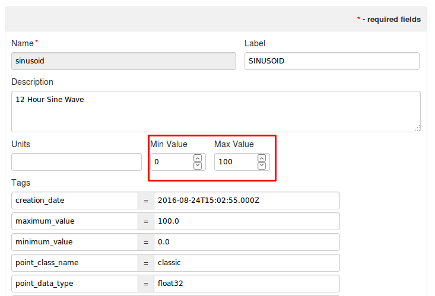
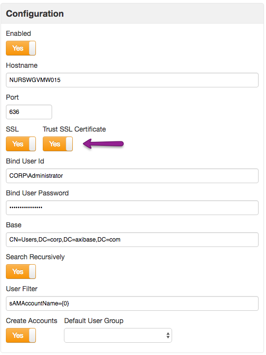
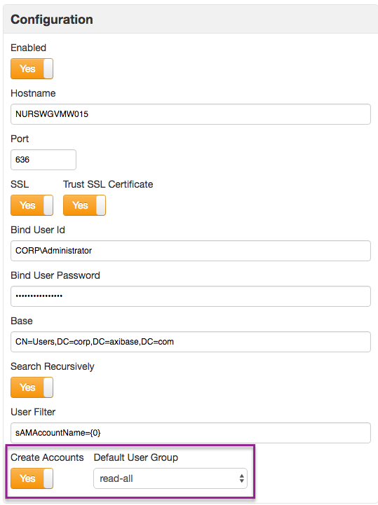
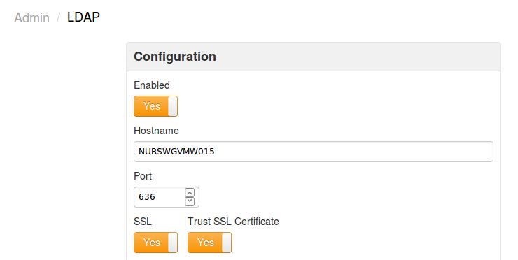
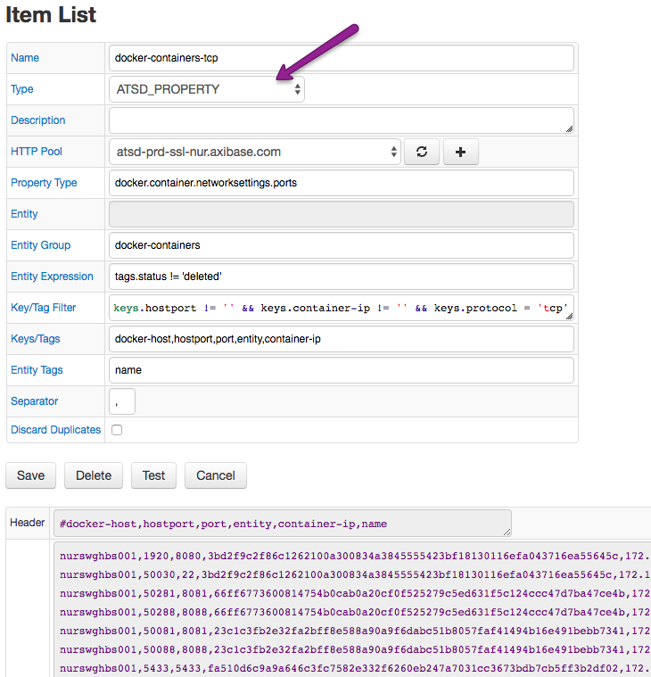

Weekly Change Log: November 28-December 4, 2016
===============================================

### ATSD

| Issue     | Category        | Type     | Subject                                                                    |
|-----------|-----------------|----------|----------------------------------------------------------------------------|
| [3677](#issue-3677)      | sql             | Feature      | Added support for `date_format` function in `WHERE`, `GROUP BY` and `ORDER BY` clauses . |
| [3674](#issue-3674)      | sql             | Bug      | Fixed slow execution time for queries with table aliases. |
| [3673](#issue-3673)      | sql             | Bug      | Added `WEEK` interval type in the `PERIOD` function. |
| 3671      | metric          | Bug      | Fixed issues with values being discarded if Min Value and Max Value are specified and Invalid Action set to 'NO ACTION'. |
| [3670](#issue-3670)      | sql             | Bug      | Fixed incorrect results with `ROW_MEMORY_THRESHOLD OPTION` compared to temporary table processing. |
| [3665](#issue-3665)      | sql             | Bug      | Added error message in case of excessive tag combinations fetched by a query. |
| 3660      | jdbc            | Bug      | Hide unused driver properties in DbVisualizer . |
| 3647      | core            | Bug      | Fixed error log download issue if the file was modified during the download process. |
| [3645](#issue-3645)      | rule engine     | Feature  | Exclude unused statistics from the details table in the email notification. |
| 3640      | api-rest        | Bug      | Fixed NullPointerException in alert-history-entity query. |
| 3618      | api-rest        | Bug      | Fixed incorrect status code in case an invalid entity expression is submitted. |
| 3617      | UI              | Bug      | Corrected date parsing issue on Export Data page. |
| [3615](#issue-3615)      | api-network     | Feature  | Added the new fields `minValue` and `maxValue` to the Metric class. |
| [3601](#issue-3601)      | sql             | Bug      | Optimized execution time for queries with arithmetic expressions. |
| [3600](#issue-3600)      | sql             | Bug      | Fixed different results of aggregation functions with and without the `LIMIT` clause. |
| [3592](#issue-3592)      | security        | Feature  | Added Trust SSL Certificate field to LDAP configuration form. |
| [3583](#issue-3583)      | security        | Feature  | Added 'Create Accounts' integration feature to LDAP. |
| 3582      | security        | Feature  | Enabled copying user account attributes from ATSD into LDAP. |
| 3570      | api-network     | Bug      | Corrected failure to insert metric command for a re-created metric.   |
| 3560      | api-network     | Feature  | Added new field 'Units' to the Metric class. |
| [3470](#issue-3470)      | sql             | Feature  | Added support for `text` column in the `SELECT` expression and the `WHERE` clause. |
| [3465](#issue-3465)      | api-rest        | Feature  | Added `addMeta` series and property methods in Data API. |
| [3438](#issue-3438)      | security        | Feature  | Modified Enterprise Edition to support LDAP authentication. |
| [3309](#issue-3309)      | graphana        | Support  | Implemented ATSD storage driver for Grafana 3.x. |

### Collector

| Issue     | Category        | Type     | Subject                                                                    |
|-----------|-----------------|----------|----------------------------------------------------------------------------|
| 3663      | jdbc            | Feature  | Added tooltips for MESSAGE type: message column, type, source, and severity. |
| 3655      | json            | Bug      | Applied missing metric prefixes. |
| [3644](#issue-3644)      | collection      | Feature  | Implemented New Item List type to load data from property records in ATSD. |
| 3638      | docker          | Bug      | Fixed startup issues with the Collector Docker container. |
| 3621      | docker          | Bug      | Added checker to synchronize Docker-engine objects and statuses with ATSD. |
| 3405      | docker          | Bug      | Fixed issue with missing Docker statistics. |

### Charts

| Issue     | Category        | Type     | Subject                                                                    |
|-----------|-----------------|----------|----------------------------------------------------------------------------|
| 3523      | property        | Bug      | Set format-number to false by default to let users enable it explicitly at the widget or column level. |


### Issue 3677
--------------

The `date_format` function can now be used in the `WHERE`, `GROUP BY`, and `HAVING` clauses to filter and group dates by month name, day name, or hour number.

```sql
SELECT date_format(time, 'MMM'), sum(value)
  FROM cdc.pneumonia_and_influenza_deaths
WHERE entity = 'mr8w-325u' and tags.city = 'Boston'
  GROUP BY tags.region, date_format(time, 'MMM')
ORDER BY date_format(time, 'MM')
```

```ls
| date_format(time,'MMM') | sum(value) |
|-------------------------|------------|
| Jan                     | 4000       |
| Feb                     | 3636       |
| Mar                     | 3802       |
| Apr                     | 3236       |
| May                     | 2966       |
| Jun                     | 2727       |
| Jul                     | 2619       |
| Aug                     | 2589       |
| Sep                     | 2461       |
| Oct                     | 2775       |
| Nov                     | 2817       |
| Dec                     | 3063       |
```

Refer to [diurnal](/api/sql/examples/diurnal.md) query examples.


### Issue 3673
--------------

We fixed the [PERIOD](/api/sql#period) function by adding the `WEEK` interval type.
The list of interval types supported by `PERIOD` now includes:

* YEAR
* QUARTER
* MONTH
* WEEK
* DAY
* HOUR
* MINUTE
* SECOND
* MILLISECOND

The `WEEK` interval type, along with `DAY`, `MONTH`, `QUARTER`, and `YEAR` are aligned to the server calendar by default.
In particular, the `WEEK` period, when calendar-aligned, starts on the first Monday in the initial year in the specified timespan, and is incremented forward.
For example, the first Monday in 2016 was January 4th and the 2-week periods were started on that date.

```sql
SELECT date_format(time, 'yyyy-MM-dd EEEEE') as 'date', sum(value)
  FROM dmv.instances
WHERE tags.city = 'New York'
  AND datetime >= '2016-09-01T00:00:00Z'
GROUP BY PERIOD(2 WEEK)
```

```ls
| date              | sum(value) |
|-------------------|------------|
| 2016-09-12 Monday | 1971       |
| 2016-09-26 Monday | 987        |
```

> Note that empty periods and periods with a start date outside of the requested timespan are NOT included in the result set.

As an alternative to a `CALENDAR` alignment, specify `START_TIME` as the second argument to the `PERIOD` function in order to align periods to the beginning of the timespan.

```sql
SELECT date_format(time, 'yyyy-MM-dd EEEEE') as 'date', sum(value)
  FROM dmv.instances
WHERE tags.city = 'New York'
  AND datetime >= '2016-09-01T00:00:00Z'
GROUP BY PERIOD(2 WEEK, START_TIME)
```

```ls
| date              | sum(value) |
|-------------------|------------|
| 2016-09-01 Monday | 1567       |
| 2016-09-14 Monday | 1450       |
```

### Issue 3670
--------------

The `ROW_MEMORY_THRESHOLD` option allows in-memory processing of result sets. It should not affect the returned records in any way. The issue provided a fix for a query that produced
different results in two modes: in-memory and temporary table.

### Issue 3665
--------------

The query executor was changed to raise an error if too many tag combinations are located for one of the metric and entities specified in the query. The limit is 1000. If the limit is
exceeded, the following error message is returned to the client so that the user can refactor the query and add conditions to the `WHERE` clause to reduce the number of series.
Previously, an error was not raised and the result set was truncated behind the scenes, leading to unexpected results.

```
IllegalStateException: Too many tags combinations for metric 'df.disk_used' and entity 'nurswghbs001'. Limit: 1000.
```

### Issue 3645
--------------

We cleaned-up email alert template by removing rows from alert details that are not relevant if window count = 1.

### Issue 3615
--------------

Continuing the extension of the ATSD schema, we added the new fields `minValue` and `maxValue` to the Metric class so that commonly used metadata about metrics can be described with
fields, as opposed to tags because fields provide validation, dictionaries, and ease-of-use for users when editing metrics.



### Issue 3601
--------------

We added a fix so that queries with arithmetic expressions execute nearly as fast as queries without expressions:

```sql
select avg(value+0) from mpstat.cpu_busy
```

```sql
select avg(value) from mpstat.cpu_busy
```

### Issue 3592
--------------

The Trust SSL Certificate setting, when enabled, allows encrypted connections to LDAP servers with self-signed SSL certificates.



### Issue 3583
--------------

The new LDAP integration feature, 'Create Accounts', makes it possible to self-register user accounts in ATSD if the new user account exists in LDAP and the user was able to successfully
authenticate. The new account settings, such as username, email, and first/last name, are inherited from LDAP attributes.

If the 'Default User Group' is specified, the new self-registered users are automatically added to this group and inherit its permissions.



### Issue 3470
--------------

A new [`text` column](/api/sql/examples/select-text-value.md) was made available in the `SELECT` expression and the `WHERE` clause, so
that string annotations can be displayed in the result set along with numeric values. The `text` column can be selected in a simple query or in a `JOIN` query.

```sql
SELECT entity, datetime, value, text
  FROM atsd_series
WHERE metric IN ('temperature', 'status') AND datetime >= '2016-10-13T08:00:00Z'
```

```ls
| entity   | datetime             | value | text                           |
|----------|----------------------|-------|--------------------------------|
| sensor-1 | 2016-10-13T08:00:00Z | 20.3  | null                           |
| sensor-1 | 2016-10-13T08:15:00Z | 24.4  | Provisional                    |
| sensor-1 | 2016-10-13T10:30:00Z | NaN   | Shutdown by adm-user, RFC-5434 |
```

### Issue 3465
--------------

The new parameter `addMeta` was added to [series](/api/data/series/query.md) and property methods
so that clients can retrieve entity and metric fields and tags in one request, saving an extra round-trip. Another advantage is that the `addMeta` parameter doesn't require the user to
have a Meta API READ role.

Request:

```json
[{
  "startDate": "previous_minute",
  "endDate":   "now",
  "entity": "nurswgvml007",
  "metric": "cpu_busy",
  "addMeta": true
}]
```

Response:

```json
[{
  "entity":"nurswgvml007","metric":"cpu_busy","type":"HISTORY",
  "meta":{
    "metric":{"name":"cpu_busy","enabled":true,"dataType":"FLOAT","counter":false,"label":"CPU Busy %","persistent":true,"tags":{"source":"iostat","table":"System"},"timePrecision":"MILLISECONDS","retentionDays":0,"minValue":0.0,"maxValue":100.0,"invalidAction":"TRANSFORM","versioned":false,"interpolate":"LINEAR","timeZone":"US/Eastern"},
   "entity":{"name":"nurswgvml007","enabled":true,"timeZone":"PST","tags":{"alias":"007"},"interpolate":"LINEAR","label":"NURswgvml007"}
  },
  "data":[
    {"d":"2016-12-28T15:57:04.000Z","v":6},
    {"d":"2016-12-28T15:57:20.000Z","v":5.1},
    {"d":"2016-12-28T15:57:36.000Z","v":5}
  ]
}]
```

### Issue 3438
--------------

The Enterprise Edition now supports LDAP authentication to simplify and centralize credentials management in large organizations:



### Issue 3309
--------------

[https://github.com/axibase/grafana-data-source](https://github.com/axibase/grafana-data-source)

### Issue 3644
--------------

A new Item List type was implemented to load data from property records in ATSD. This allows automating monitoring and data collection jobs, for example, to TCP-check open ports for a
list of containers retrieved by the Docker job.



### Issue 3674
--------------

```sql
SELECT count(t1.value)
  FROM cdc.all_deaths t1
WHERE t1.entity = 'mr8w-325u'
  AND t1.tags.city = 'Baton Rouge'
```
