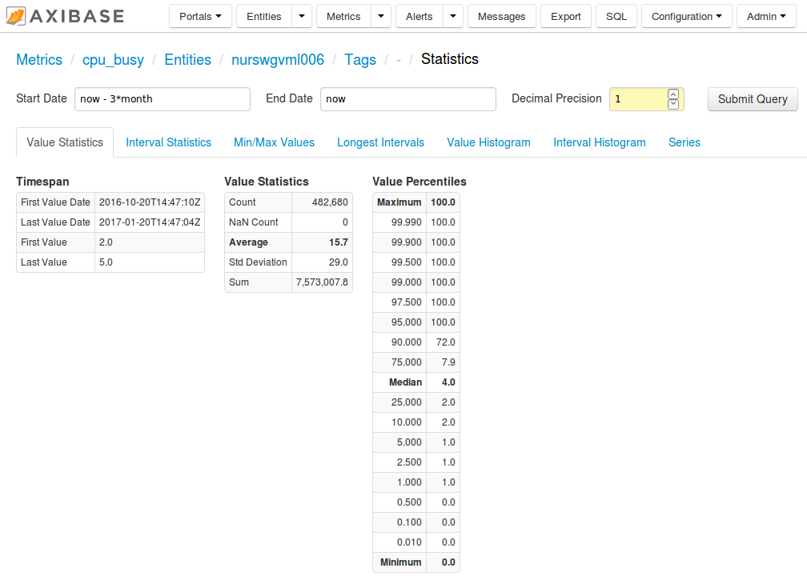
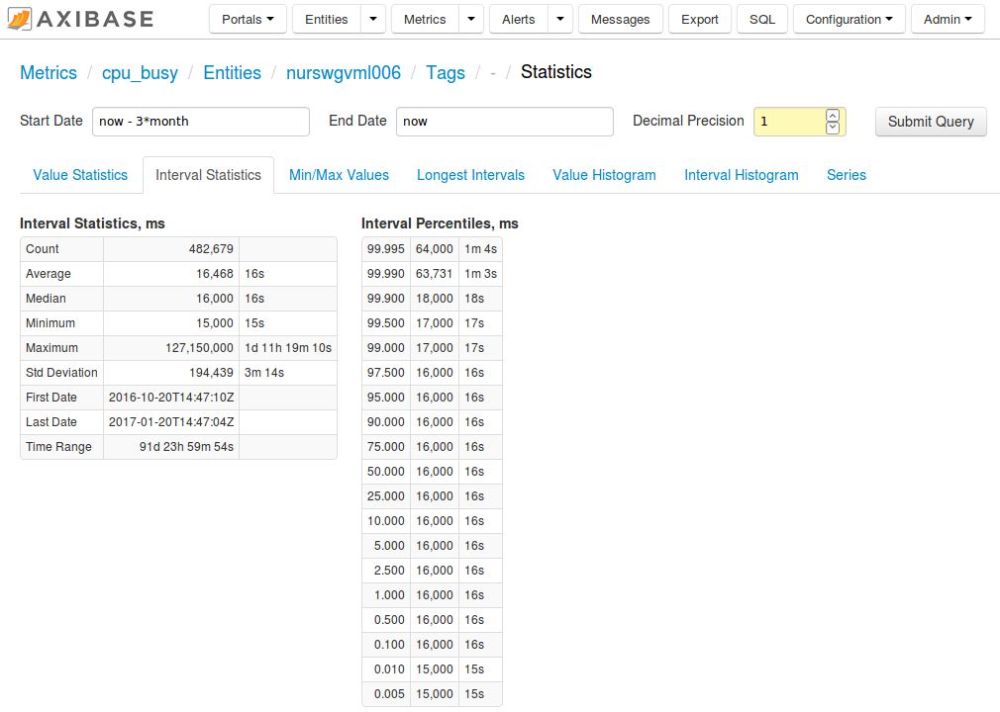
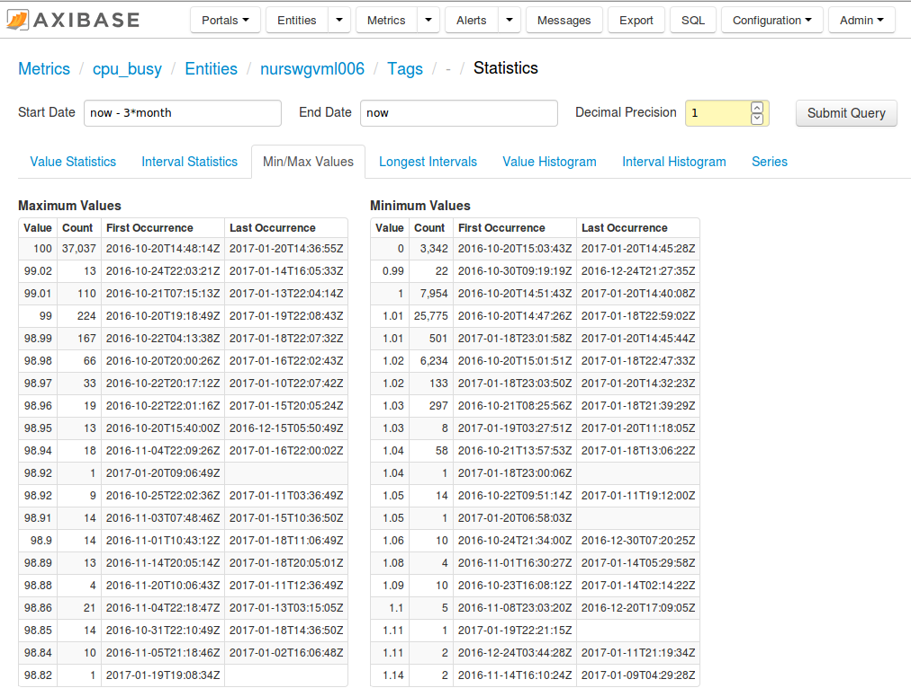
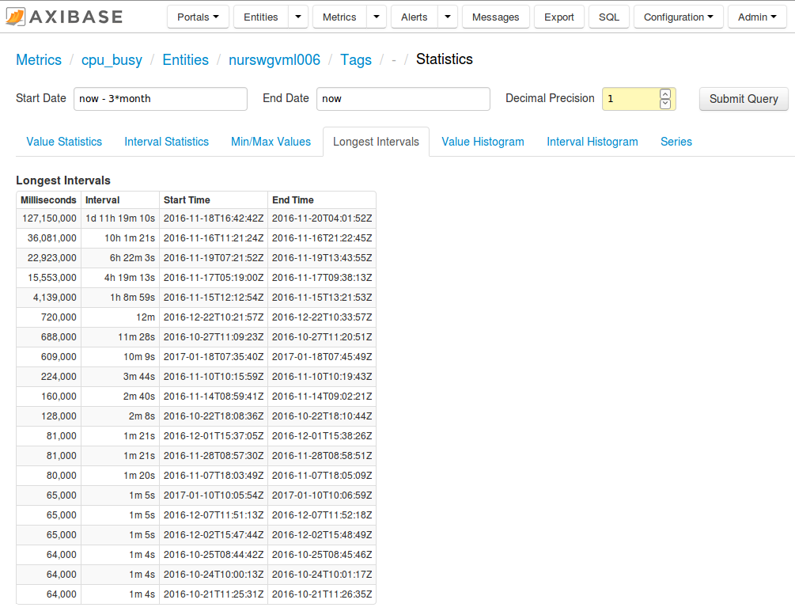
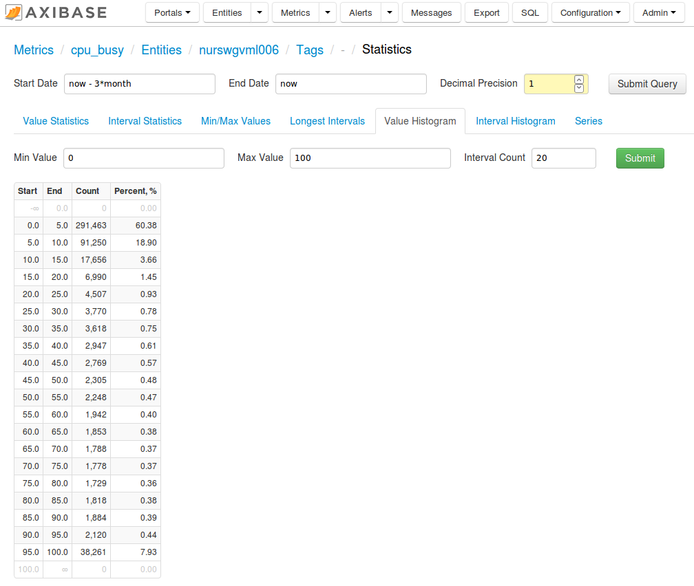
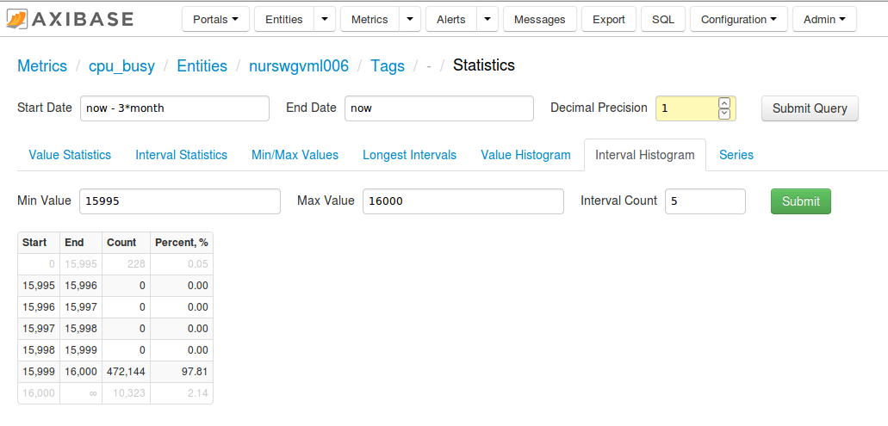
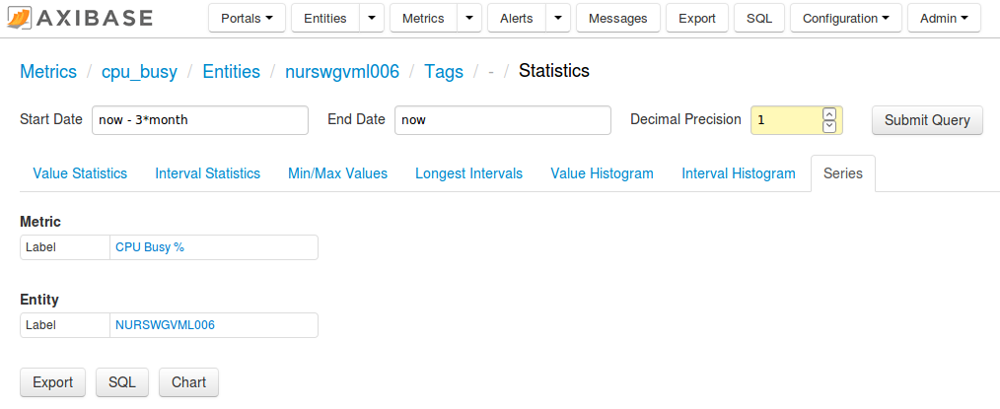
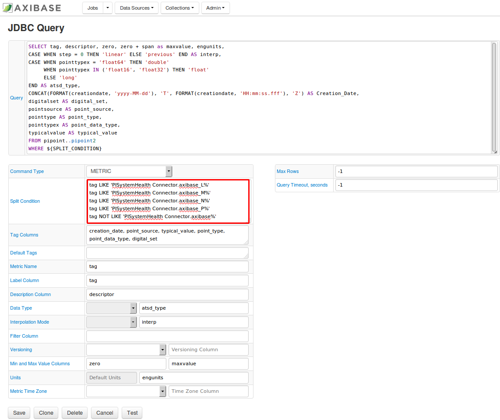

Weekly Change Log: January 16 - January 22, 2017
================================================

### ATSD

| Issue| Category        | Type    | Subject                                                                             |
|------|-----------------|---------|-------------------------------------------------------------------------------------|
| [3797](#issue-3797) | sql             | Feature | Added support for the `ROW_NUMBER` function                                                 | 
| 3796 | api-network     | Feature | Network API: append text value                                                               | 
| [3795](#issue-3795) | sql             | Bug     | SQL: group by entity tag                                                                     |
| 3786 | statistics      | Bug     | Series statistics: interval histogram range; limit; tooltip                                  |
| [3783](#issue-3783) | sql             | Bug     | SQL: extra comma if all columns contain null (empty string)                                  | 
| 3781 | jdbc            | Bug     | JDBC Driver: empty rows in result csv are skipped                                            | 
| 3753 | jdbc            | Bug     | JDBC Driver: Exception while parsing metadata                                                | 
| 3691 | rule engine     | Feature | Added date() function to convert string date to Date object that can be compared with date objects like "current_time" etc. | 
| [3680](#issue-3680) | statistics      | Feature | Added a page to show series characteristics, such as value and interval statistics and histograms, for a provide time interval.                                                                        | 

### Collector

| Issue| Category        | Type    | Subject                                                                             |
|------|-----------------|---------|-------------------------------------------------------------------------------------|
| 3784 | jdbc            | Feature | Added the `${SPLIT_CONDITION}` placeholder support in the JDBC job to allow fetching large result sets in smaller chunks which satisfy the conditions in the `Split Condition` textarea. |
| 3656 | socrata         | Bug     | Refactored the Socrata job so that a 70Mb dataset can be processed without OoM using the current memory allocation of 1 gb. |

### Charts

| Issue| Category        | Type    | Subject                                                                             |
|------|-----------------|---------|-------------------------------------------------------------------------------------|
| [2528](#issue-2528) | property        | Feature | Added support for `column-label-format` setting for property and table widgets to trim unnecessary text. |
| [1926](#issue-1926) | box             | Feature | Updated mouse-over features for box charts. | 

## ATSD

### Issue 3797
--------------

Support was added to the `ROW_NUMBER` function after the `GROUP BY` clause for `SELECT` statements.

Now we can specify the `ROW_NUMBER` condition in two parts of a `SELECT` statement: before or after the `GROUP BY` clause. Generally, a `SELECT` statement may contain two `ROW_NUMBER` 
conditions. If the `ROW_NUMBER` condition is placed before the `GROUP BY` clause, this condition is applied before grouping. If the `ROW_NUMBER` condition is placed after the `GROUP BY` 
clause, this condition is applied after grouping.

Additionally, this new support allows for syntax such as `ROW_NUMBER(entity, tags ORDER BY period(15 minute))`. Previously, we could not use order by period(...) in the `ROW_NUMBER` 
function. There are still, however, some limitations: we can use order by period only after the `GROUP BY` clause and the period must be the same as in `GROUP BY` clause.

### Issue 3796
--------------

### Issue 3795
--------------

```sql
SELECT entity.tags.app, count(value) 
  FROM disk_used
WHERE entity IN ('nurswgvml007', 'nurswgvml006')
  AND tags.mount_point = '/'
  AND datetime > now - 5*minute
GROUP BY entity.tags.app
```

### Issue 3691
--------------

### Issue 3680
--------------

A new page was added to ATSD to help characterize series by providing computed series statistics for a provided time interval. 

Each of the following tabs are included in this new page.

* Value Statistics: provides summary statistics for values of the time series for the specified time interval. There are three tables included within this tab: **Timespan**, **Value Statistics**, and **Value
  Percentiles**. **Timespan** provides the dates for the the first and last value of the time series and their respective values. **Value Statistics** provides the Count (total non Nan 
  samples), NaN count, as well as the Average, Standard Deviation, and Sum of all **non** NaN values. **Value Percentiles** provides a list of the maximum and minimum values of the 
  series, with the corresponding percentages of observations which fall beneath the specific listed value (ie 75% of all values in this series fall below 7.1).
    
  

* Interval Statistics: provides time duration statistics for values included in the specific time interval. All values are presented in two forms: as milliseconds and in a human readable 
  format (ie, 1d 2h 3m 4s). Two tables are included in under this tab: **Interval Statistics, ms** and **Interval Percentiles, ms**. The **Interval Statistics** table provides a concise 
  summary of the time characteristics of the series, including the Count of the number of intervals in the series, the average interval time, the total time range for the series, among
  several other points. The **Interval Percentiles, ms** table provides a list of the maximum and minimum time intervals of the series, with the corresponding percentages of 
  observations which fall beneath the specific listed value (ie 99.9% of all time intervals in this series fall under 18 seconds). 
  
  

* Min/Max Values: provides the 20 maximum and minimum values of the series. Include are the value, count, and first and last occurrences of these values. 

  

* Longest Intervals: provides the maximum 20 time intervals between time series samples. Provided in milliseconds and in human readable format. 

  

* Value Histogram: provides a breakdown of the distribution of the values within the specified series. You need to specify the **Min Value**, **Max Value**, and **Interval Count** fields, 
  and then press the 'Submit' button. 
 
  

* Interval Histogram: provides a breakdown of the distribution of the values within the specified series. You need to specify the **Min Value**, **Max Value**, and **Interval Count** 
  fields, and then press the 'Submit' button. 

  

* Series: provides links to the Metric and Entity labels. Additionally, allows the user to export the series data, navigate to the SQL console, and to view a Chart Lab graph showing the 
  distribution of the data. 

  
  
## Collector

### Issue 3784
--------------

```ls
SELECT top 10000 tag, descriptor, zero, zero + span as maxvalue, engunits,
CASE WHEN step = 0 THEN 'linear' ELSE 'previous' END AS interp, 
CASE WHEN pointtypex = 'float64' THEN 'double'
     WHEN pointtypex IN ('float16', 'float32') THEN 'float'
     ELSE 'long'
END AS atsd_type
FROM pipoint..pipoint2
WHERE ${SPLIT_CONDITION}


```

Split Condition:

```ls
tag LIKE 'AB%'
tag LIKE 'AC%'
tag LIKE 'DA%'
NOT (tag LIKE 'AB%' OR tag LIKE 'AC%' OR tag LIKE 'DA%')
```


## Charts

### Issue 2528
--------------

In order to reduce text line width and cut back on unnecessary text, support was added to the `column-label-format` setting for property and table widgets in Chart Lab. For example, in 
order to remove a common prefix from a column label, add the following code snippet to your configuration:  

```ls
column-label-format = value.replace(/^systemproperties./, "")
```

### Issue 1926
--------------

Now upon a mouse over for box charts in Chart Lab, metric names are displayed at the top of the visualization and the distribution of the series (minimum, maximum, count, and value 
percentiles) is displayed next to it's respective series.

https://apps.axibase.com/chartlab/46e8b4ec

 