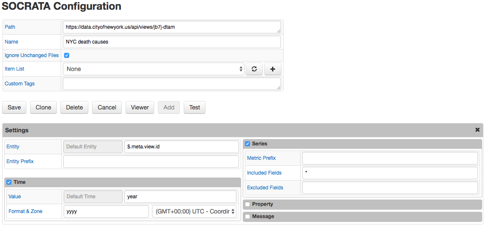

Weekly Change Log: January 23 - January 29, 2017
================================================

### ATSD

| Issue| Category    | Type    | Subject                                                                              |
|------|-------------|---------|--------------------------------------------------------------------------------------| 
| 3831 | api-rest    | Bug     | Fixed metric [`series`](/api/meta/entity/get.md#entity-get) request processing if series count exceeded 1000. Added a warning message to web UI when the threshold is reached. |
| 3825 | sql         | Bug     | Removed extra rows from the result set when the [`VALUE {n}`](/api/sql/examples/interpolate-extend.md#interpolate-with-extend) interpolation function was specified in a `GROUP BY` period clause. | 
| 3816 | UI          | Bug     | Fixed ordering of timestamps on the Interval tab on the [Series Statistics](/tree/collector-changes/changelogs/2017_03#issue-3680) page . Intervals smaller than the median minus standard deviation re now not displayed. | 
| 3813 | UI          | Bug     | Fixed 'series not found' issue when displaying series with multiple tags on the Series Statistics page. | 
| 3808 | metric      | Bug     | Corrected a defect where incorrect `NaN` count was shown on Series Statistics page. | 
| [3742](#issue-3742) | UI          | Feature | Added a `Text Column` button to the UI Export form. | 

### Collector

| Issue| Category    | Type    | Subject                                                                              |
|------|-------------|---------|--------------------------------------------------------------------------------------|
| 3823 | socrata     | Bug     | Added a record to Statistics Detail page to display tasks with active downloads. | 
| 3821 | socrata     | Bug     | Added 'Add Row Number' field to add an extra metric with the name `{prefix}row_number` added to series commands in case the data row doesn't contain any numeric columns. |
| 3820 | docker      | Bug     | Fixed missing 'path' entity tag for volumes. |
| 3819 | docker      | Feature     | Build volume label the container label instead of container name. | 
| [3818](#issue-3818) | socrata     | Feature | In `Test` mode, added a table displaying columns from the metadata section. | 
| 3812 | socrata     | Bug     | Removed `http` pool from the configuration tab. Now, only the dataset path will be displayed. | 
| 3811 | socrata     | Bug     | Fixed auto-complete defect affecting configuration form fields. | 
| 3810 | socrata     | Bug     | Updated settings so that if a field is specified in 'Custom Tags' and is not specified in 'Included Fields', it will not be sent as a metric.| 
| 3804 | socrata     | Bug     | Excluded `null` values from custom tags or any other fields in commands for both JSON and Socrata jobs. | 
| 3803 | socrata     | Bug     | Fixed issue where time fields were being stored as metrics. | 
| 3802 | socrata     | Bug     | Corrected issues with statistics display displaying inaccurate command counters. | 
| 3801 | socrata     | Bug     | Handle an error caused by trailing slashes in the Path field. | 
| 3799 | socrata     | Bug     | Removed form jitter. | 
| 3798 | socrata     | Bug     | Updated time parser for JSON and Socrata jobs to accept the `yyyyw` time format. | 
| 3793 | socrata     | Bug     | Added heuristics to the Socrata job. | 
| [3772](#issue-3772) | Socrata     | Feature | Created new Socrata job to query [Socrata](https://socrata.com/) data. |

## ATSD

### Issue 3742
--------------

A `Text Column` button was added to the user interface export form. By enabling this button, a text column will be displayed for data exported in CSV and HTML formats.   
     
Now, a [text value](/api/network/series.md#series-tags-text-value-messages) can be used to annotate a numeric observation without changing the series primary key. See 
[Issue 3480](/tree/master/changelogs/2017_02#issue-3480) for more information.      

## Collector

### Issue 3818
--------------

Columns which were added include (along with their sources):

* Name: from `meta.name`
* Field Name: from `meta.fieldNameData`
* Data Type: from `meta.dataTypeName`
* Render Type: from `meta.renderTypeName`
* Schema Type: should classify how this column is processed in our commands, e.g. Metric, Series Tag, Time, Property Type, etc.
* Included: should be `Yes` or `No` based on the Excluded/Included field rules.
* Largest Value: from `meta.cachedContents.largest`
* Smallest Value: from `meta.cachedContents.smallest`
* First Value: from `meta.cachedContents.top[0]['item']`
* Not Null Count: from `meta.cachedContents.not_null`
* Null Count: from `meta.cachedContents.null`
* Description: from `meta.description`

### Issue 3772
--------------

In order to more efficiently handle Socrata data, we created a new Socrata job. Previously, a Socrata format was provided in the JSON job. This format has been removed.
 
The basic structure of the new Socrata job is similar to the Socrata format from the JSON job. Changes were made in general to the user interface in Collector, in the form of several tooltips.

Additionally, when the `Name` field is empty on an unsaved `job-socrata-query` page and the user clicks the `Add` button, the `Name` will be set to the dataset name.

After creating the new Socrata job, JSON jobs with the Socrata format are converted to Socrata jobs using SQL scripts.

