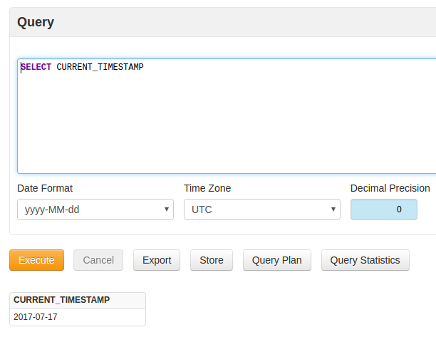
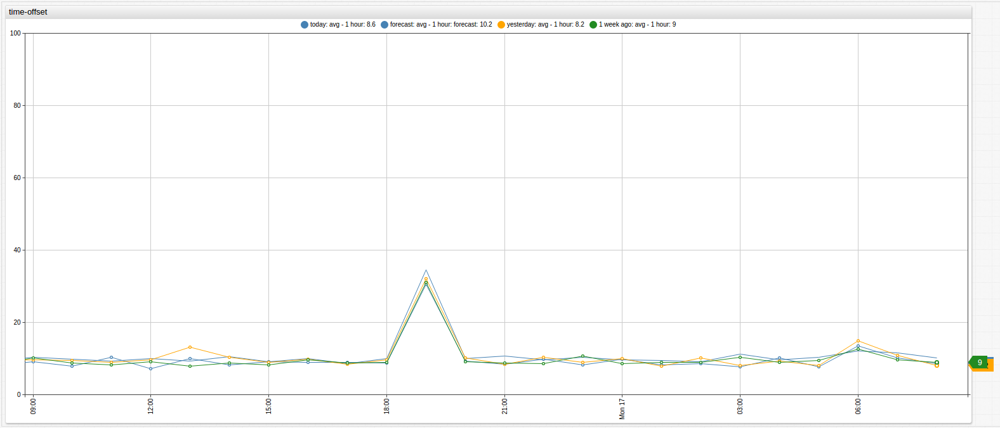
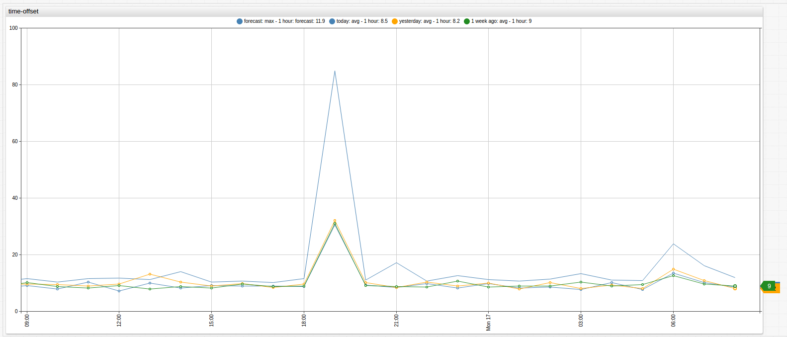
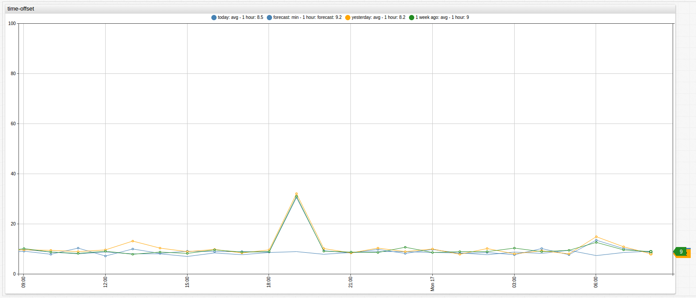
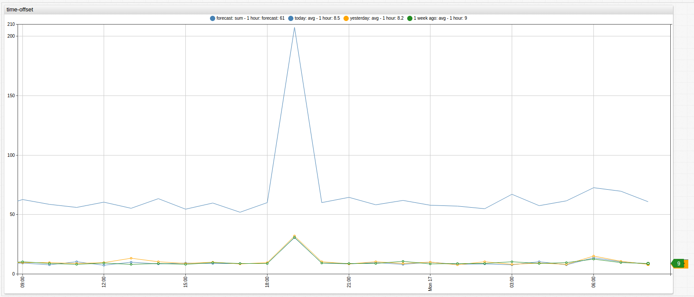
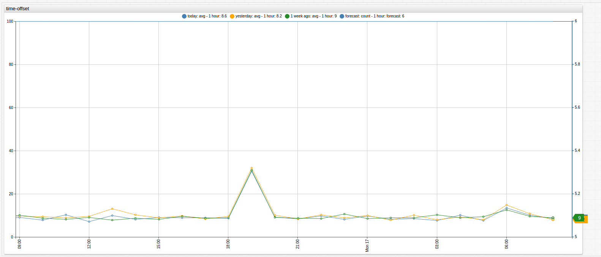

Weekly Change Log: July 10, 2017 - July 16, 2017
==================================================

### ATSD

| Issue| Category    | Type    | Subject              |
|------|-------------|---------|----------------------| 
| 4390 | sql | Bug | Fixed an error with [`CAST(time AS number)`](https://github.com/axibase/atsd/tree/master/api/sql#keywords)  |
| [4375](#Issue-4375) | sql | Feature | Added support for [`CURRENT_TIMESTAMP`](https://github.com/axibase/atsd/tree/master/api/sql#current_timestamp) function |
| [4360](#Issue-4360) | forecast | Feature | Added support for several aggregation functions in [Data Forecasting](https://axibase.com/products/axibase-time-series-database/forecasts/) mode |

### ATSD

##### Issue 4375

The `CURRENT_TIMESTAMP` function returns current database time in the ISO-8601 format. It is analogous to the [`NOW`](https://github.com/axibase/atsd/tree/master/api/sql#keywords)
function which returns current database time in Unix milliseconds.

##### Issue 4360

In **Configuration > Forecasts**, when declaring forecast parameters, use the dropdown to select desired aggregation statistic:

###### AVG

Averages the values during a period.

###### MAX 

Displays the maximum value during a period.

###### MIN

Displays the minimum value dueing a period.

###### SUM

Sums the values during a period.

###### COUNT 

Displays the number of samples for a period.

