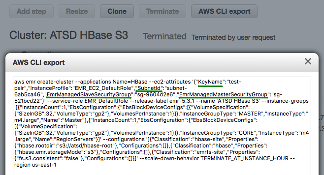
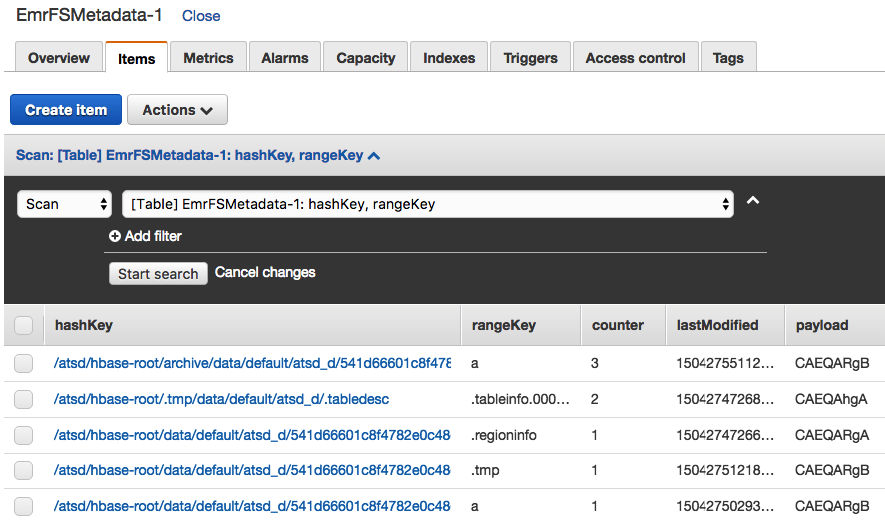

# Installation on AWS HBase S3

## Overview

Axibase Time Series Database can be deployed on HBase using [AWS S3](http://docs.aws.amazon.com/emr/latest/ReleaseGuide/emr-hbase-s3.html) as the underlying file system.

## Operational Advantages

* Storage and compute layers can be scaled independently to address a variety of use cases, including **small cluster/large dataset** scenario.
* The number of region servers can be dynamically adjusted based on auto-scaling rules.
* Simplified backup and recovery.
* Reduced storage footprint (no need for 3-x data replication and extra disk space required for HFile compactions).
* Increased resilience based on AWS S3 reliability and durability.
* Read-only cluster replicas.

The minimum cluster size supported by this installation option is **two** EC2 instances one of which is shared by the HBase Master and ATSD.

## Create S3 Bucket

The S3 bucket must be created prior to installation.  The bucket, named `atsd` in the example below, will store the HBase root directory containing both metadata and HFiles.

```sh
aws s3 mb s3://atsd
```

The HBase root directory will be created if necessary when the cluster is started for the first time. It will be not deleted when the cluster is stopped or terminated.

Check the contents of the bucket prior to launching the cluster.

```sh
aws s3 ls --summarize --human-readable --recursive s3://atsd
```

## Download Distribution Files

```sh
curl -o atsd-cluster.tar.gz https://axibase.com/public/atsd-cluster.tar.gz
```

```sh
tar -xvf atsd-cluster.tar.gz atsd/atsd-hbase*jar
```

## Upload ATSD Co-processor File to S3

The `atsd-hbase.$REVISION.jar` file contains ATSD co-processors and filters.

By storing the jar file in S3, Java classes in this file are automatically available to all region servers when they are started.

```sh
aws s3 cp atsd/atsd-hbase.*.jar s3://atsd/hbase-root/lib/atsd-hbase.jar
```

Verify that the jar file is stored in S3:

```sh
aws s3 ls --summarize --human-readable --recursive s3://atsd/hbase-root/lib
```

```
  2017-08-31 21:43:24  555.1 KiB hbase-root/lib/atsd-hbase.jar

  Total Objects: 1
    Total Size: 555.1 KiB
```

The `atsd-hbase.$REVISION.jar` should be stored in a directory identified by the `hbase.dynamic.jars.dir` setting in HBase. By default this directory resolves to `hbase.rootdir/lib`.

> When uploading the jar file to `hbase.rootdir/lib` directory, the revision is removed to avoid changing `coprocessor.jar` setting in ATSD when the jar file is replaced.

## Launch Cluster

Copy the AWS CLI cluster launch command into an editor.

```sh
export CLUSTER_ID=$(            \
aws emr create-cluster          \
--name "ATSD HBase"             \
--applications Name=HBase       \
--release-label emr-5.3.1       \
--output text                   \
--use-default-roles             \
--ec2-attributes KeyName=<key-name>,SubnetId=<subnet>     \
--instance-groups               \
  Name=Master,InstanceCount=1,InstanceGroupType=MASTER,InstanceType=m4.large     \
  Name=Region,InstanceCount=3,InstanceGroupType=CORE,InstanceType=m4.large       \
--configurations '[{
     "Classification": "hbase",
     "Properties": { "hbase.emr.storageMode": "s3" }
  },{
     "Classification": "hbase-site",
     "Properties": { "hbase.rootdir": "s3://atsd/hbase-root" }
  }]'              \
)
```

### Specify Network Parameters

Replace `<key-name>` and `<subnet>` parameters.

The `<key-name>` parameter corresponds to the name of the private key used to log in to cluster nodes.

The `<subnet>` parameter is required when launching particular instance types. To find out the correct subnet for your account, launch a sample cluster manually in the AWS EMR console and review the settings using AWS CLI export.

```ls
--ec2-attributes KeyName=ec2-pkey,SubnetId=subnet-6ab5ca46,EmrManagedMasterSecurityGroup=sg-521bcd22,EmrManagedSlaveSecurityGroup=sg-9604d2e6    \
```



### Specify Initial Cluster Size

Adjust EC2 instance types and total instance count for the `RegionServers` group as appropriate. Review [AWS documentation](http://docs.aws.amazon.com/emr/latest/ManagementGuide/emr-gs-launch-sample-cluster.html) for additional commands.

The cluster size can be adjusted at runtime.

The minimum number of nodes in each instance group is 1, therefore the smallest cluster can have two EC2 instances:

```
  Name=Master,InstanceCount=1,InstanceGroupType=MASTER,InstanceType=m4.large        \
  Name=Region,InstanceCount=1,InstanceGroupType=CORE,InstanceType=m4.large          \
```

### Enable Consistent S3 View

For long-running production clusters, enable [EMR Consistent View](http://docs.aws.amazon.com/emr/latest/ManagementGuide/emr-plan-consistent-view.html) which identifies inconsistencies in S3 object listings and resolves them using retries with exponential timeouts. When this option is enabled, the HBase metadata is also stored in a [DynamoDB](http://docs.aws.amazon.com/emr/latest/ManagementGuide/emrfs-metadata.html) table.

The checks are enabled by adding the `Consistent` setting to the launch command.

```ls
--emrfs Consistent=true,Args=[fs.s3.consistent.metadata.tableName=EmrFSMetadata]   \
```

Note that the EMR service does not automatically remove the specified DynamoDB table when the cluster is terminated. Delete the DynamoDB table manually after the cluster is shutdown. When running multiple clusters concurrently, ensure that each cluster uses a different DynamoDB table name to avoid collisions (default table name is `EmrFSMetadata`).



## Launch Cluster

Launch the cluster by executing the above command. The command returns a cluster ID and stores it as an environment variable.

## Verify HBase Status

### Log in to Master Node

Monitor cluster status until the bootstrapping process is complete.

```sh
watch 'aws emr describe-cluster --cluster-id $CLUSTER_ID | grep MasterPublic | cut -d "\"" -f 4'
```

Determine public IP address of the HBase Master node.

```
export MASTER_IP=$(aws emr describe-cluster --cluster-id $CLUSTER_ID | grep MasterPublic | cut -d "\"" -f 4) \
&& echo $MASTER_IP
```

Specify path to private ssh key and log in to the node.

```sh
ssh -i /path/to/<key-name>.pem -o StrictHostKeyChecking=no hadoop@$MASTER_IP
```

Wait until HBase services are running on the HMaster node.

```sh
watch 'initctl list | grep hbase'
```

```
  hbase-thrift start/running, process 8137
  hbase-rest start/running, process 7842
  hbase-master start/running, process 7987
```

Verify HBase version (1.2.3+) and rerun the status command until the cluster becomes operational.


```sh
echo "status" | hbase shell
```

Wait until the cluster is initialized and the "Master is initializing" error is no longer displayed.

```
status
1 active master, 0 backup masters, 4 servers, 0 dead, 1.0000 average load
```

## Install ATSD

Log in to the server where ATSD will be installed.

```sh
ssh -i /path/to/<key-name>.pem ec2-user@$PUBLIC_IP
```

> For testing and development, you can install ATSD on the HMaster node.

Verify that [JDK 8](../administration/migration/install-java-8.md) is installed on the server.

```sh
javac -version
java version
```

Change to a volume with at least 10GB of available disk space.

```sh
df -h
```

```sh
cd /mnt
```

Download ATSD distribution files.

```sh
curl -o atsd-cluster.tar.gz https://axibase.com/public/atsd-cluster.tar.gz
```

```sh
tar -xvf atsd-cluster.tar.gz
```

Set Path to Java 8 in the ATSD start script.

```sh
JP=`dirname "$(dirname "$(readlink -f "$(which javac || which java)")")"` \
&& sed -i "s,^export JAVA_HOME=.*,export JAVA_HOME=$JP,g" atsd/atsd/bin/start-atsd.sh \
&& echo $JP
```

Set Path to ATSD coprocessor file.

```sh
echo "coprocessors.jar=s3://atsd/hbase-root/lib/atsd-hbase.jar" >> atsd/atsd/conf/server.properties \
&& grep atsd/atsd/conf/server.properties -e "coprocessors.jar"
```

If installing ATSD on HMaster node where ports might be taken, replace the default ATSD port numbers to 9081, 9082, 9084, 9088, 9443, respectively.

```sh
sed -i 's/=.*80/=90/g; s/=.*8443/=9443/g' atsd/atsd/conf/server.properties \
&& grep atsd/atsd/conf/server.properties -e "port"
```

Check memory usage and increase ATSD JVM memory to 50% of total physical memory installed in the server, if available.

```sh
free
```

```sh
nano atsd/atsd/conf/atsd-env.sh
JAVA_OPTS="-server -Xmx4000M -XX:+HeapDumpOnOutOfMemoryError -XX:HeapDumpPath="$atsd_home"/logs"
```

Open Hadoop properties file and specify HMaster hostname.

```sh
nano atsd/atsd/conf/hadoop.properties
```

```sh
# localhost if co-installing ATSD on HMaster
hbase.zookeeper.quorum = 10.50.0.102
```

Start ATSD.

```sh
./atsd/atsd/bin/start-atsd.sh
```

Monitor startup progress using the log file.

```
tail -f atsd/atsd/logs/atsd.log
```

It may take ATSD several minutes to create tables after initializing the system.

```
...
2017-08-31 22:10:37,890;INFO;main;org.springframework.web.servlet.DispatcherServlet;FrameworkServlet 'dispatcher': initialization completed in 3271 ms
...
2017-08-31 22:10:37,927;INFO;main;org.eclipse.jetty.server.AbstractConnector;Started SelectChannelConnector@0.0.0.0:9088
2017-08-31 22:10:37,947;INFO;main;org.eclipse.jetty.util.ssl.SslContextFactory;Enabled Protocols [TLSv1, TLSv1.1, TLSv1.2] of [SSLv2Hello, SSLv3, TLSv1, TLSv1.1, TLSv1.2]
2017-08-31 22:10:37,950;INFO;main;org.eclipse.jetty.server.AbstractConnector;Started SslSelectChannelConnector@0.0.0.0:9443
```

Login to the ATSD web interface on https://atsd_hostname:8443. Modify the port to `9443` if port settings were previously replaced.


## Troubleshooting

### Port Access

Make sure that the Security Group associated with the EC2 instance where ATSD is running allows access to ATSD listening ports.

If necessary, add security group rules to open inbound access to ports `8081`, `8082/udp`, `8084`, `8088`, `8443` or `9081`, `9082/udp`, `9084`, `9088`, `9443` respectively.

### ATSD Shutdown

ATSD requires a license file when connected to an HBase cluster.

Open **Settings > License** page and generate a license request.

Once the license file is processed by Axibase, start ATSD, open **Settings > License** page and import the license.

```sh
./atsd/atsd/bin/start-atsd.sh
```

### Missing ATSD Coprocessor File

```ls
017-09-01 13:44:30,386;INFO;main;com.axibase.tsd.hbase.SchemaBean;Set path to coprocessor: table 'atsd_d', coprocessor com.axibase.tsd.hbase.coprocessor.CompactEndpoint, path to jar s3://atsd/hbase-root/lib/atsd-hbase.jar
2017-09-01 13:44:30,387;INFO;main;com.axibase.tsd.hbase.SchemaBean;Set path to coprocessor: table 'atsd_d', coprocessor com.axibase.tsd.hbase.coprocessor.DeleteDataEndpoint, path to jar s3://atsd/hbase-root/lib/atsd-hbase.jar
...
2017-09-01 13:44:30,474;WARN;main;org.springframework.context.support.ClassPathXmlApplicationContext;Exception encountered during context initialization - cancelling refresh attempt: org.springframework.beans.factory.BeanCreationException: Error creating bean with name 'series.batch.size' defined in URL [jar:file:/mnt/atsd/atsd/bin/atsd.17245.jar!/applicationContext-properties.xml]: Cannot resolve reference to bean 'seriesPollerHolder' while setting bean property 'updateAction'; nested exception is org.springframework.beans.factory.BeanCreationException: Error creating bean with name 'seriesPollerHolder': Injection of resource dependencies failed; nested exception is org.springframework.beans.factory.BeanCreationException: Error creating bean with name 'serverOptionDaoImpl': Injection of resource dependencies failed; nested exception is org.springframework.beans.factory.BeanCreationException: Error creating bean with name 'schemaBean': Invocation of init method failed; nested exception is org.apache.hadoop.hbase.DoNotRetryIOException: org.apache.hadoop.hbase.DoNotRetryIOException: No such file or directory: 'hbase-root/lib/atsd-hbase.jar' Set hbase.table.sanity.checks to false at conf or table descriptor if you want to bypass sanity checks
```

Check the `coprocessors.jar` setting.

```sh
grep atsd/atsd/conf/server.properties -e "coprocessors.jar"
```

Check that the file is present in S3.

```sh
aws s3 ls --summarize --human-readable --recursive s3://atsd/hbase-root/lib
```

```
  2017-08-31 21:43:24  555.1 KiB hbase-root/lib/atsd-hbase.jar

  Total Objects: 1
    Total Size: 555.1 KiB
```

If necessary, copy the file.

```sh
aws s3 cp atsd/atsd-hbase.*.jar s3://atsd/hbase-root/lib/atsd-hbase.jar
```

Restart the HBase cluster, both HMaster and Region Servers, restart ATSD.
