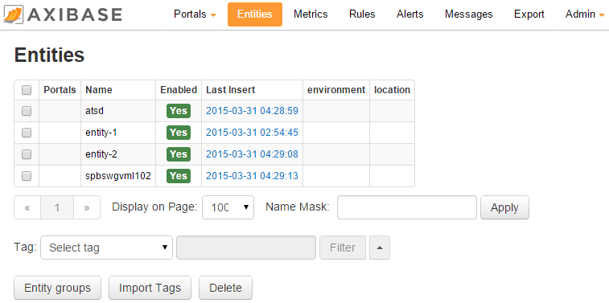

# Installing Axibase Time-Series Database on MapR


Download the MapR M3 distribution and follow the installation
instructions from the MapR M3 website:
[https://www.mapr.com/products/hadoop-download](https://www.mapr.com/products/hadoop-download)
to install MapR Community Edition.

Recommendations for installing MapR M3:

-   When MapR installer asks “Is this cluster going to run Apache
    HBase”, be sure to answer “y”
-   Be sure to allocate at least the minimum recommended RAM amount and
    Hard Drive space for MapR
-   We recommend to install MapR on a separate Hard Drive in order to
    avoid issues down the line

## ATSD Installation

Copy ATSD distribution archive to the target machine:

```sh
 /opt/atsd.tar.gz                                                         
```

Unpack the package:

```sh
 cd /opt                                                                  
 tar -xzvf atsd.tar.gz                                                    
```

Stop the HBase process:

```sh            
 sudo service mapr-warden stop                                            
```

Copy atsd.jar file containing coprocessors to the hbase/lib directory:

```sh
 cp /opt/atsd/hbase/lib/atsd.jar /opt/mapr/hbase/hbase-0.94.24/lib/       
```

Start HBase. Make sure that all services are started, it may take a few
minutes:

```sh
 sudo service mapr-warden start                                           
```

Start HBase master and regionserver services:

```sh
 /opt/mapr/hbase/hbase-0.94.24/bin/hbase-daemons.sh --config /opt/mapr/hb 
 ase/hbase-0.94.24/conf start master                                      
 /opt/mapr/hbase/hbase-0.94.24/bin/hbase-daemons.sh --config /opt/mapr/hb 
 ase/hbase-0.94.24/conf start regionserver                                
```

Modify ATSD configuration files to avoid port conflict with MapR
services:

```sh
 echo "hbase.zookeeper.property.clientPort = 5181" >> /opt/atsd/atsd/conf 
 /hadoop.properties                                                       
 sed -i "s/http.port = 8088/http.port = 8099/g" /opt/atsd/atsd/conf/serve 
 r.properties                                                             
```

Start ATSD:

```sh
 /opt/atsd/atsd/bin/start-atsd.sh                                         
```

Verify that ATSD web interface is available at http://atsd\_server:8099

## Verifying Data Insertion

Open the SSH console on a computer, other than ATSD, and insert the data
into the ATSD via telnet:

```sh
 telnet "atsd_server" 8081                                                
```

For example:

```sh
 telnet 10.102.0.6 8081                                                   
 series e:entity-2 m:metric-2=123                                         
```

To verify the telnet test, open the ATSD web interface again and check
that the new entity, ‘entity-2′, was added on the Entities tab. Note
that insert command returns no output.

The new entity, enitity-2, should be present under the Entities tab.



## Verifying ATSD Portals

Using your browser, navigate to the Portals tab in the ATSD web
interface.

A pre-defined portal consisting of 12 widgets should be visible and
should display various system usage metrics for the machine where the
ATSD is installed.


## Optional Steps

Verifying System Time

> Open Admin \> Server Time tab in the ATSD web interface and verify the
time and timezone information.

Modify system time or setup NTP in order to keep the server time
accurate.


Network Settings

If you’re anticipating high data insertion rate with bursts of 100000
packets per second or more, increase maximum receiving buffer on Linux
OS: [Read Network Settings
Guide](../administration/networking-settings.md "Network Settings")

### Setting up the Email Client

See [Setting up the Email Client
guide](../administration/setting-up-email-client.md "Email Client").

### Updating ATSD

```sh
 /opt/atsd/bin/update.sh
```

See [Updating ATSD
guide](../administration/update.md "Update ATSD").

### Restarting ATSD

See [Restarting ATSD
guide](../administration/restarting.md "Restarting ATSD").

### Uninstalling ATSD

See [Uninstalling ATSD
guide](../administration/uninstalling.md "Uninstalling ATSD").