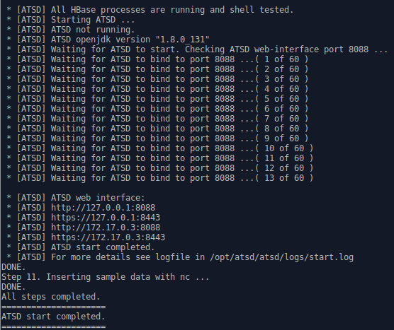

# Installation from RPM Package


This installation requires RedHat Enterprise Linux, CentOS, and Amazon
Linux versions 6.x, 7.x

Make sure that the target machine has at least 1 GB of RAM. For
production installations see
[Requirements](../administration/requirements.md "ATSD Requirements")

If the target machine does not have Internet connection to download
dependencies, use the [Manual ATSD Installation guide](../administration/update-manual.md "Manual ATSD Installation").

```sh
 sudo yum install java-1.7.0-openjdk-devel openssh-server cronie sysstat  
 sed passwd iproute net-tools                                             
```

```sh
 sudo rpm -i atsd_ce_8645_amd64.rpm                                       
```

If some of the above dependencies are not found, for example in case of
installation on new systems, perform `sudo yum update` to upgrade all
packages on your operating system to the latest versions.

## Verifying Installation

At the end of the installation, the installer displays the list of IPs
and ports (8088, 8443) of the ATSD web interface.



Open your browser and navigate to port `8088` on the target machine.

When accessing the ATSD web interface for the first time, you will need
to setup an administrator account.

## Verifying ATSD Portals

Click on Portals tab in the ATSD web interface.

Open pre-defined ‘ATSD’ portal to view key operating system and database
metrics.


## Installation Troubleshooting

If ATSD web interface is not accessible, open its log file and review it
for errors.

Send the log file to Axibase support in case the problem is persistent
and cannot be fixed with a restart.

```sh
 tail -f /opt/atsd/atsd/logs/atsd.log                                     
```