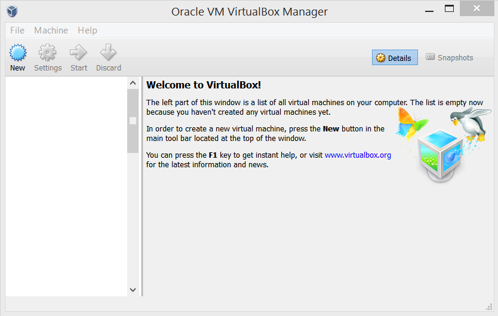
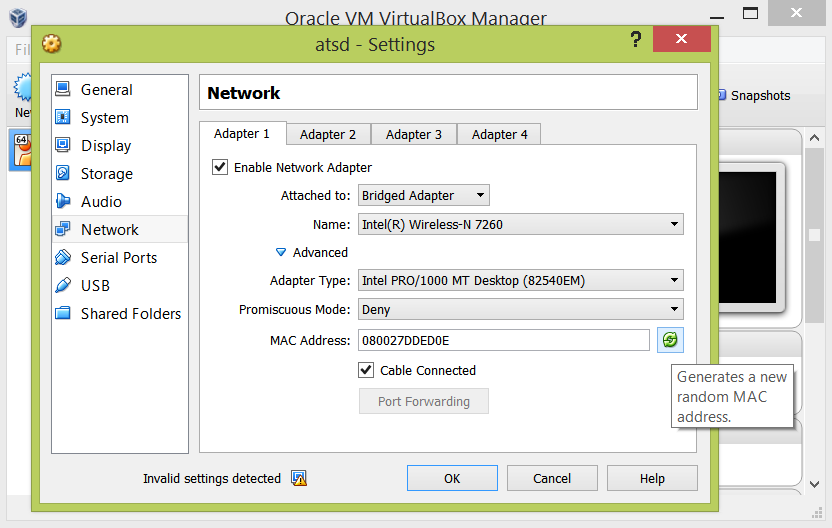
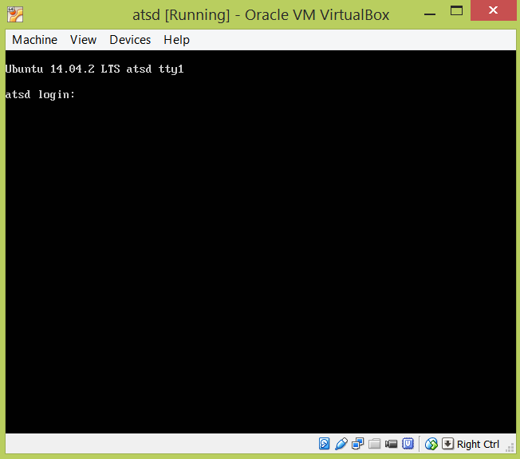
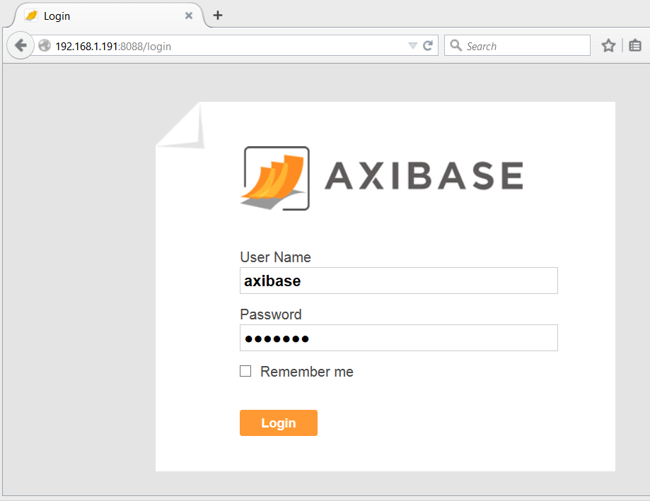

# Install in Oracle VirtualBox


ATSD can be installed by importing an .ova image in VirtualBox. This
method automatically creates a virtual machine running Ubuntu 14.04
64bit LTS with ATSD and dependencies pre-installed and fully configured.
The process take a few minutes with minimal input required from the
user, this is the easiest and fastest way to install ATSD.

## Prerequisites

To setup the ATSD virtual machine in VirtualBox you must have the
following resources available to you:

Requirements:

-   A 64-bit machine with a processor that supports virtualization. Note
    that not all 64-bit processors have this capability.
-   Have virtualization enabled in your BIOS, this is normally enabled
    by default, but in some cases you may have to enter your system bios
    manually to enable virtualization.
-   At least 4 GB of RAM on Host Machine and at least 1 GB of RAM
    allocated to the Virtual Machine.

[Download the latest version of VirtualBox
here.](https://www.virtualbox.org/wiki/Downloads)

## Installing ATSD in Oracle VirtualBox

​1. Open Oracle VirtualBox



​2. Navigate to File –\> Import Appliance


​3. Open the atsd .ova file and click next. For example:
atsd\_ce\_8760.ova


​4. Confirm the Appliance setting by clicking Import, read the Software
License Agreement in the pop-up window, select Agree to continue.


​5. Wait for the Appliance to be imported.


​6. Navigate to Settings –\> System to allocate at least 1 GB of RAM to
the Virtual Machine. Under the Processor tab allocate at least 1 CPU to
the Virtual Machine.


​7. Navigate to Settings –\> Network, set Attached to: Bridged Adapter,
if the Virtual Machine does not start with this setting, then change
this setting to Host-only Adapter. Click on Generate new MAC Address, to
generate a new MAC address for the VM.



​8. Start the Virtual Machine, wait for ATSD and components to start.


​9. Login to the Virtual Machine:

**username = `axibase`**

**password = `axibase`**

**`axibase` user is a sudoer.**



​10. Check the IP address of the VM:

```sh
 ip addr                                                                  
```


​11. Use your browser to navigate to atsd\_server:8088. For example:
192.168.1.191:8088. Login to ATSD, username = axibase and password =
axibase.



## Verifying ATSD Portals

Using your browser, navigate to the Portals tab in the ATSD web
interface.

A pre-defined portal consisting of 12 widgets should be visible and
should display various system usage metrics for the machine where the
ATSD is installed.


## Optional Steps

Verifying System Time

> Open Admin \> Server Time tab in the ATSD web interface and verify the
time and timezone information.

Modify system time or setup NTP in order to keep the server time
accurate.


Network Settings

If you’re anticipating high data insertion rate with bursts of 100000
packets per second or more, increase maximum receiving buffer on Linux
OS: [Read Network Settings
Guide](../administration/networking-settings.md "Network Settings")

### Setting up the Email Client

See [Setting up the Email Client
guide](../administration/setting-up-email-client.md "Email Client").

### Updating ATSD

```sh
 /opt/atsd/bin/update.sh
```

See [Updating ATSD
guide](../administration/update.md "Update ATSD").

### Restarting ATSD

See [Restarting ATSD
guide](../administration/restarting.md "Restarting ATSD").

### Uninstalling ATSD

See [Uninstalling ATSD
guide](../administration/uninstalling.md "Uninstalling ATSD").
