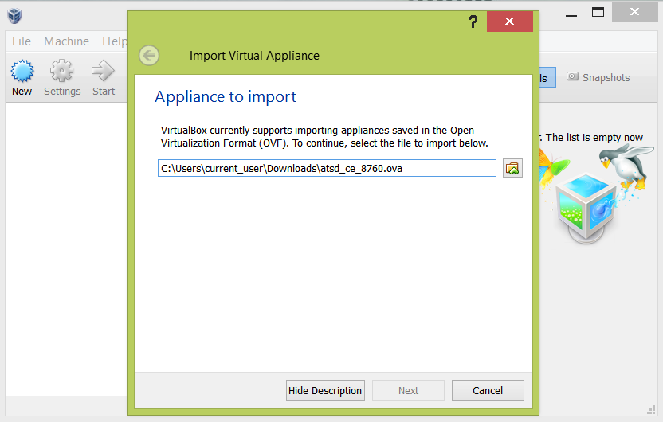
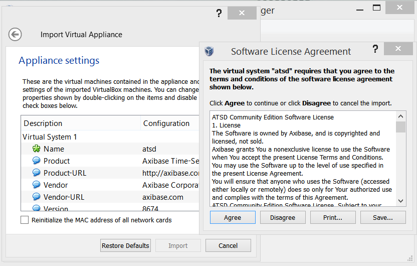
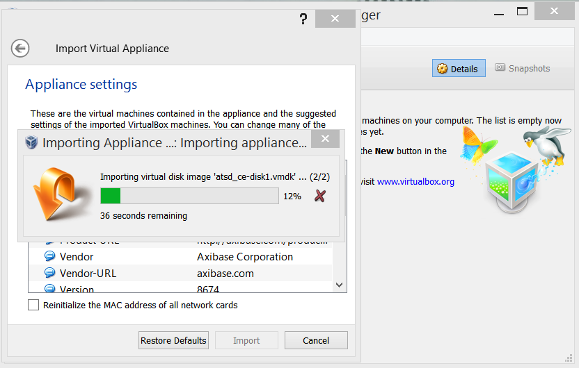
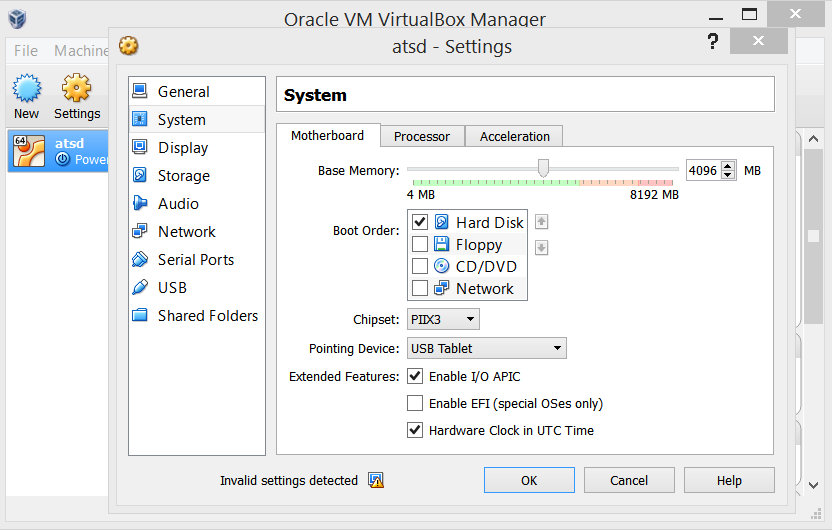
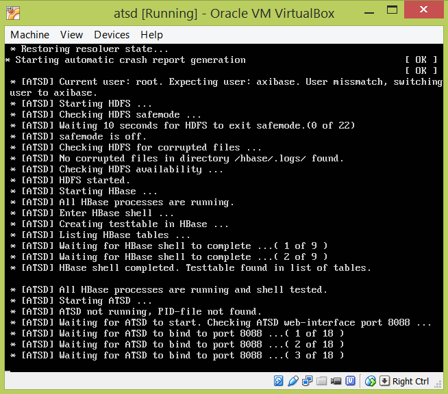

# ATSD Installation in Oracle VirtualBox

## Overview

ATSD can be installed by importing an `.ova` image in [Oracle VirtualBox](https://www.virtualbox.org/). This
method creates a virtual machine running Ubuntu 14.04
64bit LTS with ATSD and dependencies pre-installed and fully configured.
The process takes a few minutes with minimal input required from the
user. 

## Download

* Download the latest version of [Oracle VirtualBox](https://www.virtualbox.org/wiki/Downloads), if necessary.
* Download the latest OVA image from [https://axibase.com/public/atsd_ce.ova](https://axibase.com/public/atsd_ce.ova)

## Prerequisites

To setup the ATSD virtual machine in VirtualBox you must have the
following resources available:

-   A 64-bit machine with a processor that supports virtualization. Note
    that not all 64-bit processors have this capability.
-   Have virtualization enabled in your BIOS. This is normally enabled
    by default, but in some cases you may have to enter in your system BIOS
    manually to enable virtualization.
-   At least 4 GB of RAM on the host machine and at least 1 GB of RAM
    allocated to the virtual machine.

## Installing ATSD in Oracle VirtualBox

1. Open Oracle VirtualBox.

2. Open **File > Import Appliance**.


3. Select the downloaded ATSD `atsd_ce_*.ova` file and click **Next**.



4. Confirm the Appliance settings by clicking Import. Read the 
License Agreement in the pop-up window. Click **Agree** to continue.



5. Wait for the Appliance to be imported.



6. Open **Settings > System** and allocate at least 1 GB of RAM and 1 virtual CPU to
the virtual machine.



7. Open **Settings > Network**. Set Attached to: **Bridged Adapter**.
If the virtual machine does not start with this setting, click on 'Generate new MAC Address'/'Reinitialize MAC Address' to
generate a new MAC address for the virtual machine.


8. Start the virtual machine. Wait for ATSD to start.



9. Login to the virtual machine console:

  ```
  username = axibase
  password = axibase
  ```

    > `axibase` user is a sudoer.


10. Check the IP address of the virtual machine:

```sh
 ip addr                                                                  
```


11. Use your browser to navigate to `https://atsd_ip_address:8443`. For example:
`https://192.168.1.191:8443`.


12. Create an administrative account and re-login into ATSD web interface using these credentials.


## Validation

* [Verify database installation](verifying-installation.md).

## Post-installation Steps

* [Basic configuration](post-installation.md).
* [Getting Started guide](../tutorials/getting-started.md).
