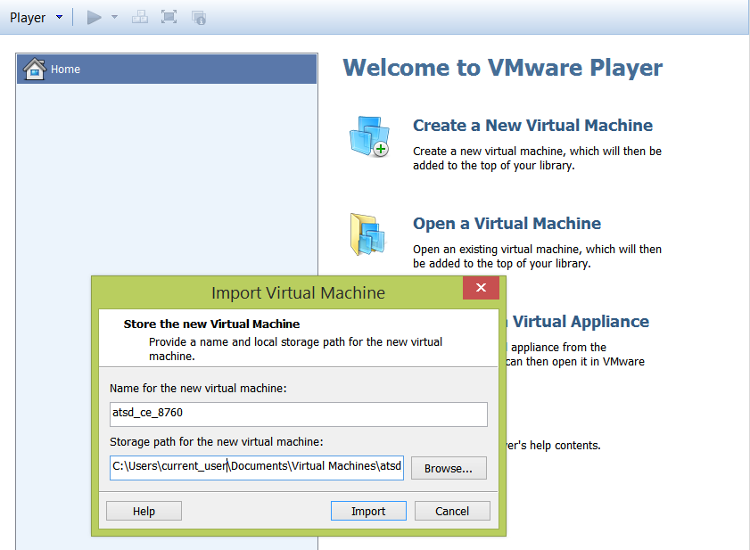
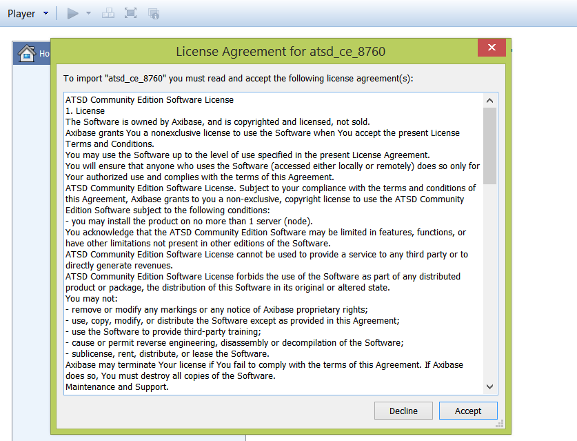
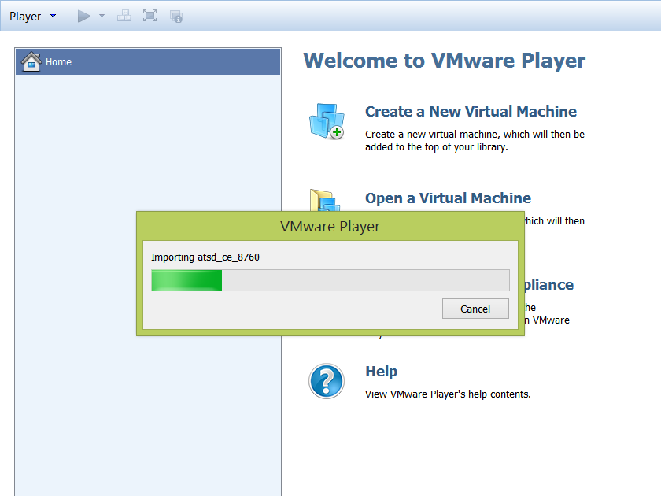
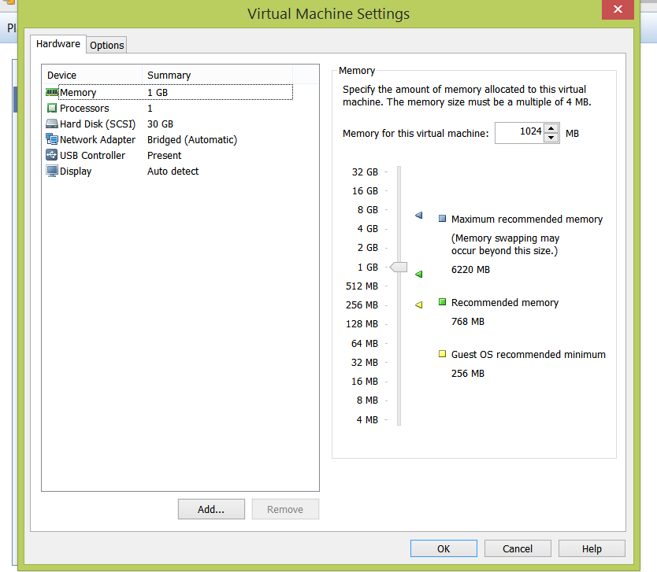
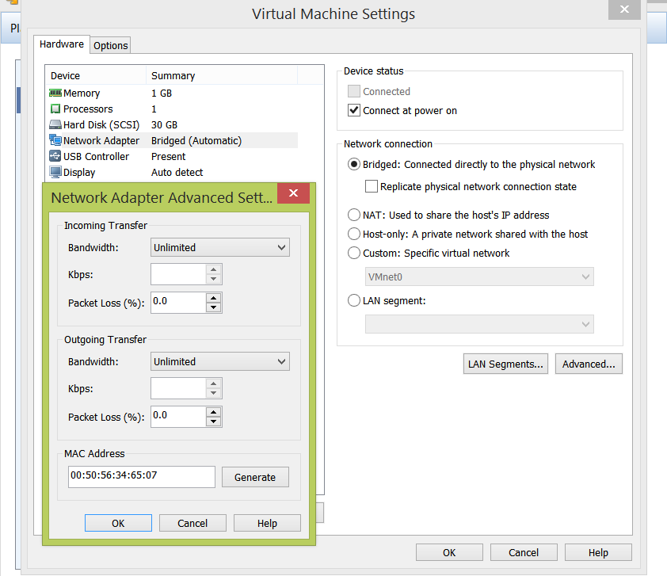
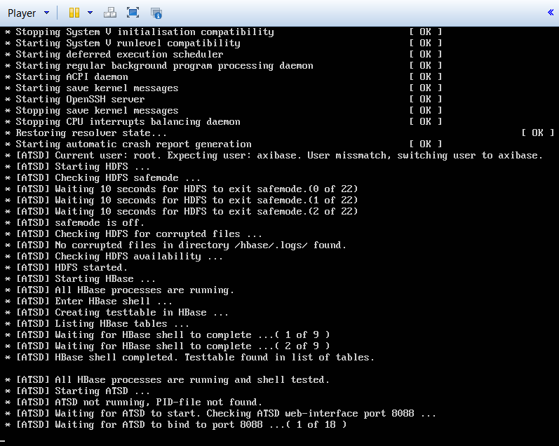
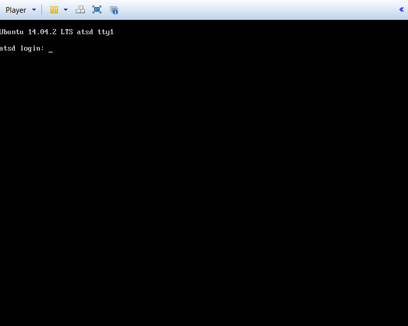
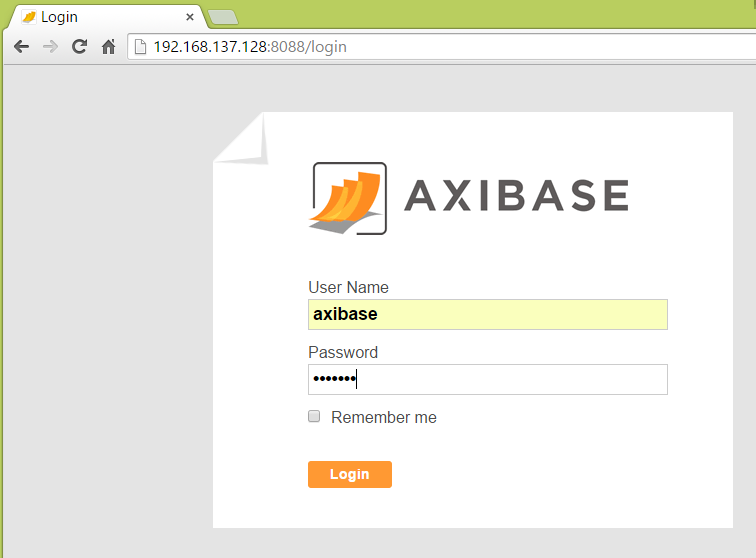

# ATSD Installation on VMware

## Overview

ATSD can be installed by importing an `.ova` image in VMware Fusion,
VMware Workstation, VMware ESXi Server, VMware vSphere Hypervisor, and
VMware Player. This method automatically creates a virtual machine
running Ubuntu 14.04 64bit LTS with ATSD and dependencies pre-installed
and fully configured. The process takes a few minutes with minimal input
required from the user. This is the easiest and fastest way to install
ATSD.

## Download

* [axibase.com](https://axibase.com/public/atsd_ce.ova)

## Prerequisites

To setup the ATSD virtual machine in VMware you must have the following
resources available:

-   A 64-bit machine with a processor that supports virtualization. Note
    that not all 64-bit processors have this capability.
-   Have virtualization enabled in your BIOS. This is normally enabled
    by default, but in some cases you may have to enter your system bios
    manually to enable virtualization.
-   At least 4 GB of RAM on the host machine and at least 1 GB of RAM
    allocated to the virtual machine.

## Installing ATSD in VMware Player

​1. Open VMware.


​2. Click on: Open a virtual machine. Then select the `atsd\_ce\_8760.ova`
file.



​3. Click: Import. Read and accept the License Agreement for ATSD in the
popup window.



​4. Wait for the virtual machine to be imported into VMware.



​5. Navigate to: Edit virtual machine settings. Allocate at least 1 GB
of RAM and at least 1 CPU to the virtual machine.



​6. Under Network Adapter select Bridged. If the virtual machine does
not start with this setting, then change this setting to Host-only.
Click on Advanced and generate a new MAC address for the virtual machine.



​7. Start the virtual machine by clicking on: Play virtual machine. Wait
for ATSD and Components to start.



​8. Login to the virtual machine:

**username = `axibase`**

**password = `axibase`**

**`axibase` user is a sudoer.**



​9. Check the IP address of the VM:

```sh
 ip addr                                                                  
```


​10. Use your browser to navigate to `atsd_hostname:8088`. For example:
`192.168.137.128:8088`. Login to ATSD, username = axibase and password =
axibase.



## Validation

* [Verify database installation](verifying-installation.md).

## Post-installation Steps

* [Basic configuration](post-installation.md).
* [Getting Started guide](../tutorials/getting-started.md).
