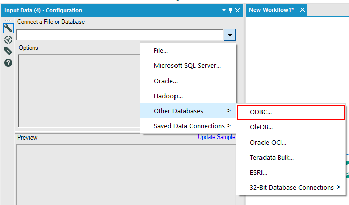
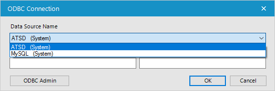
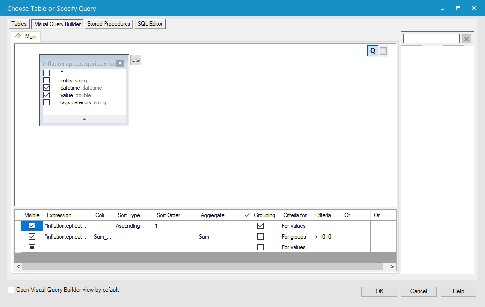
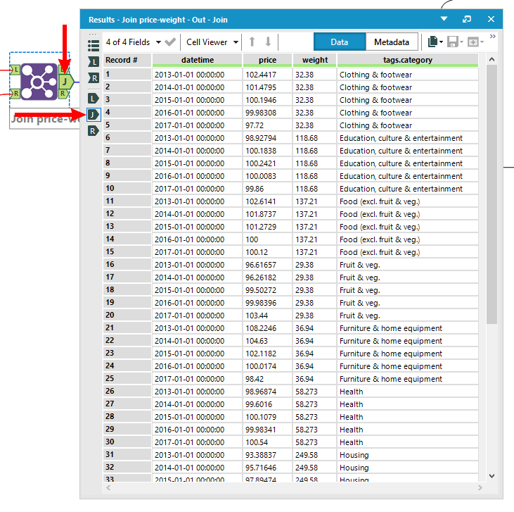
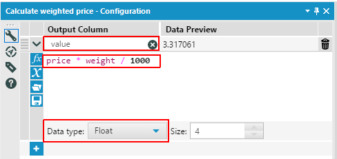

# Alteryx Designer


## Overview

Alteryx Designer is a graphical design environment to create and edit ETL
(Extract, Transform, Load) workflows. The following guide includes examples of
loading time series data from the Axibase Time Series Database (ATSD),
calculating derived time series in Alteryx and storing the results back in ATSD.

## Sample Dataset

For these instructions we will use [sample series commands](resources/commands.txt).
The series contain the Consumer Price Index (CPI) for each category
of items in a consumer's basket as well as a weight for each category in the CPI
basket. The weights are stored as fractions of 1000. The CPI is tracked from 2013 to
2017 and uses Year 2016 values as the baseline. Weight values are available only for
year 2017.

To load the data into ATSD, login into the database web interface and submit
these commands on the **Metrics > Data Entry** page.


## Prerequisites

- Install Alteryx Designer
- Install [ODBC-JDBC gateway](../odbc/README.md).

## Create Database Connection

- Add the **Input Data** tool to your workflow.

  

- Choose **Other Databases > ODBC...** in the Input Data configuration window.
- Open **ODBC Connection** dialog.

  

  

- Open the **ODBC Data Source Administrator** window by pressing the **ODBC Admin** button in the **ODBC Connection** dialog.

- Configure the datasource as described [here](../odbc/README.md#configure-odbc-data-source).

- Add `tables` property into the DSN URL to filter metrics by name in the Query
  Builder. For example, `tables=*` exposes all metrics whereas `tables=infla*`
  shows all metrics that start with 'infla' substring.

  ```text
  jdbc:axibase:atsd:ATSD_HOST:8443;tables=*
  ```

> Read more about the `table` property in the [JDBC driver](https://github.com/axibase/atsd-jdbc#jdbc-connection-properties-supported-by-driver) documentation.

- Uncheck the **Strip Quote** flag and press **OK**.

  

- Select the name you specified for DSN during bridge configuration from the **Data
  Source Name** list and press **OK**.

  

## Building Queries

After creating a connection you will see the **Choose Table or Specify Query** dialog.


It allows you build the query by choosing a table with columns or entering query
text manually.

- Table names visible in the **Tables** tab satisfy the `tables` pattern
  specified in the DSN URL. Click the **Refresh** button to reload the list, if
  necessary.

  

- In the **Visual Query Tab**, you can specify particular columns and add optional
  sorting and grouping to preview and prepare your
  data before processing it in workflow. Below is a SQL query and a corresponding
  configuration.

  ```sql
   SELECT datetime, sum(value) AS sum_value
       FROM inflation.cpi.categories.price
       GROUP BY datetime
       HAVING sum_value > 1010
       ORDER BY datetime
  ```

  

- The **SQL Editor** allows you to review and modify pre-built queries or write
  your own queries.

- The **Test Query** button truncates the query and sends only the remaining
  `SELECT ... FROM ...` expression to the database for validation.

  

Press **OK** when the query is ready for processing.

### Check Query Results

Press **Run Workflow**, to see the result of the query.


## Calculate and Store Derived Series

This section demonstrates how to create an Alteryx Designer workflow that uses existing
data in ATSD to produce new series and then store these series back in ATSD.
To calculate a weighted inflation index we multiply the CPI of each category by
its weight divided by 1000 and sum the products.

The resulting workflow will be implemented as follows:


The workflow consists of the following steps (nodes):

1. **Input Data** tool.
   Repeat the steps in the previous section for this tool, choose
   `inflation.cpi.categories.price` table. Select `datetime`,
   `value` columns and manually add `tags.category` as shown below.

   

2. **Input Data** tool. Follow the same procedure as above for the
   `inflation.cpi.categories.weight` table.

3. **Filter** tool. Specify the condition `>= January 1st, 2010`
   and use the **T** (_true_) node output to retrieve the series created after 2009 only.

   

   

4. **Filter** tool. Follow the same procedure as above.

5. **Join** tool. Join prices and weights by `tags.category` field. Deselect
   fields as shown on the image. Rename `value` fields for
   `inflation.cpi.categories.price` and `inflation.cpi.categories.weight` to
   `price` and `weight` respectively.

   

   > **Note**
   >
   > To check input or output of any node, _run the workflow_ and click its
   > input/output.
   >
   > 

6. **Formula** tool. Connect its input to the **J** (_inner join_)
   output of the **Join** node. Next, create a new column named `value` to
   store the result. Fill in the expression to calculate it, and specify the
   correct data type.

   

   

7. **Summarize** tool. Select fields from above to get the actions list as shown
   below on the image. Input `value` into  **Output Field Name**.

   

8. **Sort** tool. Apply it to sort records by date.

   

9. **Formula** tool. Add an `entity` column with the **Formula** tool. Name it
   `bls.gov`. The default data type `V_WString` is not supported yet by the ATSD JDBC driver,
   use `String` or `WString` (for Unicode) instead.

   

10. **Output Data** tool. Choose ODBC Connection as before and enter a name for
    the new metric, in this case `inflation.cpi.composite.price`.
    Edit **Output Options** in the configuration dialog.

    

    

11. **Browse** tool. View the final result.

Press **Run Workflow**.

The data will be retrieved from the database, processed in Designer by the workflow
with new series stored back in the database. Click **Browse** node.

   
