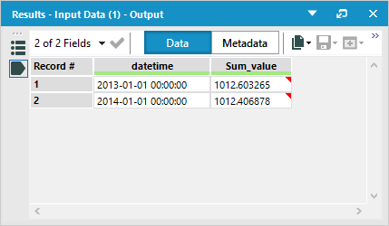
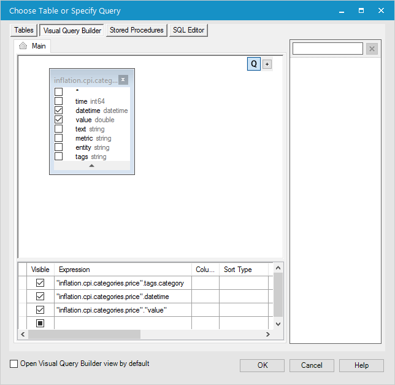
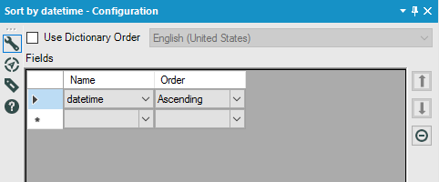
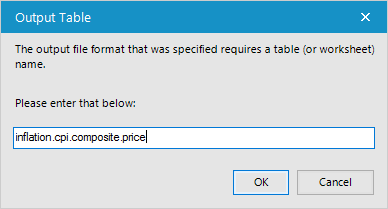
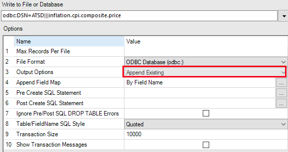

# Alteryx Designer

- [Overview](#overview)
- [Sample dataset](#sample-dataset)
- [Create database connection](#create-database-connection)
- [Build SQL query to database](#build-sql-query-to-database)
- [Calculate and store a derived series](#calculate-and-store-derived-series)

## Overview

Alteryx Designer is a graphical design environment to create and edit ETL
(Extract, Transform, Load) workflows. The following guide includes examples of
loading time series data from the Axibase Time Series Database (ATSD),
calculating derived time series in Alteryx and storing the results back in ATSD.

## Sample dataset

For these instructions we will use [this dataset](resources/commands.txt)
as an example. The series contain the Consumer Price Index (CPI) for each category
of items in a consumer's basket as well as a weight for each category in the CPI
basket. The weights are stored as fractions of 1000. The CPI is tracked from 2013 to
2017 and uses Year 2016 values as the baseline. Weight values are available only for.
One of the ways to load dataset into ATSD is to send these commands with
**Metrics→Data Entry** in ATSD web interface.


## Create database connection

- Add the **Input Data** tool to your workflow

  

- Choose **Other Databases→ODBC...** in the Input Data configuration to
  open the **ODBC Connection** dialog.

  

  

- Install [ODBJ-JDBC gateway](../odbc/README.md).

- Open the **ODBC Data Source Administrator**
  window by pressing the **ODBC Admin** button in the **ODBC Connection** dialog.
  Fill in the fields as described
  [here](../odbc/README.md#configure-odbc-data-source).

- Add `tables` property into the DSN URL of the dialog. It allows you choose a
  table from the metrics list that satisfies some pattern. For example this URL
  ```text
  jdbc:axibase:atsd:atsd_host:8088;secure=false;tables=*
  ```
  allows to view all the metrics available in a given ATSD instance at the
  host with `atsd_host` name.
  Read more about the `table` property in the [JDBC driver](https://github.com/axibase/atsd-jdbc#jdbc-connection-properties-supported-by-driver) documentation.

- Check the **Strip Quote** flag in the same dialog and press **OK**.

  

- Choose the name you specified for DSN during bridge configuration from the **Data
  Source Name** list and press **OK**.

  

> **Note:**
> In this example, `tables=inflation.*`

## Building SQL query to database

After creating a connection you will see the **Choose Table or Specify Query** dialog.


It allows you build the query to a database by choosing a table or specifying
its text manually.

- All the metric names you see in the **Tables** tab satisfy the `tables` pattern from
  your DSN URL. To be sure that this list is the most current version, click
  the **Refresh** button.

  

- In the **Visual Query Tab**, you can select the columns that you need, or add initial
  sorting and grouping, etc. It might be useful to prepare your
  data before processing it in workflow. Below is a builder configuration
  that corresponds to an SQL query is shown

  ```sql
   Select
      inflation.cpi.categories.price.datetime,
      Sum(inflation.cpi.categories.price.value) As Sum_value
   From inflation.cpi.categories.price
   Group By inflation.cpi.categories.price.datetime
   Having Sum(inflation.cpi.categories.price.value) > 1010
   Order By inflation.cpi.categories.price.datetime
  ```

  

- In **SQL Editor** you can review and edit the query that was built or write
  your own query. To check the connection press **Test Query**

  > **Note:**
  > Don't use **Test Query** to validate the query since it only checks the `SELECT`
  > portion of the query. If there are errors in another part of the query, they will
  > not be reported.

  

Press **OK** when query is built.

### Check query result

Press **Run Workflow**, to see the result of the query .




## Calculate and store a derived series

This section demonstrates how to create an Alteryx Designer workflow that uses a
series from ATSD to produce new series and then store these series back in ATSD.
To calculate a weighted inflation index we multiply the CPI of each category by
its weight divided by 1000 and sum the products.

The final arrangement of the tools in the workflow will be:


We will go through each node.

1. **Input Data** tool.
   Repeat the steps in the previous section for this tool, choose
   `inflation.cpi.categories.price` table. Select `datetime`,
   `value` columns and manually add `tags.category` as shown below.

   

2. **Input Data** tool. Follow the same procedure as above but with the
   `inflation.cpi.categories.weight` table.

3. **Filter** tool. Specify the condition `>= January 1st, 2010`
   and use the **T** (_true_) node output to retrieve the series created after 2009 only.

   

   

4. **Filter** tool. Follow the same procedure as above.

5. **Join** tool. Add joining by `tags.category` field. Deselect fields as shown
   on the image. Rename `value` fields for `inflation.cpi.categories.price` and
   `inflation.cpi.categories.weight` to `price` and `weight` respectively.

   

   > **Note**
   >
   > To check input or output of any node, _run the workflow_ and click its
   > input/output. You will see something like this
   >
   > 

6. **Formula** tool. Connect its input to the **J** (_inner join_)
   output of the 3rd node. Next, create a new column to store result.
   Name it `value`. Fill in the expression to calculate it, and specify
   the correct resultant data type.

   

   

7. **Summarize** tool. Select fields from above to get the actions list as shown
   below on the image. Input `value` into  **Output Field Name**.

   

8. **Sort** tool. Use it to make the data appear in chronological order.

   

9. **Formula** tool. Add an `entity` column with the **Formula** tool. Name it
   `bls.gov`. The default data type `V_WString` is not supported yet,
   use `String` or `WString` (for Unicode) instead.

   

10. **Output Data** tool. Choose ODBC Connection as before and enter a name for
    the _existing_ metric, in this case `inflation.cpi.composite.price`.
    Edit **Output Options** and **Table/FieldName SQL Style** options in the
    configuration dialog.

    

    

11. **Browse** tool. For convenience, to quickly view the final result.

Press **Run Workflow**.
The data will be fetched, processed, and the new data will be stored. Click
**Browse** node.

   
