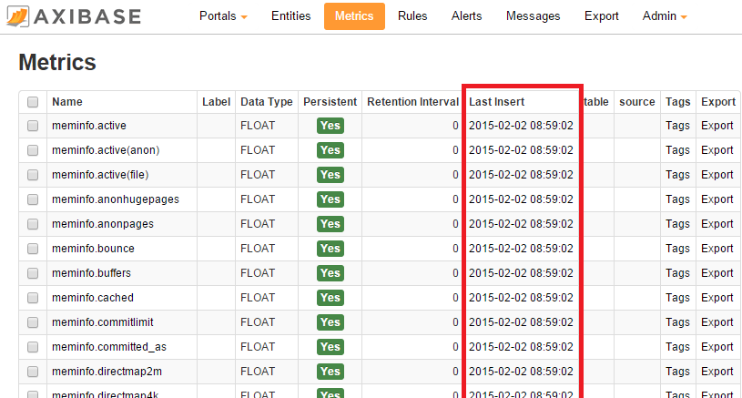

# Custom Scripts

Custom Scripts can be used to write data into the ATSD.

This page contains the installation guide for a custom Axibase Collector Script.

[Download the Collector Script.](http://axibase.com/ftp/lz/atsd_collectors.tar.gz)

#### Prerequisites

##### 'nc' network utility

Important: only the BSD version is supported. The GNU version is not supported by collector scripts.

Check if 'nc' is installed:

```sh
nc
```

The nc (BSD) output will be as follows:

```sh
usage: nc [-46DdhklnrStUuvzC] [-i interval] [-p source_port]
[-s source_ip_address] [-T ToS] [-w timeout] [-X proxy_version]
[-x proxy_address[:port]] [hostname] [port[s]]
```

If nc (BSD) is not available, install the appropriate package using software repositories.

Ubuntu:

```sh
sudo apt-get install netcat-openbsd
```

RedHat Enterprise Linux (RHEL):

```sh
yum install nc
```

##### 'sysstat' utility

mpstat and iostat are included in the 'sysstat' package. If this package is not installed in your system by default, install it.

Ubuntu:

```sh
sudo apt-get install sysstat
```

RHEL:

```sh
sudo yum install sysstat
```

#### Installation

Download the [atsd_collectors.tar.gz](http://axibase.com/ftp/lz/atsd_collectors.tar.gz) archive with collector scripts to the target machine

##### Unpack the archive:

```sh
tar xzf atsd_collectors.tar.gz
```

##### Check that scripts have an executable flag:

```sh
cd collectors
chmod a+x *
```

##### Set ATSD server options:

Edit the script `immortal_nc.sh`. Set the following parameters:

`HOSTNAME` – ATSD server ip or hostname.
`PORT` – ATSD telnet port.

#### Usage

Run the collectors by executing the script `start-all-collectors.sh`:

```sh
/opt/atsd/collectors/start-all-collectors.sh
```

Make sure that there is no output as it may indicate missing dependencies or connection errors.

After starting the collectors, verify in the ATSD web interface that metrics are coming from the target host.

> http://atsd_host:port/entities/metrics.xhtml?entity=hostname

Each collector script collects metrics with the appropriate prefix.


