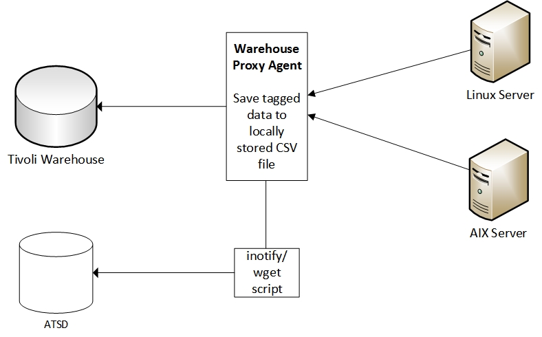

# IBM Tivoli Monitoring

## Overview
ATSD extends IBM Tivoli Monitoring with streaming analytics and
long-term detailed data retention capabilities.

## Installation steps

### Enabling ITM to stream data into the ATSD is done through the Warehouse Proxy Agent

- Import CSV parser definitions into ATSD for particular agent codes: UX, PA, LZ, NT, VM, T3, UD, etc.
- Configure [Warehouse Proxy Agent](http://www-01.ibm.com/support/knowledgecenter/SSATHD_7.7.0/com.ibm.itm.doc_6.3fp2/adminuse/history_analytics_scenarios.htm "WPA") to store analytical data into CSV files on the local file system.
- Enable private history collection on the agent.
- Read and upload CSV files into ATSD continuously using scripts.
- To minimize latency, watch for new CSV files using inotify or similar utility.


#### `hd.ini` Settings to enable private history streaming in ITM.
```ini
KHD_CSV_OUTPUT_ACTIVATE=Y
KHD_CSV_OUTPUT=/tmp/itm/csv
KHD_CSV_OUTPUT_TAGGED_ONLY=Y
KHD_CSV_ISO_DATE_FORMAT=Y
KHD_CSV_MAXSIZE=400
KHD_CSV_EVAL_INTERVAL=60
```

### Enabling private history on agent

- [`Linux OS`](csv-configs/agents/lz-situation.xml)
- [`VMware`](csv-configs/agents/vm-situation.xml)
- [`IBM MQ`](csv-configs/agents/mq-situation.xml)


#### Sender Script

Sender script that checks the specified directory for new CSV files and
uploads them into ATSD. 

You can check the script’s logs in `/tmp/itm/logs` directory.

You can download script file from [here](inotify_sender.sh)




## Verifying  in ATSD

* Login into ATSD
* Click on Metrics tab and filter metrics by following prefixes:

 - `klz`
  

 - `lnx`
  


## Viewing Data in ATSD

### Metrics
* List of collected [ITM metrics](metric-list.md)

### Entity Groups

- `ITM - Linux OS`

### Portals
- [ITM – Linux OS Portal](http://apps.axibase.com/chartlab/43f054ee)


## CSV Parser definitions
- Linux OS [configs](klz-csv-configs.xml)
- VMware [configs](kvm-csv-configs.xml)