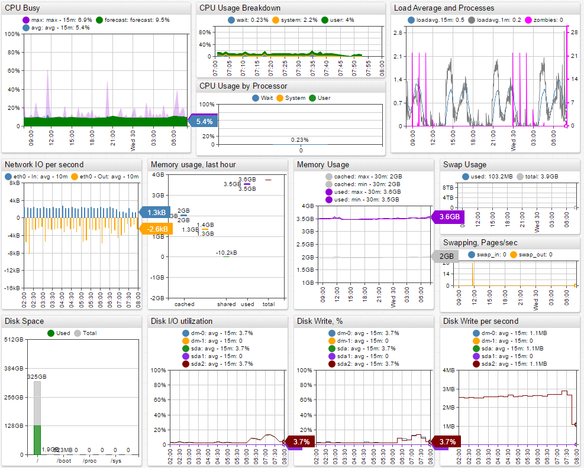

# IBM Tivoli Monitoring

## Overview

In order to offload detailed data from ITM infrastructure with minimal latency you need to enable ITM Warehouse Proxy Agent to dump incoming analytical data into CSV files on the local file system. The dump directory will be continously monitored by an `inotify` script which will upload new CSV files into ATSD as soon as they are created.

This enabled ATSD to server as a long-term repository of historical data that is typically deleted after a few months in order to minimize the disk space usage in Tivoli Data Warehouse.

Since the from ITM agents will be received by ATSD without any delay, it can be used for real-time analytics and peformance dashboards.


## Installation steps

## Configure ITM Warehouse Proxy Agent

* Configure WPA to store analytical data received from agents into CSV files on the local file system as described [here](http://www-01.ibm.com/support/knowledgecenter/SSATHD_7.7.0/com.ibm.itm.doc_6.3fp2/adminuse/history_analytics_scenarios.htm "WPA")

Set `hd.ini` settings to enable private history streaming:

* Go to ITM folder and append the following strings to your `config/hd.ini` file:
    ```ini
    KHD_CSV_OUTPUT_ACTIVATE=Y
    KHD_CSV_OUTPUT=/tmp/itm/csv
    KHD_CSV_OUTPUT_TAGGED_ONLY=Y
    KHD_CSV_ISO_DATE_FORMAT=Y
    KHD_CSV_MAXSIZE=400
    KHD_CSV_EVAL_INTERVAL=60
    ```
* Then restart WareHouse Proxy agent:
    ```sh
    bin/itmcmd stop hd
    bin/itmcmd start hd
    ```

## Configure ITM Agents

* Copy situation config to localconfig/${PRODUCT_CODE}/

    `${PRODUCT_CODE}` is an agent id. The ids of most popular products you can find [here](http://www-01.ibm.com/support/docview.wss?uid=swg21265222).

    > The configs has a specific name ${PRODUCT_CODE}_situation.xml.

* You can download configs of the following products:
    - [Linux OS](csv-configs/agents/lz-situation.xml)
    - [VMware](csv-configs/agents/vm-situation.xml)
    - [IBM MQ](csv-configs/agents/mq-situation.xml)

* After copying you need restart agent

    ```sh
    bin/itmcmd stop ${PRODUCT_CODE}
    bin/itmcmd start ${PRODUCT_CODE}
    ```

## Upload CSV Parsers into ATSD

- Import CSV parser definitions into ATSD for particular agent codes: UX, PA, LZ, NT, VM, T3, UD, etc.
  - Login to ATSD UI:
  - Go to `Configuration: ATSD: CSV:Parsers` page.
  - Click 'Import' button.
  - Select one of the following parsers depending on your product:
      - [Linux OS](csv-configs/atsd/klz-csv-configs.xml)
      - [VMware](csv-configs/atsd/kvm-csv-configs.xml)
      - [IBM MQ](csv-configs/atsd/mq-csv-configs.xml)

## Configure `inotify` script to read CSV files and upload them into ATSD

Download [inotify_sender](inotify_sender.sh) script .

>Note: you need to set up your ITM host url in script

* Set your ITM host url by editing following string in script:
    ```sh
    if [ "$url" = "" ]; then
        url="http://atsd_host:8088"
    fi
    ```

* Set permissions to execute script:
    ```sh
    chmod a+x inotify_sender.sh
    ```

* Run the script with the following command:
    ```sh
    ./inotify_sender.sh
    ```
* Check script logs in `/tmp/itm/logs` directory.

* Add following command to autostart

## Verifying Data in ATSD

* Login into ATSD
* Click on Metrics tab and filter metrics by following prefixes:

 - `klz`
  

 - `lnx`
  

 - `mq`
  

## Viewing Data in ATSD

### Metrics

* List of collected [ITM metrics](metric-list.md)

### Entity Groups

- `ITM - Linux OS`

### Portals
- [ITM – Linux OS Portal](http://apps.axibase.com/chartlab/43f054ee)




