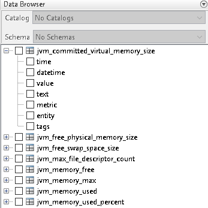

# MATLAB

- [Install ATSD Driver](#install-atsd-driver)
- [Configure Database Connection](#configure-database-connection)
- [Verify Connection](#verify-connection)
- [Review Tables in Database Explorer](#review-tables-in-database-explorer)
- [Load Data](#load-data)
- [Write Data](#write-data)
- [Calculate Derived Series](#calculate-derived-series)

## Install ATSD Driver

[Download ATSD JDBC driver (with dependencies)](https://github.com/axibase/atsd-jdbc/releases)

There are two ways of enabling ATSD JDBC driver in MatLab: static and dynamic

### Static

- Run the `prefdir` command in the MatLab Command Window. The command displayes path to a directory used in subsequent steps.


- Close MatLab if it's running.
- Navigate to the `prefdir` directory above and create a file named `javaclasspath.txt`.
- Open `javaclasspath.txt` file. Add the full path to the ATSD driver JAR file, for example, `/home/user/MATLAB/atsd-jdbc-1.2.22-DEPS.jar`
- Save and close `javaclasspath.txt`.
- Restart MatLab.

### Dynamic

- Run the `javaaddpath('dpath')` command in the MatLab Command Window, where `'dpath'` is the full path to the ATSD driver JAR file.

Example:


## Configure Database Connection

### ATSD connection via Database Explorer

- Click 'New - JDB' option.
- Select 'Vendor - OTHER'.
- Set Driver field to `com.axibase.tsd.driver.jdbc.AtsdDriver`.
- Specify JDBC URL like `jdbc:axibase:atsd:https://ATSD_HOSTNAME:8443/api/sql;catalog=atsd;tables="TABLE_NAME_FILTER";expandTags=true;trustServerCertificate=true`  
[Information about ATSD JDBC URL parameters](https://github.com/axibase/atsd-jdbc/blob/master/README.md)
- Leave Username and Password fields empty.
- Now connect to ATSD using "Data source name" button and login on the Database Browser window.

Example:


`ATSD_HOSTNAME` is a hostname address of ATSD instance you want connect to

`TABLE_NAME_FILTER` is a list of comma-separated metrics or metric expressions to be displayed as tables in the MatLab Database Browser.

`TABLE_NAME_FILTER` examples:
- `*java*` for metrics that contains word `java`
- `custom.metric*` for metrics which name starts with `custom.metric`
- `*2017` for metrics which name ends with `2017`

### ATSD connection via MatLab Command Window

Example of https connection to ATSD:

```matlab
driver = 'com.axibase.tsd.driver.jdbc.AtsdDriver';
url = 'jdbc:axibase:atsd:https://ATSD_HOSTNAME:8443/api/sql;trustServerCertificate=true';
username = 'USERNAME';
password = 'PASSWORD';
conn_atsd = database('', username, password, driver, url);
```

## Verify Connection

ATSD connection via Command Window can be verified using the `SELECT 1` query. The returned `data` should be 1.
Assuming `conn_atsd` is defined:

```matlab
sqlquery = 'SELECT 1';
curs = exec(conn_atsd, sqlquery);
res = fetch(curs);
data = res.Data
```

Expected result:


## Review Tables in Database Explorer

For example, set `TABLE_NAME_FILTER` variable to `*java*`. The Database Browser would display a set of tables matching the expression:



Select one or multiple columns to open the Data Preview window displaying the first N rows of the resultset (25 by default).

Example with datetime, value and text fields selected:


Full resultset can be imported via Import button highlighted with green arrow.

## Load Data

Execute a SQL query to import the resultset into a MatLab variable:

```matlab
sqlquery = 'SELECT * FROM gc_time_percent LIMIT 50';
curs = exec(conn_atsd, sqlquery);
res = fetch(curs);
data = res.Data;
```

## Write Data

`data` example:


To insert data into ATSD (assuming `data` variable has required values):

```matlab
colnames = {'datetime', 'entity', 'value'};
insert(conn_atsd, 'METRIC_NAME', colnames, data);
```

`colnames` is a cell array which describes names and order of columns in the request.

`METRIC_NAME` is a name of a metric under which the rows in `data` should be inserted.

## Calculate Derived Series

### Establish connection to ATSD

```matlab
driver = 'com.axibase.tsd.driver.jdbc.AtsdDriver';
url = 'jdbc:axibase:atsd:https://ATSD_HOSTNAME:8443/api/sql;trustServerCertificate=true';
username = 'USERNAME';
password = 'PASSWORD';
conn_atsd = database('', username, password, driver, url);
```

### Load pricing data into variable `prices`

```matlab
% SQL query to get prices for a date range
sqlquery = 'SELECT datetime, tags.category, value FROM inflation.cpi.categories.price WHERE datetime BETWEEN "2013-01-01T00:00:00Z" AND "2017-01-01T00:00:00Z" ORDER BY 1, 2';
% get cursor from ATSD
curs = exec(conn_atsd, sqlquery);
% fetch data from cursor
res = fetch(curs);
% initialize resultset from data as cell array
prices_resultset = res.Data;
% fetch first two columns from the resultset (datetime and category fields)
time_and_categories = prices_resultset(:,1:2);
% fetch second column from prices resultset (value field)
% convert column to numeric array
prices = cell2mat(prices_resultset(:,3));
```


### Load weights data into variable `weights`

```matlab
% SQL query to get weights
sqlquery = 'SELECT tags.category, value FROM inflation.cpi.categories.weight WHERE datetime = "2017-01-01T00:00:00Z" ORDER BY 1';
% get cursor from ATSD
curs = exec(conn_atsd, sqlquery);
% fetch data from cursor
res = fetch(curs);
% initialize weights resultset from data as cell array
weights_resultset = res.Data;
% fetch second column from weights resultset (value field)
% convert column to numeric array
weights = cell2mat(weights_resultset(:,2));
% repeat weights column for 2017 values (5,1 means that resulting matrix will increase in height 5 times)
weights = repmat(weights, 5, 1);
```


### Calculate Weighted Index

```matlab
% element-wise multiply of 2 columns (1000 value is here because weights is a proportion out of 1000)
inflation_cpi_composite_price = prices .* weights / 1000;
```


### Creating cell-matrix and insert it into ATSD

```matlab
% append Category and Inflation columns
payload = [time_and_categories, num2cell(inflation_cpi_composite_price)];
% define colnames which is a cell array describing names and order of columns in payload
colnames = {'datetime', 'tags.category', 'value'};
% insert data into ATSD
insert(conn_atsd, 'inflation.cpi.composite.price', colnames, payload);
```

## Reference

* MATLAB functions:

- [database](https://www.mathworks.com/help/database/ug/database.html)
- [exec](https://www.mathworks.com/help/database/ug/exec.html)
- [fetch](https://www.mathworks.com/help/database/ug/fetch.html)
- [cell2mat](https://www.mathworks.com/help/matlab/ref/cell2mat.html)
- [repmat](https://www.mathworks.com/help/matlab/ref/repmat.html)
