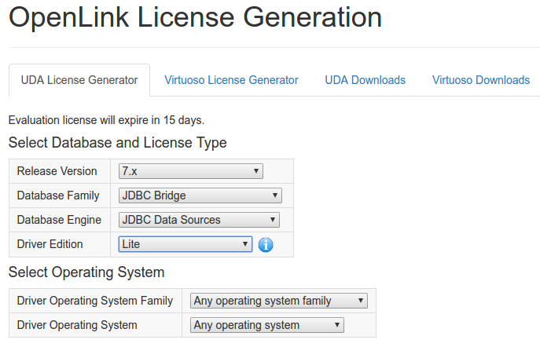
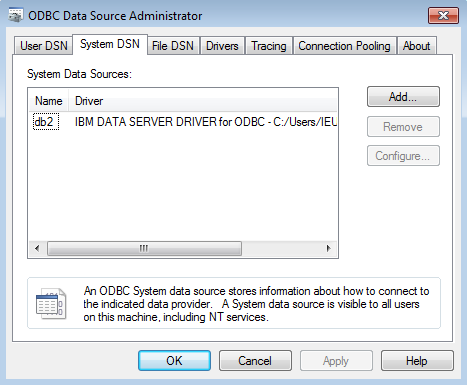
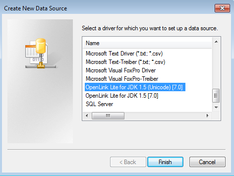
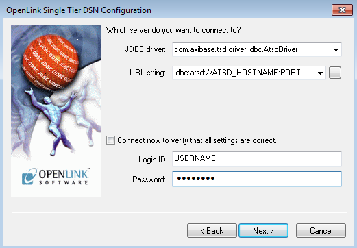

## OpenLink ODBC-JDBC Bridge

### Overview

This document describes how to install an ODBC-JDBC bridge on a Windows machine. The purpose of the bridge is to serve as a data link between the Axibase Time Series Database and Windows applications that do not support [JDBC](https://docs.oracle.com/javase/tutorial/jdbc/overview/) driver technology.

The bridge intercepts SQL queries from the client applications via the Microsoft [ODBC](https://docs.microsoft.com/en-us/sql/odbc/microsoft-open-database-connectivity-odbc) protocol and transmits the queries into ATSD using the [ATSD JDBC driver](https://github.com/axibase/atsd-jdbc).

### Downloads and Pre-requisites

- Download and install Java Runtime Environment 8 for the Windows Operating System.
- [Download](https://github.com/axibase/atsd-jdbc/releases) ATSD JDBC driver with dependencies.
- Add path to ATSD JDBC driver as a Windows Environment variable `Classpath`.
- [Register](https://shop.openlinksw.com/license_generator/login.vsp) an account with the ODBC-JDBC Bridge vendor. The account is required for trial license activation.
- [Generate license](https://shop.openlinksw.com/license_generator/) for product as showed in screenshot:



> Choose your OS version

- Download installation and license files from e-mail.

### Bridge Installation

Install and activate the bridge as follows:

- Skip the welcome page
- Accept the license agreement
- Choose folder where you downloaded the license file
- Select **Complete** option
- Confirm the installation
- Finish the installation

### Configure ODBC Data Source

Go to **Start**, type `ODBC` and launch ODBC Data Source Manager under an Administrator account


Open **System DSN** tab, click **Add...**



Choose the **OpenLink Lite for JDK 1.5 (Unicode)**, click **Finish**



Type your new connection name into `Name` field and click `Next`.

Enter following settings in the DSN Configuration window:

```
JDBC driver:   com.axibase.tsd.driver.jdbc.AtsdDriver
URL string :   <ATSD URL, for example jdbc:atsd://ATSD_HOST:ATSD_PORT>
Login ID   :   <atsd login>
Password   :   <atsd password>
```

Refer to ATSD JDBC [documentation](https://github.com/axibase/atsd-jdbc#jdbc-connection-properties-supported-by-driver)  for additional details about the URL format and the driver parameters.



Skip other steps clicking at `Next`.

