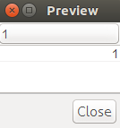
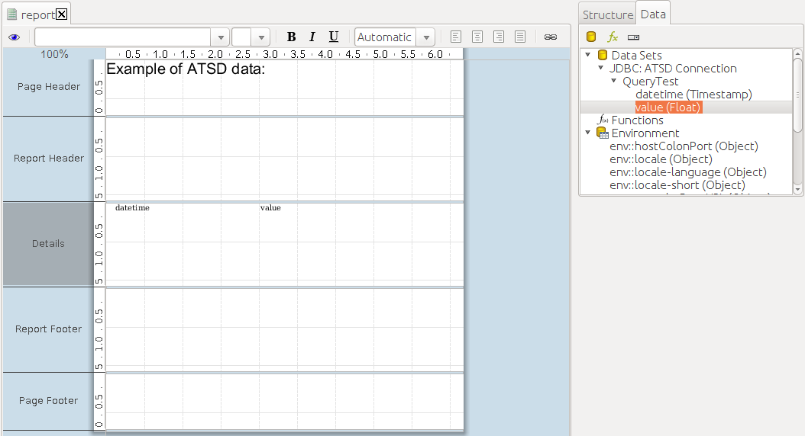
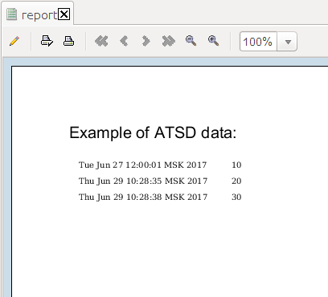

# Pentaho Report Designer

- [Install ATSD Driver](#install-atsd-driver)
- [Configure Database Connection](#configure-database-connection)
- [Import data from ATSD](#import-data-from-atsd)

## Install ATSD Driver

- Download ATSD [JDBC driver](https://github.com/axibase/atsd-jdbc/releases) with dependencies
- Copy the driver JAR file into `lib/jdbc` directory in the Report Designer installation directory
- Restart the Report Designer

## Configure Database Connection

- Select 'Data' tab in the properties pane on the right.

- Select 'Add Data Sources' button in the toolbar.
- Select 'Add a new connection' (green plus icon).

- Select `General` in the left menu
- Select `Generic database` as Connection Type
- Select `Native (JDBC)` as Access

### Configure ATSD connection properties

- Enter JDBC URL into the `Custom Connection URL` field, for example:

  `jdbc:axibase:atsd:https://ATSD_HOSTNAME:8443/api/sql;catalog=atsd;tables=inflation*;expandTags=true;trustServerCertificate=true`

> `ATSD_HOSTNAME` is the hostname of the target ATSD instance
> Review ATSD JDBC [URL parameters](https://github.com/axibase/atsd-jdbc/blob/master/README.md) for additional details.

- Set Custom Driver Class Name field to `com.axibase.tsd.driver.jdbc.AtsdDriver`
- Set `User Name` and `Password` fields to your ATSD Username and Password
- Set `Connection Name` to `ATSD Connection`

## Verify Connection

ATSD connection can be verified using the SELECT 1 query. The returned data should be 1.

Example of `SELECT 1` test query:

Result of `SELECT 1` test query:

## View Schema

- Edit `Custom Connection URL` field in ATSD Connection properties
- Append `;tables="TABLE_NAME_FILTER"` to the end of `Custom Connection URL` field

`TABLE_NAME_FILTER` is a list of comma-separated metrics or metric expressions to be displayed as tables in the MatLab Database Browser.

`TABLE_NAME_FILTER` examples:
- `*java*` for metrics that contains word `java`
- `custom.metric*` for metrics which name starts with `custom.metric`
- `*2017` for metrics which name ends with `2017`

ATSD Schema can be viewed in SQL Query Designer tool:

`SQL Query Designer` tool interface:

`SQL Query Designer` is used for visual building of a Query:

- Double click on table that you want to include to Query (it will be shown in right pane of `SQL Query Designer`)
- Select fields inside table (this fields will be included in `SELECT` clause of a Query)
- Optionally add `WHERE`, `GROUP BY` and `HAVING` or `ORDER BY`
- Click `OK` so your Query will be built and shown in text field
> Remove newline symbol after `SELECT` keyword  
> Remove quotes around column names

## Import Data

- Select 'Data' tab in the properties pane on the right
- Select 'Add Data Sources' button in the toolbar and choose `JDBC`
- Click on 'ATSD Connection'
- Click on 'Add Query' in the Available Queries list

- Enter a SQL query in the Query editor, for example `SELECT datetime, entity, value FROM jvm_memory_used LIMIT 10`
- Click on the 'Preview' button to review the resultset.

- It's possible to build a Query using `SQL Query Designer`

- Click 'OK'. The list of queries will be added to the 'Data' pane.
- Right-click on the query and choose 'Select Query'. The tree view will now display query results and fields.

- Drag and drop these field into the report canvas.
- Click `Preview` button in the top left corner (eye icon) to view query results.

Example of report preview:

[File with example report](resources/report.prpt)
