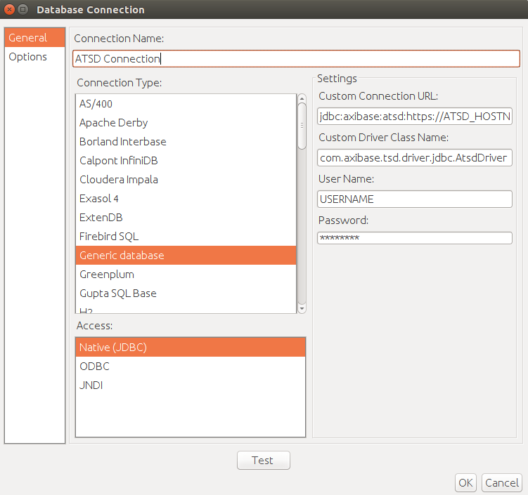
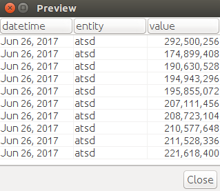
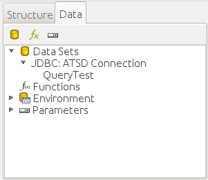

# Pentaho Report Designer

- [Install ATSD Driver](#install-atsd-driver)
- [Configure Database Connection](#configure-database-connection)
- [Import data from ATSD](#import-data-from-atsd)

## Install ATSD Driver

- Download ATSD [JDBC driver](https://github.com/axibase/atsd-jdbc/releases) with dependencies
- Put driver JAR file into `lib/jdbc` folder inside the Report Designer installation directory
- Open report-designer (reopen if it was launched already)

## Configure Database Connection
- Select the Data tab in the right hand structural pane

- Select the "Add Data Sources" button in the toolbar, or right click with your mouse on the data-sources node to open up the context menu
- Select `Add a new connection` (it's a green plus icon)

- Pick `General` in left menu
- Pick `Generic database` as Connection Type
- Pick `Native (JDBC)` as Access
- `Custom Connection URL` is a JDBC URL link. Specify JDBC URL like `jdbc:axibase:atsd:https://ATSD_HOSTNAME:8443/api/sql;catalog=atsd;tables="TABLE_NAME_FILTER";expandTags=true;trustServerCertificate=true`  
[Information about ATSD JDBC URL parameters](https://github.com/axibase/atsd-jdbc/blob/master/README.md)
- Set Custom Driver Class Name field to `com.axibase.tsd.driver.jdbc.AtsdDriver`
- Set `User Name` and `Password` fields to your ATSD Username and Password
- Set `Connection Name` to `ATSD Connection`

Example:

`ATSD_HOSTNAME` is a hostname address of ATSD instance you want connect to

## Import data from ATSD
- Select the Data tab in the right hand structural pane
- Select the "Add Data Sources" button in the toolbar, or right click with your mouse on the data-sources node to open up the context menu
- Click on `ATSD Connection` that you have created to highlight it
- Click on `Add Query` near Available Queries list

- Now Query text field is available for edit. Write there some SQL query which results you want to include to your report. For example `SELECT datetime, value FROM 'METRIC_NAME'`

- Click on Preview button to see query resultset and check that it is OK

- Click `OK` button. List of queries will be added to `Data` pane
- Click on your query with right mouse button and pick `Select Query`. Now in that tree view you can see selected field from query result

- Drag these field to report paper
- Now click `Preview` button in the left top corner of your report (it's the eye icon) -- and you will see query results as part of your report

Example of report:

Example of report preview:

