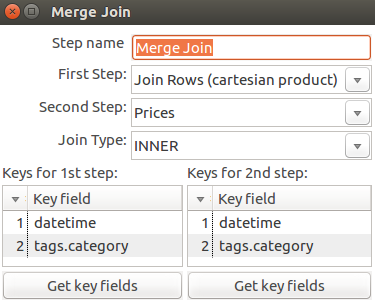
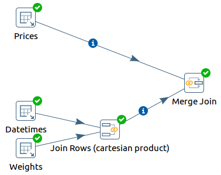
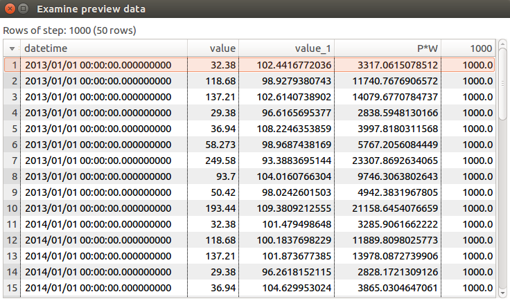
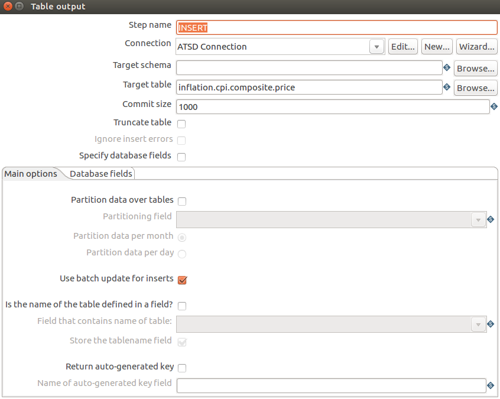

# Pentaho Data Integration

- [Prerequisites](#prerequisites)
- [Install ATSD Driver](#install-atsd-driver)
- [Configure Database Connection](#configure-database-connection)
- [View Schema](#view-schema)
- [Load data](#load-data)
- [Calculate Derived Series](#calculate-derived-series)

## Prerequisites

Install Pentaho Data Integration 7.1

## Install ATSD Driver

- Download ATSD [JDBC driver](https://github.com/axibase/atsd-jdbc/releases) with dependencies
- Copy the driver JAR file into the `lib` directory in the Data Integration installation directory
- Restart the Data Integration

## Configure Database Connection

- Create new `Transformation` via File -> New -> Transformation
- Open `View` pane of new `Transformation`


- Click with right mouse button on `Database connections` -> New
- Select `General` in the left menu
- Select `Generic database` as Connection Type
- Select `Native (JDBC)` as Access

### Configure ATSD connection properties

- Enter JDBC URL into the `Custom Connection URL` field, for example:

  `jdbc:axibase:atsd:https://ATSD_HOSTNAME:8443/api/sql;tables=inflation*;expandTags=true;trustServerCertificate=true`

> `ATSD_HOSTNAME` is the hostname of the target ATSD instance
> Review ATSD JDBC [URL parameters](https://github.com/axibase/atsd-jdbc/blob/master/README.md) for additional details.

- Set Custom Driver Class Name field to `com.axibase.tsd.driver.jdbc.AtsdDriver`
- Set `User Name` and `Password` fields to your ATSD Username and Password
- Set `Connection Name` to `ATSD Connection`


> Click 'Test' to verify connection to ATSD

## View Schema

- Edit `Custom Connection URL` field in ATSD Connection properties
- Edit `tables="TABLE_NAME_FILTER"` in `Custom Connection URL` field
- SET `TABLE_NAME_FILTER` to your table name filter

`TABLE_NAME_FILTER` is a list of comma-separated metrics or metric expressions to be displayed as tables in the MatLab Database Browser.

`TABLE_NAME_FILTER` examples:
- `*java*` for metrics that contains word `java`
- `custom.metric*` for metrics whose name starts with `custom.metric`
- `*2017` for metrics whose name ends with `2017`

Click on `Explore` button to view ATSD Schema:


## Load Data

- Drag and Drop `ATSD Connection` from `View` pane (Database connections folder)
- Set `Step name` to a unique name in this `Transformation`
- Write SQL query which result will be taken as an `Table input` for this `Transformation`
> Click `Preview` if you want to see SQL query results

Example:


## Calculate Derived Series

To calculate the weighted CPI for each year, the CPI value for a given category must be multiplied by its weight and divided by 1000. The resulting products are summed to give the value of the weighted CPI.

### Load data from ATSD

- Create 3 `Table input` from ATSD (`Prices`, `Datetimes` and `Weights`):
> `Prices` has weighted prices for categories from 2013-2017 for 10 categories. SQL query:

```sql
SELECT value, tags.category, datetime
FROM 'inflation.cpi.categories.price'
ORDER BY datetime, tags.category
```

> `Datetimes` has datetime timestamps for 2013-2017 years. SQL query:

```sql
SELECT datetime
FROM 'inflation.cpi.categories.price'
GROUP BY datetime
ORDER BY datetime
```

> `Weights` has weights for 10 categories for 2017 year. SQL query:

```sql
SELECT tags.category, value
FROM 'inflation.cpi.categories.weight'
ORDER BY datetime, tags.category
```

Example of `Datetimes`:


### Duplicate Weights values

In that step we will get `Weights` values repeated for each year from 2013 to 2017

- Open `Design` pane and find `Join Rows (cartesian product)` in `Joins` category. Drag and drop it to `Transformation` pane.
- Connect your `Join Rows (cartesian product)` with `Datetimes` and `Weights` using `Input Connection` button. That button shows when you hover your mouse pointer over `Join Rows` or any item inside `Transformation` pane


> After that by "connect" we will be meaning that way of conenction

Diagram example:


Preview of `Join Rows (cartesian product)`:


### Merge two tables into one

In that step we will append two tables to perform calculations inside one table. This table have unique row identifier (pair `datetime - tags.category`) so we can join them with INNER JOIN operation.

- Open `Design` pane and find `Merge Join` in `Joins` category. Drag and drop it to `Transformation` pane
- Connect `Merge Join` to `Join Rows (cartesian product)` and choose `Right hand side stream of the join`
- Connect `Merge Join` to `Prices` and choose `Left hand side stream of the join`
- Configure `Merge Join` as shown in the screenshot below:
> That operation will join 2 tables into one table



Preview of `Merge Join`:


Diagram example:



### Remove redundant columns

- Open `Design` pane and find `Select values` in `Transform` category. Drag and drop it to `Transformation` pane
- Connect `Select values` to `Merge Join`
- Configure `Select values` as shown in the screenshot below:
> That operation will join 2 tables into one table


Preview of `Remove columns`:


### Calculations

#### Price * Weight

Element wise multiply 2 columns:

- Open `Design` pane and find `Calculator` in `Transform` category. Drag and drop it to `Transformation` pane
- Connect `Calculator` to `Remove columns`
- Configure `Calculator` as shown in the screenshot below:
> That operation will calculate new field `P*W` (price multiplied by weight)


Preview of `Price * Weight`:


#### Add column with constant 1000

This column will be needed later in element wise division

- Open `Design` pane and find `Add constants` in `Transform` category. Drag and drop it to `Transformation` pane
- Connect `Add constants` to `Price * Weight`
- Configure `Add constants` as shown in the screenshot below:
> That operation will add new column `1000` that have value `1000` for each row


Preview of `1000`:



#### Divide by 1000

Add new column that have Price * Weight value divided by 1000 (bacause weight is a proportion from 1000)

- Open `Design` pane and find `Calculator` in `Transform` category. Drag and drop it to `Transformation` pane
- Connect `Calculator` to `1000`
- Configure `Calculator` as shown in the screenshot below:
> That operation will calculate new field `P*W/1000` (price multiplied by weight and divided by 1000)


Preview of `1000`:


#### Group By datetime

Group by rows by `datetime` and sum weighted prices values (for each year)

- Open `Design` pane and find `Group by` in `Statistics` category. Drag and drop it to `Transformation` pane
- Connect `Group by` to `/1000`
- Configure `Group by` as shown in the screenshot below:
> That operation will group records by datetime and will calculate sum of `P*W/1000` values for each group


Preview of `Group by`:


#### Add column with constant 'bls.gov' as entity value

This column will be needed later in element wise division

- Open `Design` pane and find `Add constants` in `Transform` category. Drag and drop it to `Transformation` pane
- Connect `Add constants` to `Group by`
- Configure `Add constants` as shown in the screenshot below:
> That operation will add new column `entity` that have value `bls.gov` for each row


Preview of `Entity`:


### Load derived series to ATSD

- Open `Design` pane and find `Insert / Update` in `Output` category. Drag and drop it to `Transformation` pane
- Connect `Insert / Update` to `Entity`
- Configure `Insert / Update` as shown in the screenshot below:
> That operation will insert calculated data as new metric in ATSD



> For INSERT operation Data Integration require ATSD to have that metric be created!

Complete diagram example:


### Check results

You can check the results with that SQL query:

```sql
SELECT * 
FROM 'inflation.cpi.composite.price' 
```

```ls
| entity  | datetime                 | value              |
|---------|--------------------------|--------------------|
| bls.gov | 2013-01-01T00:00:00.000Z | 100.89632897771745 |
| bls.gov | 2014-01-01T00:00:00.000Z | 101.29925299205442 |
| bls.gov | 2015-01-01T00:00:00.000Z | 100.60762066801131 |
| bls.gov | 2016-01-01T00:00:00.000Z | 100.00753061641115 |
| bls.gov | 2017-01-01T00:00:00.000Z | 100.12572021999999 |
```

## Reference

Used Data Integration modules:
- [Join Rows (cartesian product](http://wiki.pentaho.com/display/EAI/Join+Rows+%28Cartesian+product%29)
- [Merge Join](http://wiki.pentaho.com/display/EAI/Merge+Join)
- [Calculator](http://wiki.pentaho.com/display/EAI/Calculator)
- [Insert / Update](http://wiki.pentaho.com/display/EAI/Insert+-+Update)
- [Group by](http://wiki.pentaho.com/display/EAI/Group+By)
- [Add constants](http://wiki.pentaho.com/display/EAI/Add+Constants)
- [Add sequence](http://wiki.pentaho.com/display/EAI/Add+sequence)
