# Pentaho Data Integration

- [Prerequisites](#prerequisites)
- [Install ATSD Driver](#install-atsd-driver)
- [Configure Database Connection](#configure-database-connection)
- [View Schema](#view-schema)
- [Load data](#load-data)
- [Calculate Derived Series](#calculate-derived-series)

## Overview 

[Pentaho Data Integration](http://community.pentaho.com/projects/data-integration/) (PDI) provides a graphical design environment to create and edit ETL (Extract, Transform, Load) jobs and workflows. The following guide includes examples of loading time series data from the Axibase Time Series Database (ATSD), calculating derived time series in PDI and storing the results in ATSD.

## Prerequisites

- Install Pentaho Data Integration 7.1

## Install ATSD Driver

- Download ATSD [JDBC driver](https://github.com/axibase/atsd-jdbc/releases) with dependencies
- Copy the driver JAR file into the `lib` directory in the Data Integration installation directory
- Restart the Data Integration process

## Configure Database Connection

- Create new `Transformation` via File -> New -> Transformation
- Open `View` pane of new `Transformation`

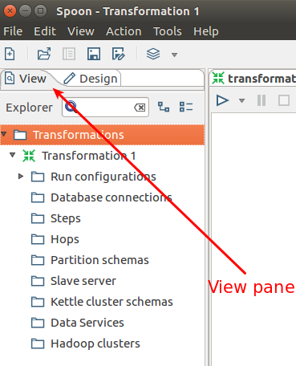

- Right-click on `Database connections` -> New
- Select `General` in the left menu
- Select `Generic database` as Connection Type
- Select `Native (JDBC)` as Access

### Configure ATSD connection properties

- Enter JDBC URL into the `Custom Connection URL` field, for example:

  `jdbc:axibase:atsd:https://ATSD_HOSTNAME:8443/api/sql;tables=inflation*;expandTags=true;trustServerCertificate=true`

> `ATSD_HOSTNAME` is the hostname of the target ATSD instance
> Review ATSD JDBC [URL parameters](https://github.com/axibase/atsd-jdbc/blob/master/README.md) for additional details.

- Set Custom Driver Class Name field to `com.axibase.tsd.driver.jdbc.AtsdDriver`
- Set `User Name` and `Password` fields to your ATSD Username and Password
- Set `Connection Name` to `ATSD Connection`

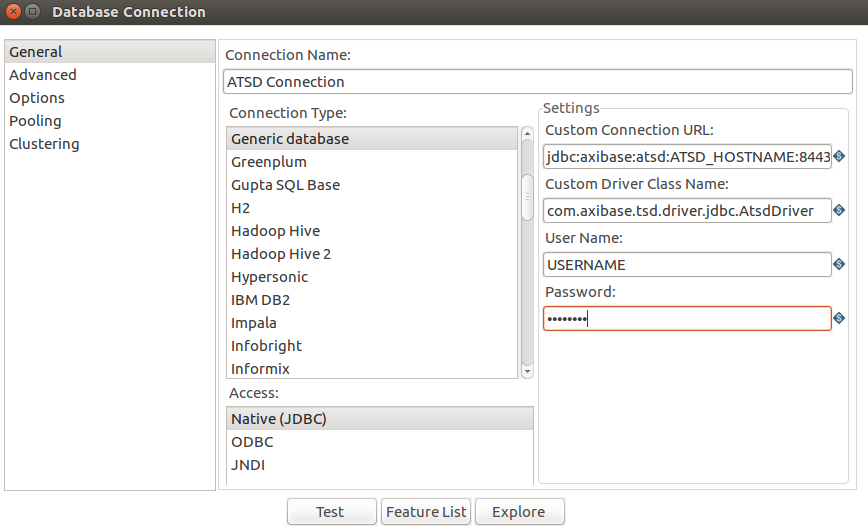

> Click 'Test' to verify connection to ATSD

## View Schema

- Edit `Custom Connection URL` field in ATSD Connection properties
- Edit `tables="TABLE_NAME_FILTER"` in `Custom Connection URL` field
- SET `TABLE_NAME_FILTER` to your table name filter

`TABLE_NAME_FILTER` is a list of comma-separated metrics or metric expressions to be displayed as tables in the MatLab Database Browser.

`TABLE_NAME_FILTER` examples:
- `*java*` for metrics that contains the word `java`
- `custom.metric*` for metrics whose name starts with `custom.metric`
- `*2017` for metrics whose name ends with `2017`

Click on the `Explore` button to view the ATSD Schema:

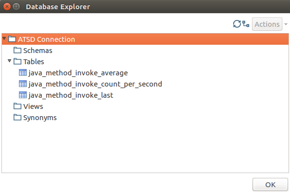

## Load Data

- Drag and Drop `ATSD Connection` from the `View` pane (Database Connections folder)
- Set `Step name` to a unique name for this `Transformation`
- Write an SQL query whose result will be taken as a `Table input` for this `Transformation`
> Click `Preview` if you want to see SQL query results

Example:

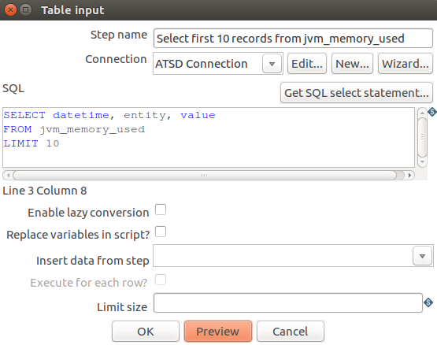

## Calculate Derived Series

To calculate the weighted CPI for each year, the CPI value for a given category must be multiplied by its weight and divided by 1000. The resulting products are summed to give the value of the weighted CPI.

### Load data from ATSD

- Create 3 `Table input` from ATSD (`Prices`, `Datetimes` and `Weights`):
> `Prices` has weighted prices for categories from 2013-2017 for 10 categories. SQL query:

```sql
SELECT value, tags.category, datetime
FROM 'inflation.cpi.categories.price'
ORDER BY datetime, tags.category
```

> `Datetimes` has datetime timestamps for 2013-2017 years. SQL query:

```sql
SELECT datetime
FROM 'inflation.cpi.categories.price'
GROUP BY datetime
ORDER BY datetime
```

> `Weights` has weights for 10 categories for 2017 year. SQL query:

```sql
SELECT tags.category, value
FROM 'inflation.cpi.categories.weight'
ORDER BY datetime, tags.category
```

Example of `Datetimes`:

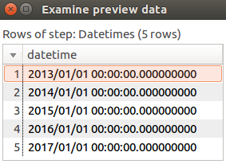

### Duplicate Weights values

In this step we will get `Weights` values repeated for each year from 2013 to 2017

- Open the `Design` pane and find `Join Rows (cartesian product)` in `Joins` category. Drag and drop it to the `Transformation` pane.
- Connect your `Join Rows (cartesian product)` with `Datetimes` and `Weights` using `Input Connection` button. That button shows when you hover your mouse pointer over `Join Rows` or any item inside the `Transformation` pane

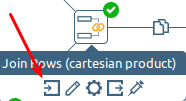

> After that, "connect" means way of conenction

Diagram example:

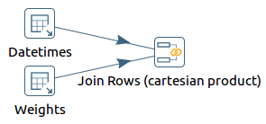

Preview of `Join Rows (cartesian product)`:


### Merge two tables into one

In this step we will append two tables to perform calculations inside one table. This table will have a unique row identifier (pair `datetime - tags.category`) so we can join them with the INNER JOIN operation.

- Open the `Design` pane and find `Merge Join` in the `Joins` category. Drag and drop it to the `Transformation` pane
- Connect `Merge Join` to `Join Rows (cartesian product)` and choose `Right hand side stream of the join`
- Connect `Merge Join` to `Prices` and choose `Left hand side stream of the join`
- Configure `Merge Join` as shown in the screenshot below:
> That operation will join 2 tables into one table


Preview of `Merge Join`:


Diagram example:


### Remove redundant columns

- Open the `Design` pane and find `Select values` in the `Transform` category. Drag and drop it to `Transformation` pane
- Connect `Select values` to `Merge Join`
- Configure `Select values` as shown in the screenshot below:

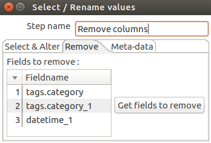

Preview of `Remove columns`:

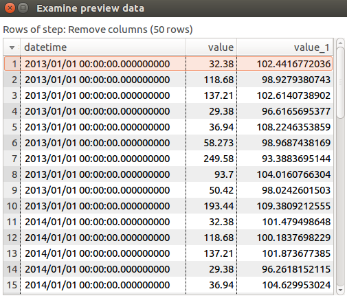

### Calculations

#### Price * Weight

Multiply 2 columns element-wise:

- Open the `Design` pane and find `Calculator` in `Transform` category. Drag and drop it to the `Transformation` pane
- Connect `Calculator` to `Remove columns`
- Configure `Calculator` as shown in the screenshot below:
> This operation will calculate a new field `P*W` (price multiplied by weight)


Preview of `Price * Weight`:

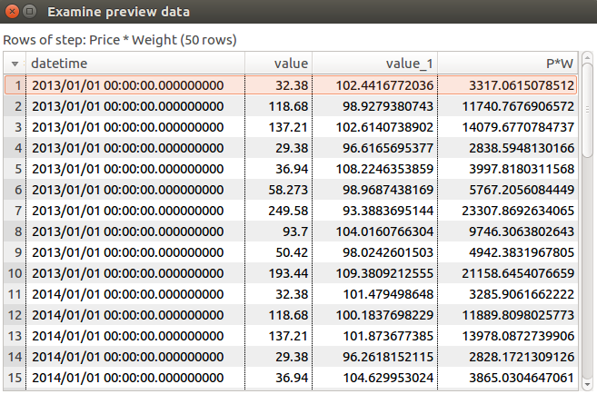

#### Add a column with a constant 1000

(This column will be needed later in element wise division)

- Open the `Design` pane and find `Add constants` in `Transform` category. Drag and drop it to the `Transformation` pane
- Connect `Add constants` to `Price * Weight`
- Configure `Add constants` as shown in the screenshot below:
> This operation will add a new column `1000` that has a value of `1000` for each row


Preview of `1000`:


#### Divide by 1000

Add a new column that has Price * Weight divided by 1000 (because the weight is proportional to 1000)

- Open the `Design` pane and find `Calculator` in the `Transform` category. Drag and drop it to the `Transformation` pane
- Connect the `Calculator` to `1000`
- Configure the `Calculator` as shown in the screenshot below:
> This operation will calculate a new field `P*W/1000` (price multiplied by weight, divided by 1000)


Preview of `1000`:

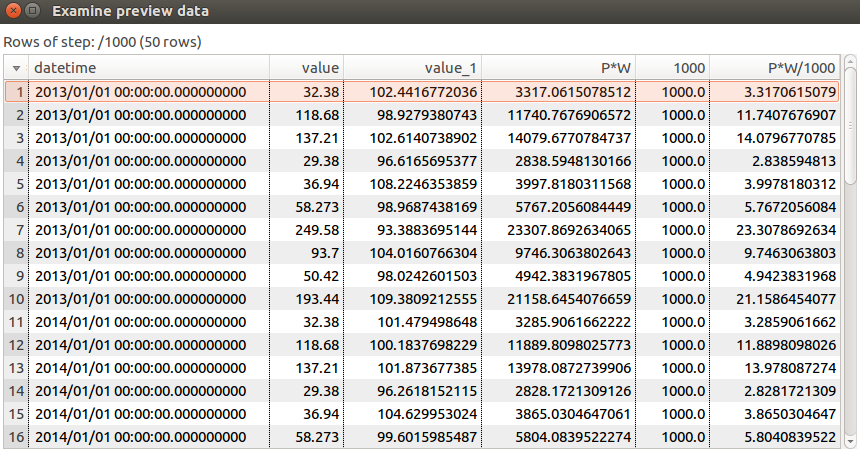

#### Group By datetime

Group by rows by `datetime` and sum weighted price values (for each year)

- Open the `Design` pane and find `Group by` in the`Statistics` category. Drag and drop it to `Transformation` pane
- Connect `Group by` to `/1000`
- Configure `Group by` as shown in the screenshot below:
> That operation will group records by datetime and calculate the sum of `P*W/1000` values for each group


Preview of `Group by`:

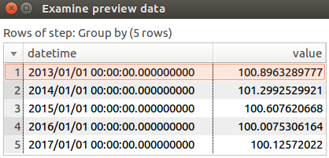

#### Add a column with constant 'bls.gov' as entity value

(This column will be needed later in element wise division)

- Open the `Design` pane and find `Add constants` in the `Transform` category. Drag and drop it to the `Transformation` pane
- Connect `Add constants` to `Group by`
- Configure `Add constants` as shown in the screenshot below:
> This operation will add a new column `entity` that has the value `bls.gov` for each row


Preview of `Entity`:


### Load derived series to ATSD

- Open the `Design` pane and find `Insert / Update` in the `Output` category. Drag and drop it to `Transformation` pane
- Connect `Insert / Update` to `Entity`
- Configure `Insert / Update` as shown in the screenshot below (`Tagret table` is the tagret metric where we want to store the data):
> This operation will insert calculated data as a new metric in ATSD


> For the INSERT operation, Data Integration requires ATSD to have that metric created already!

Complete diagram example:

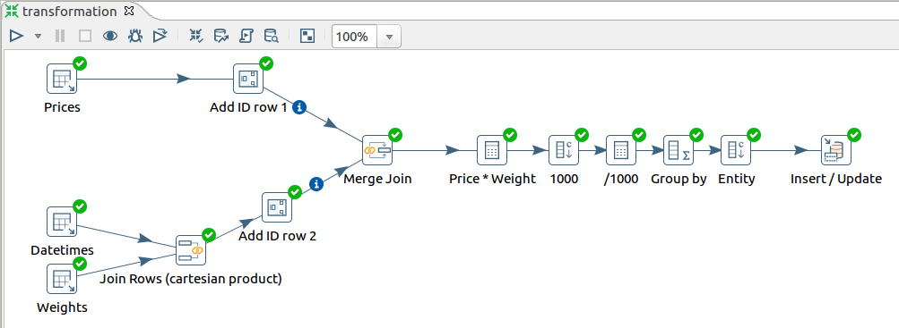

### Check results

You can check the results with that SQL query:

```sql
SELECT * 
FROM 'inflation.cpi.composite.price' 
```

```ls
| entity  | datetime                 | value              |
|---------|--------------------------|--------------------|
| bls.gov | 2013-01-01T00:00:00.000Z | 100.89632897771745 |
| bls.gov | 2014-01-01T00:00:00.000Z | 101.29925299205442 |
| bls.gov | 2015-01-01T00:00:00.000Z | 100.60762066801131 |
| bls.gov | 2016-01-01T00:00:00.000Z | 100.00753061641115 |
| bls.gov | 2017-01-01T00:00:00.000Z | 100.12572021999999 |
```

## Reference

Used Data Integration modules:
- [Join Rows (cartesian product)](http://wiki.pentaho.com/display/EAI/Join+Rows+%28Cartesian+product%29)
- [Merge Join](http://wiki.pentaho.com/display/EAI/Merge+Join)
- [Calculator](http://wiki.pentaho.com/display/EAI/Calculator)
- [Insert / Update](http://wiki.pentaho.com/display/EAI/Insert+-+Update)
- [Group by](http://wiki.pentaho.com/display/EAI/Group+By)
- [Add constants](http://wiki.pentaho.com/display/EAI/Add+Constants)
- [Add sequence](http://wiki.pentaho.com/display/EAI/Add+sequence)
