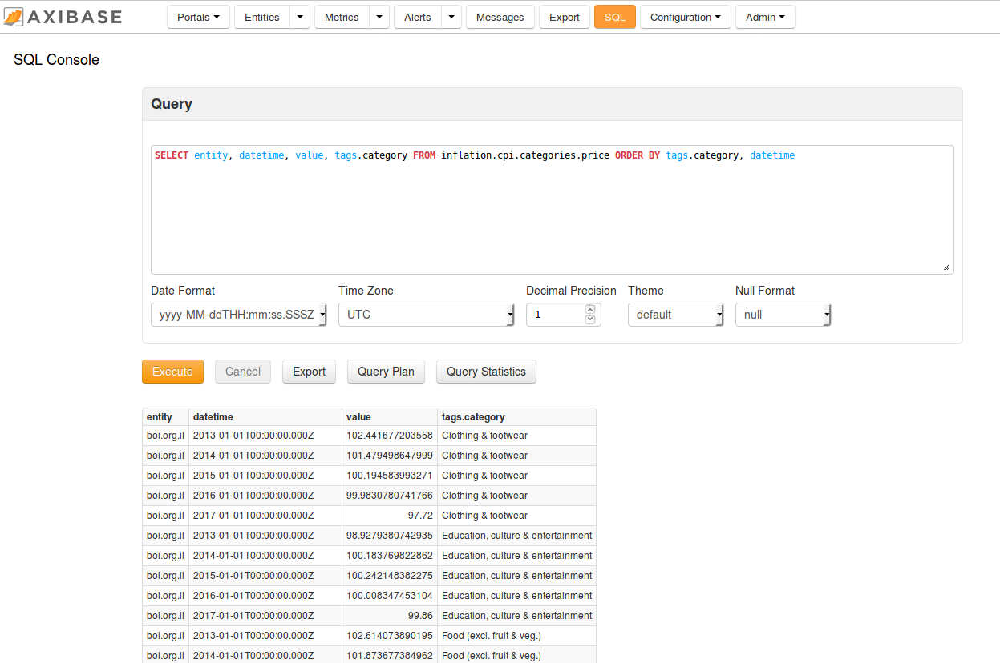
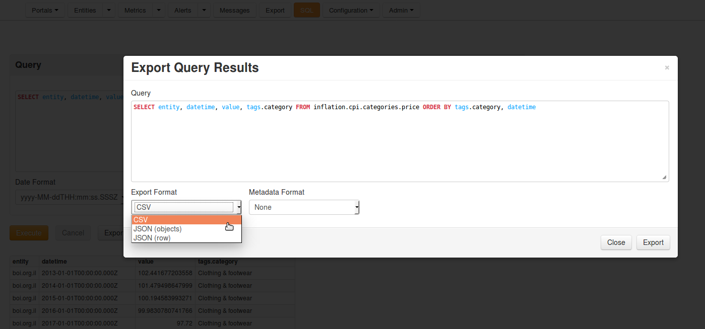
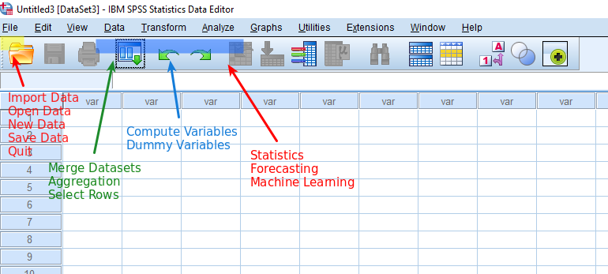
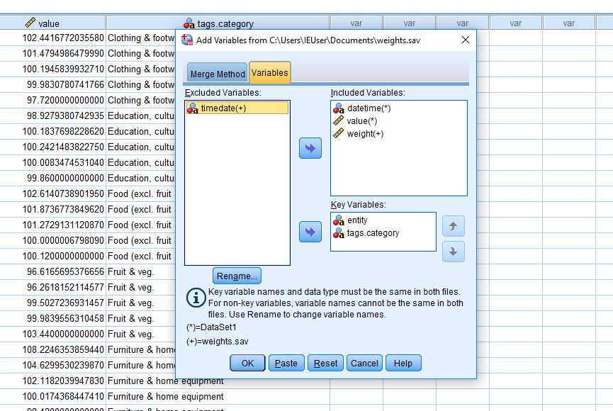
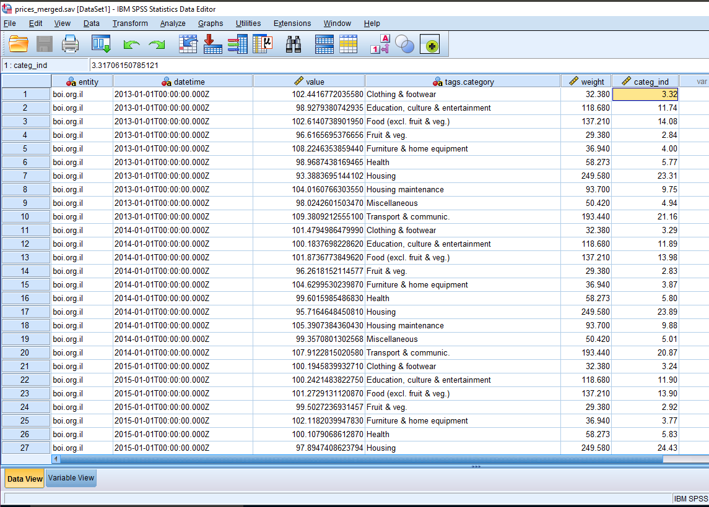
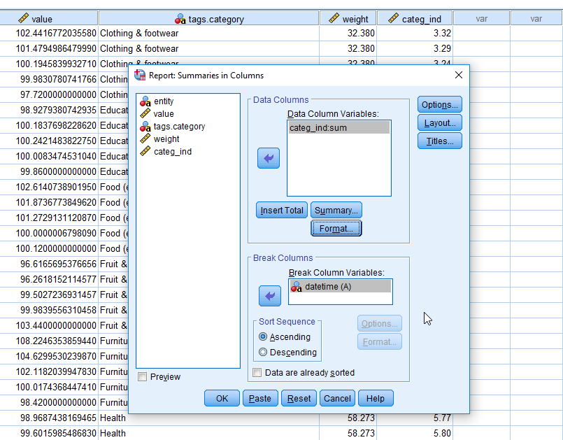
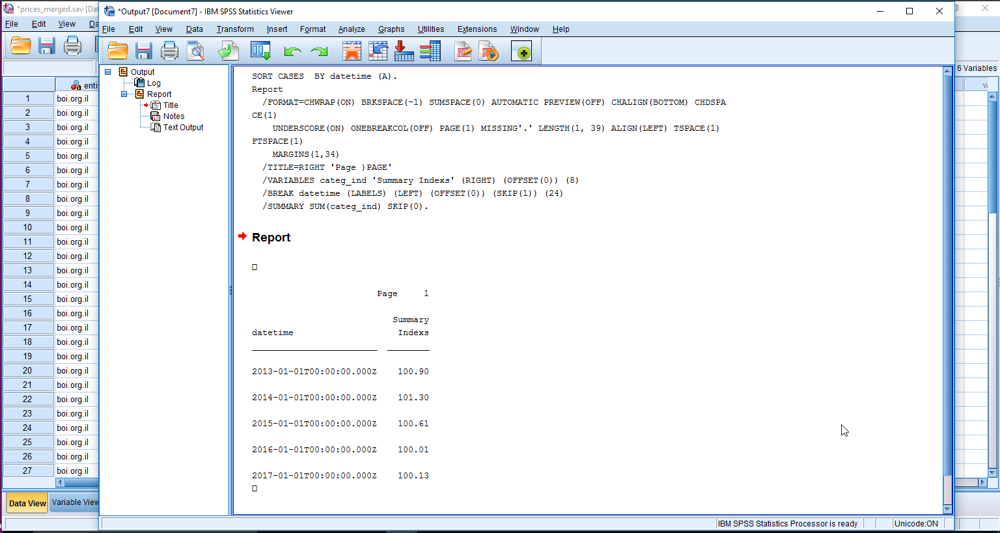
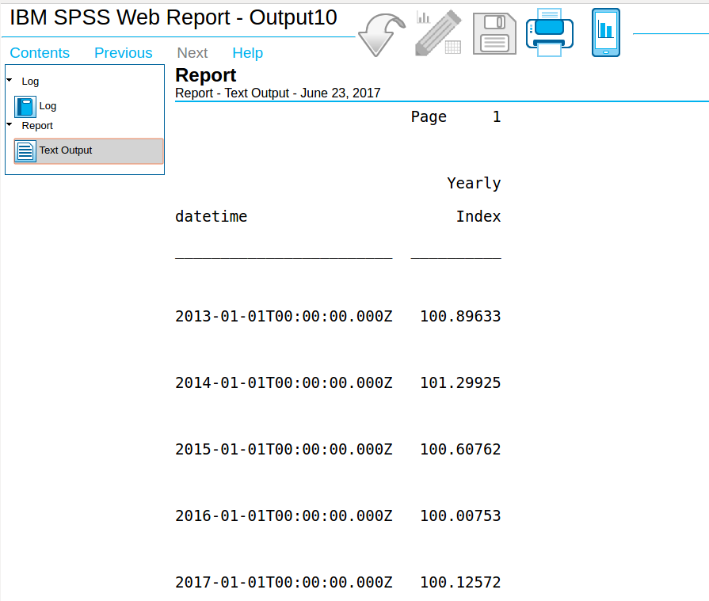
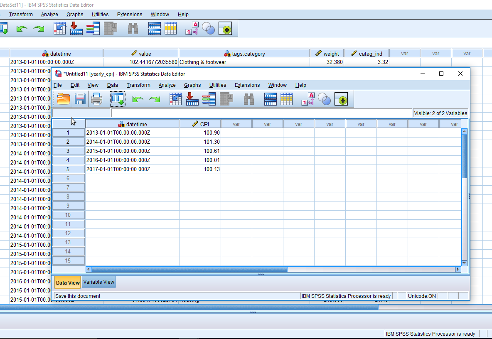

# IBM SPSS Data Analysis.

## Overview

[IBM SPSS](https://www.ibm.com/analytics/us/en/technology/spss/) is an advanced statistical analysis tool. The following guide describes the process of loading data from Axibase Time Series Database into SPSS as well as calculating derived series using Weighted CPI as an example.

SPSS provides several options for loading datasets from external data sources such as Excel files and databases. To complete this exercise you need to have sample data available in your ATSD instance.

## Load Data

1. Login into ATSD web interface
2. Open **Metrics -> Data Entry** form, select the 'Commands' tab.
3. Copy [series commands](resources/commands.txt) into the form and click Submit/Send.


The commands contain consumer price index (CPI) for each category of items in a consumer basket as well as the weight of each category in the CPI basket. The price index is available for years 2013-2017 and is baselined to year 2016. The weights are available for year 2017 and will be applied to all prior years. The weights are specified using 1000 as the total. The underlying data is available in the following [Excel file](resources/eng_e02.xls).

The calculate a weighted inflation index we need to multiple CPI of each category by its weight and sum the products.

## Export Data

ATSD provides a web-based SQL console that allows exporting query results into different formats including Excel, CSV, JSON with optional metadata composed according to [W3C Model for Tabular Data](https://github.com/axibase/atsd/blob/master/api/sql/api.md#metadata).

> If you don't have an ATSD instance available, [weights.csv](resources/weights.csv) and [prices.csv](resources/prices.csv) files are provided for your convenience. The files contain output of SQL queries discussed below.

### Prices

Select CPI price data by executing the following query: 

```sql
SELECT entity, datetime, value, tags.category 
  FROM inflation.cpi.categories.price 
ORDER BY tags.category, datetime
```



Export query results into `prices.csv` file.



### Weights

Select Weight data by executing the following query: 

```sql
SELECT entity, datetime as timedate, value as weight, tags.category 
  FROM inflation.cpi.categories.weight 
ORDER BY tags.category, datetime
```

Export query results into `weights.csv` file.

### Column Aliases

SPSS performs a merge of datasets using equal column names, similar to a `SELF JOIN` in SQL terms. 

To prevent the `datetime` and `value` columns from being used in the merge operation, we change their names in the **Weights** query using column aliases. Otherwise, the merged dataset produced by SPSS would contain data only for year 2017.

## SPSS User Interface


Menu Item | Description
--------- | -----------
File | Standard operations for any program (import data from Excel/CSV files, create/save datasets, connect to OBDC server for data extraction etc.)
Data | Common operations with datasets (select rows, aggregation, merge/split files etc.)
Transform | Data transformation (calculating new variables, convert current dataset into time series or another data structure, turn ordinal variables into dummy variables etc.)
Analyze | Statistical methods and machine learning algorithms (forecasting, regression, classification, neural networks etc.)




## Import Data

* Open **File -> Import Data -> CSV Data...**.
* Select CSV files and click Open to import the `prices.sav` and `weights.sav` files.


As a result, data from CSV files is now available as SPSS datasets `prices.sav` and `weights.sav`.

## Merge Datasets

Merge the two datasets by adding the `weight` column from the `weights.sav` dataset to the `prices.sav` dataset.

* Open **Data -> Merge Files... -> Add Variables...**
* Select `weights.sav` dataset
* Set lookup table you want to merge with current (table of weights)
* Choose "One-to-Many" link and open 'Variables' tab in the dialog window.
* Move `datetime` from the current dataset, `value`, `weight` to included list
* Move `timedate` from the second dataset - to excluded list.
* Add `tags.category` and `entity` to 'Key Variables' to join the dataset by these columns.




> Since the two datasets have different row counts, make sure you select all the rows. The final dataset should have 27 lines.

Save the merged dataset into a new file `prices_merged.sav`.


## Analyze Dataset

To calculate the weighted CPI for each year we need to multiply the category CPI by its weight devided by 1000 and then to sum the products.

### Calculate Weighted CPI per Category

Open `prices_merged.sav` dataset and create new column named `categ_ind`.

* Open **Transform -> Compute Variable...**  
* Select columns from the left into the expression editor and specify a formula. 
* Select `value` and `weight` columns, divided `weight` by 1000 and multiple `value` by adjusted `weight`. 
* Assign a name to the new column.


As a result, we have `categ_ind` column available in the dataset.



### Calculate Annual CPI

SPSS provides two alternatives to aggregate data by period.
  
#### Aggregation using Analyze Menu
    
* Open **Analyze -> Reports -> Report Summaries in Columns...** 
* Move `categ_index` column to 'Summary Variables' field and select `SUM` aggregation function. 
* Set `datetime` column as the 'break' (grouping) variable. You can format aggregation columns in the dialog window.


    
* Publish the report selecting **File -> Export As a Web Report** in the output window.
* The output contains the processing log and the results window.
    
    
    
* The report is available in [HTML format]((resources/index_calculation.htm)).

    

#### Aggregation using Data Menu
    
* Open **Data -> Aggregate...** 
* Set `categ_ind` as summary variable and apply `SUM` function
* Set `datetime` as the 'break' (grouping) variable
* Customize column formats and output options

    
    
* The last column `categ_ind_sum` on the right contains the aggregation results.

    
