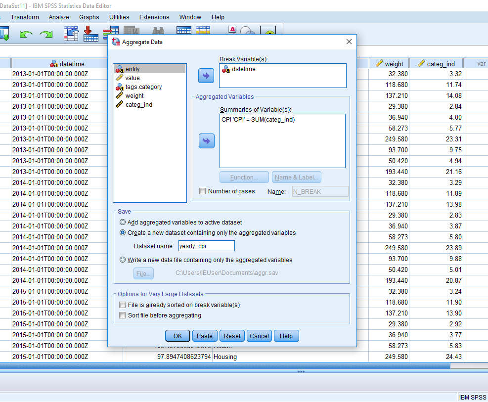

## Introduction to IBM STSS calculations. Data Aggregation.

### Before data analysis we should import datasets from any source and make pre-process them.

Let we have one source, it's database server (HBS Axibase in our case, [link to sql console](https://hbs.axibase.com:9443/sql/console)) where we can execute SQL queries and export results.
Suppose we solve a problem of yearly consumer basket index calculation. We have two datasets.

 * dataset with weights for every marketing category (2017 yr)

```sql
SELECT entity, datetime as timedate, value as weight, tags.category FROM inflation.cpi.categories.weight ORDER BY tags.category, datetime
```
 * dataset with prices in period 2013-2017, it shows yearly prices in all marketing categories

```sql
SELECT entity, datetime, value, tags.category FROM inflation.cpi.categories.price ORDER BY tags.category, datetime
```
Firstly, run these queries on HBS Axibase server and export results into CSV file.

**NB**: SPSS merges datasets by common columns. So, we have to make aliases for 'value' metric as 'weight' and 'datetime' column as 'timedate'. Otherwise, we would have got merged dataset with data only for 2017 year. On the other hand, you may try to exclude column datetime(+) during merge. But it should be better to give aliases for columns in SQL query.

Secondly, import your CSV files in IBM SPSS.
1. In SPSS File -> Import Data -> CSV Data... Choose your CSV documents and check Open button. You should import both CSV (prices and weights) for converting into datasets with .sav extension.

**Look at main menu items for working in the future:**
.
 * **Data** includes common operations with datasets (select rows, aggregation, merge/split files);
 * **Transform** gives opportunities for data transformation such as calculating new variables, convert current dataset into time series or another data structure, turn ordinal variables into dummy variables;
 * **Analyze** contains majority of statistical methods and machine learning algorithms (forecasting, regression, classification, neural networks etc.)

Finally, make merge of .sav files.
2. Data -> Merge Files... -> Add Variables -> Select file you want to merge with current -> Continue -> Set lookup table you want to merge with current -> Choose "One-to-Many" link and go to 'Variables' tab in dialogue window.
Move necessary columns to included list, unnecessary columns - to excluded list. To select join key move column to the field 'Key Variables'


**NB:** Be careful during files union, don't forget about final count of observations and check correctness of merged data. For example, we have files with 10 lines and 27 lines. If you select file with 10 lines as the basic, the final file will contain only 10 lines with new column. Otherwise, final dataset would have 27 lines.

### So, data preprocessing was over we are ready to make various analysis with dataset.

Again, we want to know common yearly index of customer basket. Let we compute new column with production of value and (weight/1000) and then get sum of products for yearly period.
3. Transform -> Compute Variable...  Select columns from the left field into expression text field and use all operations you need. Don't forget to dive a name for new column!


There are several ways in SPSS for data aggregation. 

4. (1) Analyze -> Reports -> Report Summaries in Columns. Move categ_index to 'Summary variables' field and select aggregation function SUM. Set datetime column as a break variable. You can format aggregation columns in dialogue window.


Next way to calculate sum of indexes is aggregation function.
4. (2) Data -> Aggregate... (Data Aggregation). Set categ_ind as summary variable and assign SUM function, set datetime as break variable (like GROUP BY in SQL). Columns formatting is available here too.


If you make aggregation in Analyze section, you can convert your output .sav into HTM. There will be log and report sections.


Try to look at HTM version of [Yearly Index Calculation](resources/index_calculation.htm)

**NB:** To change decimals of a scale variable click 'Variable View' tab in the lower left corner of SPSS. This tab shows useful info about dataset variables (data type, measure, role etc.) and allows to add/delete/edit columns.

**NB:** After user operation (analysis, chart building, open/close file, merge etc.) SPSS generates output file .spv with procedure commands. You may save either all files or those what contains useful information about data analysis. In addition, we recommended to convert .sav into HTM report for results publication.
