# IBM SPSS Modeler


## Overview

IBM SPSS Modeler is a predictive analytics platform that helps you build accurate predictive 
models quickly and deliver predictive intelligence to individuals, groups, systems and the enterprise.
The following guide includes examples of loading time series data from the Axibase Time Series Database (ATSD),
filtering them and storing the results back in ATSD.

## Sample Dataset

For the purpose of instruction, we will use [sample series commands](resources/commands.txt).
The series contain the Consumer Price Index (CPI) for each category
of items in a consumer's basket as well as a weight for each category in the CPI
basket. The weights are stored as fractions of 1000. The CPI is tracked from 2013 to
2017 and uses Year 2016 values as the baseline. Weight values are available only for
year 2017.

To load the data into ATSD, login into the database web interface and submit
these commands on the **Metrics > Data Entry** page.

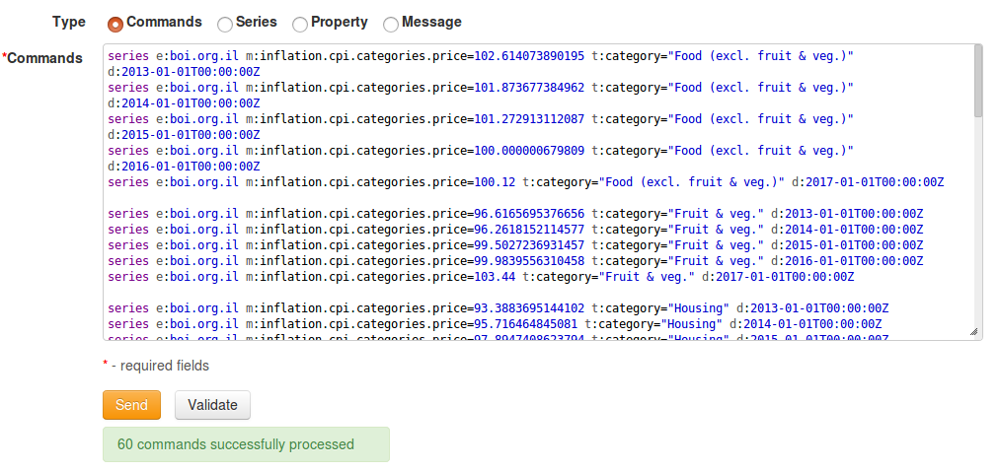

Also you can download ready [stream file](resources/Stream.str) for review in your own IBM SPSS Modeler installation.

## Prerequisites

- Install [IBM SPSS Modeler](http://www-01.ibm.com/support/docview.wss?uid=swg24039399), version 18
- Install [ODBC-JDBC gateway](../../odbc/README.md).

## Create Database data source

- In the bottom panel of IBM SPSS Modeler select **Sources** tab and choose **Database**

  

- Add the **Database** source to your stream

  

- Right click on this source and select **Edit...**

  

- Expand **Data source** and choose **Add new database connection**

  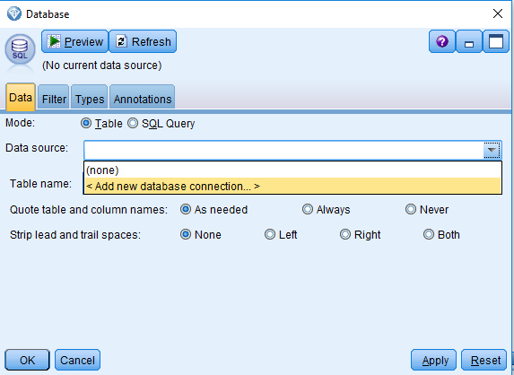
  
- Choose ATSD ODBC data source. If there are no data sources - create it as described [here](../odbc/README.md#configure-odbc-data-source) and click **Refresh**

  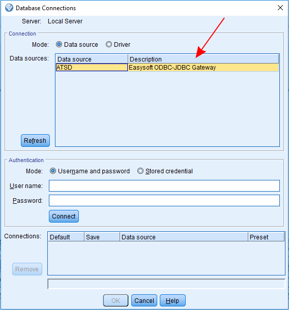
  
- Enter username and password and click **Connect**

  
  
- New connection should appear in **Connections** table

  
  
- Click **OK**. After wizard close choose your new data source

  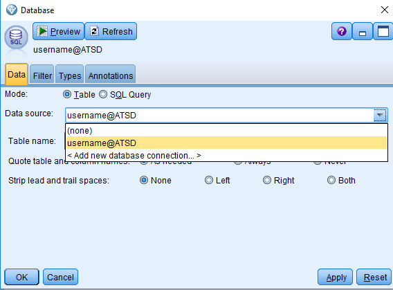
  
- Click **Select...**

  
  
- Select `inflation.cpi.categories.price` metric and click **OK**

  
  
If you don't find your metric, update ODBC data source as described [here](no-tables-fix.md), delete your connection in SPSS Modeler and 
create it again.

- Check **Never** in **Quote table and column names** 

  
  
- Go to **Filter** tab and disable `time`, `text` and `metric` fields

  
  
- Database source setup is finished. To check database source click **Preview**

  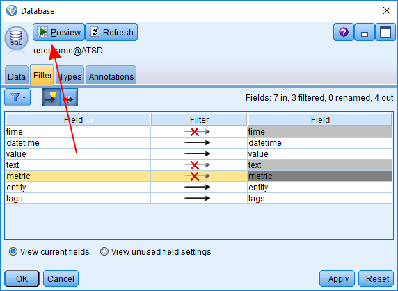
  
First 10 rows should be shown in preview table

  
  
- Close preview table and click **OK** in database source settings window to save changes

- Repeat these steps to create another data source for metric `inflation.cpi.categories.weight` 
  
  
  
## Join two tables

- In the bottom panel of IBM SPSS Modeler select **Record Ops** tab, choose **Merge** node and
add it to stream

  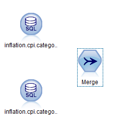
  
- Right click on any database source node and select **Connect...**

  

- Select **Merge** node. A link should appear between two nodes

  
  
- Connect other database source with **Merge** node

  
  
- Right click on the **Merge** node and select **Edit...**. Set **Merge method** to **Keys**
and add `tags` field to **Keys for merge** field

  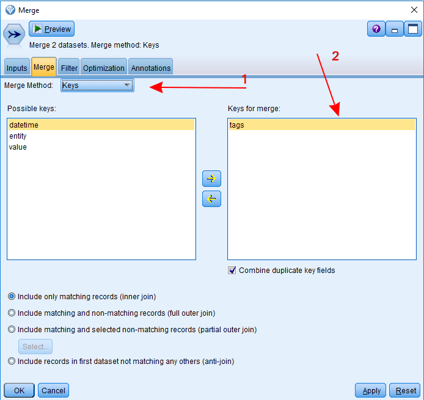
  
- Go to **Filter** tab and disable (click on arrow in Filter column) both entity fields and
datetime field for `inflation.cpi.categories.weight` table

  
  
- Rename `value` field in `inflation.cpi.categories.price` table to `price` and `value` field
in `inflation.cpi.categories.weight` to `weight`

  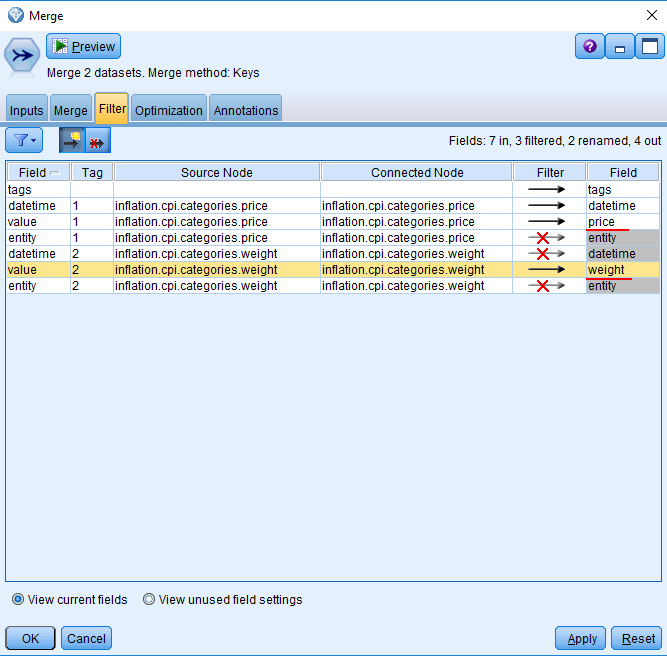
  
- Click **Preview** button to check result

  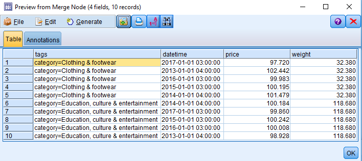
  
- Save changes and close the editor

## Calculate weighted price for every row

- In the bottom panel of IBM SPSS Modeler select **Field Ops** tab, choose **Derive** node and
add it to stream

  
  
- Connect **Merge** and **Derive** nodes

  
  
- Right click on the **Derive** node and select **Edit...**. Set **Derive field** to 
**weighted_price**, field type to **Continuous** and add formula **price * weight / 1000**
  
  
  
- Click **Preview** button to check result. **weighted_price** column should be added.

  
  
- Save changes and close the editor

## Calculate weighted inflation index for each year

- In the bottom panel of IBM SPSS Modeler select **Record Ops** tab, choose **Aggregate** node and
add it to stream

  
  
- Connect **Derive** (weighted_price) and **Aggregate** nodes

  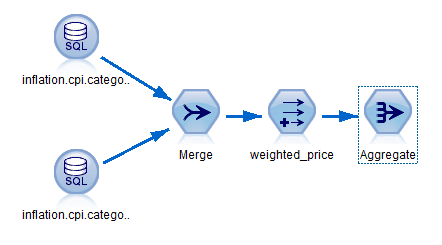
  
- Right click on the **Aggregate** node and select **Edit...**. Add `datetime` in **Key fields**
and disable **Include record count in field** checkbox. 

  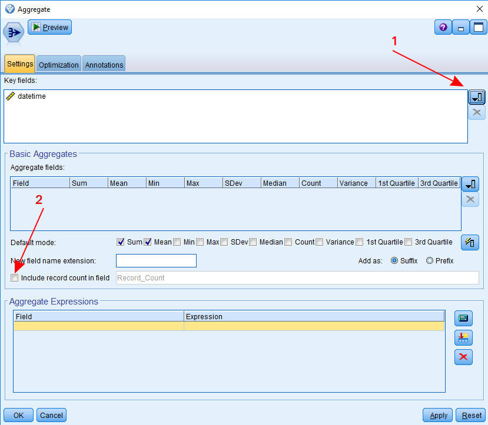
  
- In **Aggregate expressions** table enter field name `value` and click **Launch expression builder**

  
  
- In Expression Builder window enter formula `SUM('weighted_price')` and click **OK**

  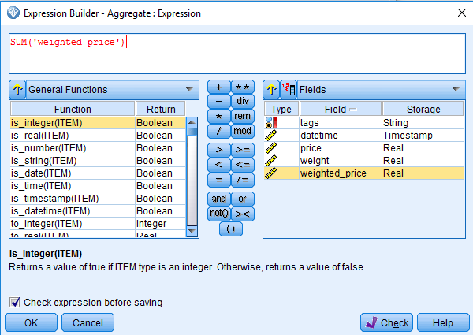
  
- Click **Preview** button to check result

  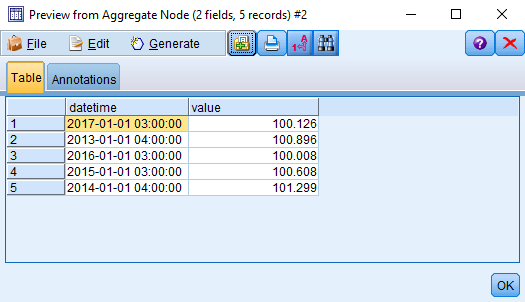

- Save changes and close the editor

## Add constant entity field

- In the bottom panel of IBM SPSS Modeler select **Field Ops** tab, choose **Derive** node and
add it to stream

  
  
- Connect **Aggregate** and **Derive** nodes

  
  
- Right click on the **Derive** node and select **Edit...**. Set **Derive field** to 
**entity**, field type to **Categorical** and add formula **"bls.gov"**

  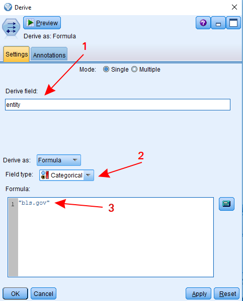
  
- Click **Preview** button to check result. **entity** column should be added.

  
  
- Save changes and close the editor

## Create export metric in ATSD

- Log in ATSD web interface, go to **Metrics > Data Entry** page and execute command

```
metric m:inflation.cpi.composite.price
```


## Export result to ATSD

- In the bottom panel of IBM SPSS Modeler select **Export** tab, choose **Database** node and
add it to stream

  
  
- Connect **Derive** (entity) and **Database** nodes

  
  
- Right click on the **Database** node and select **Edit...**. Choose **Data source**, select
**Insert into table** option. Click **Select...** and choose `inflation.cpi.composite.price` table.
Also set **Quote table and column names** to **Never**

  
  
- Click **Advanced...** button

  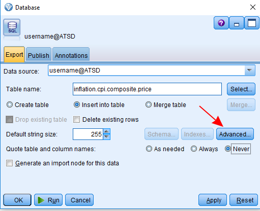
  
- In Advanced Options window set **Use bulk loading** to **Via ODBC** and **Use binding** to
**Row-wise**. Click **OK** to save and exit.

  
  
- Click **Run** to export data to ATSD

  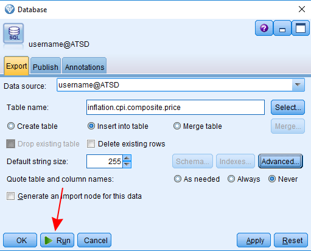

- To check that data is successfully exported to ATSD go to ATSD web interface, click **SQL** and execute
following query

```sql
SELECT entity, datetime, value 
FROM 'inflation.cpi.composite.price'
```

  