# IBM SPSS Modeler


## Overview

IBM SPSS Modeler provides a set of tools to build data transformations and analysis models for users without programming experience. The following guide includes examples of loading time series data from the Axibase Time Series Database (ATSD),
calculating derived time series in IBM SPSS Modeler and storing the results back in ATSD.

## Sample Dataset

For the purpose of instruction, we will use [sample series commands](resources/commands.txt).
The series contain the Consumer Price Index (CPI) for each category
of items in a consumer's basket as well as a weight for each category in the CPI
basket. The weights are stored as fractions of 1000. The CPI is tracked from 2013 to
2017 and uses Year 2016 values as the baseline. Weight values are available only for
year 2017.

To load the data into ATSD, login into the database web interface and submit
these commands on the **Metrics > Data Entry** page.


## Prerequisites

- Install [IBM SPSS Modeler](http://www-01.ibm.com/support/docview.wss?uid=swg24039399), version 18
- Install [ODBC-JDBC bridge](../../odbc/README.md).

## Create Data Source

- Create a new stream. Stream is a configuration that includes all the steps to load and analyze the data in SPSS Modeler. 

- Select **Sources** tab in the bottom panel and choose **Database** 

  

- Add the **Database** source to the stream by drag-and-dropping into the stream workspace.

  

- Right click on the source and click **Edit...**

  

- Expand **Data source** and choose **Add new database connection**

  
  
- Choose ATSD ODBC data source. If there are no data sources - create an ODBC-bridged connection to ATSD as described [here](../../odbc/README.md#configure-odbc-data-source) and click **Refresh**

  
  
- Enter username and password and click **Connect**

  
  
- New connection should appear in the **Connections** table

  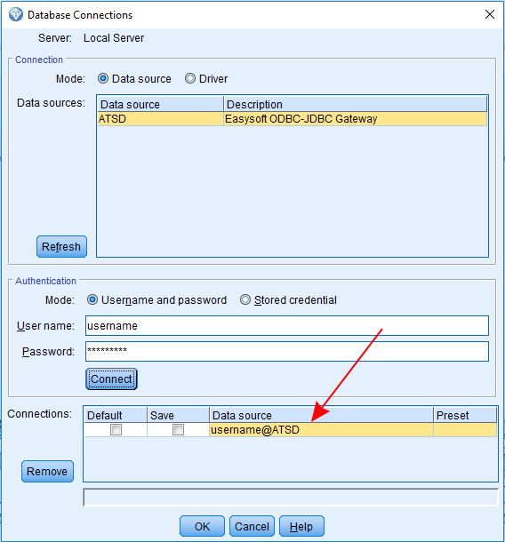
  
- Click **OK**. Select the newly created ATSD data source.

  
  
- Click **Select...** to view the list of available ATSD tables. The list of tables is based on the `tables=` property specified in the JDBC URL. If you don't see the desired table in the list, update ODBC data source as described [here](../../odbc/table-config.md), delete your connection in SPSS Modeler and create it again. Specify `tables=*` to view all tables in ATSD.

  
  
- Disable **Show table owner** checkbox, select `inflation.cpi.categories.price` table and click **OK**

  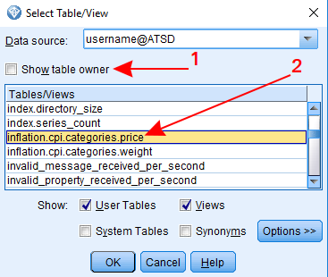
  
- Check **Never** in **Quote table and column names** 

  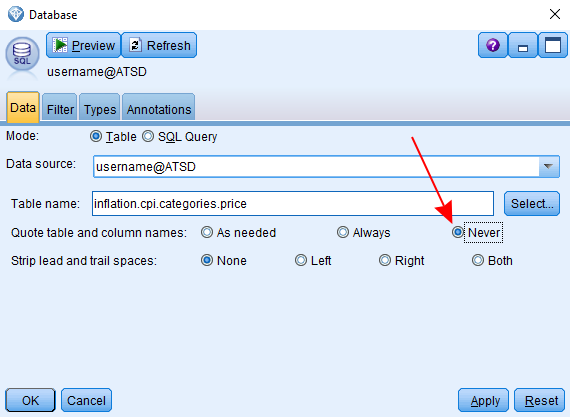
  
- Go to **Filter** tab and click on arrow in the Filter column to disable `time`, `text` and `metric` columns.

  
  
- Database source setup is finished. Click **Preview** to verify the results by reviewing the first 10 rows in the the table.

  

  
  
- Close the preview table and click **OK** in database source settings window to save changes.

- Repeat these steps to create another data source for table `inflation.cpi.categories.weight` 
  
  
  
## Join Tables

- Select **Record Ops** tab in the bottom panel, choose **Merge** node and add it to the stream

  
  
- Right click on one of the database source shapes and select **Connect...**

  

- Select **Merge** shape. A link should appear between the source and the **Merge** shapes.

  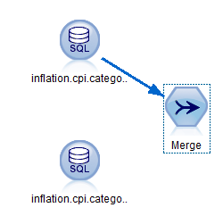
  
- Connect the other source with the **Merge** shape using a similar technique.

  
  
- Right click on the **Merge** shape and select **Edit...**. Set **Merge method** to **Keys**
and add `tags` field to **Keys for merge** field

  
  
- Open the **Filter** tab and disable both entity fields and the datetime field for the `inflation.cpi.categories.weight` table.

  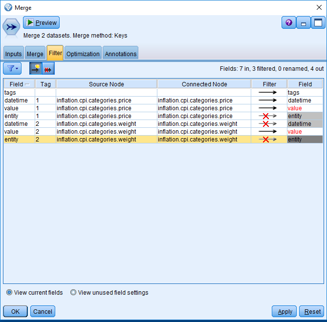
  
- Rename `value` field in `inflation.cpi.categories.price` table to `price` and `value` field
in `inflation.cpi.categories.weight` to `weight`

  
  
- Click **Preview** button to check results

  
  
- Close the **Preview** window and click **Ok** to save changes.

## Calculate Weighted Price

- Select **Field Ops** tab in the bottom panel, choose **Derive** shape and
add it to the stream

  
  
- Connect **Merge** and **Derive** shapes

  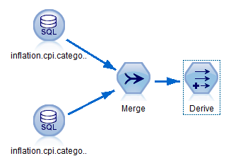
  
- Right click on the **Derive** shape and select **Edit...**
  - Set **Derive field** to **weighted_price**
  - Set field type to **Continuous**
  - Add formula **price * weight / 1000**
  
  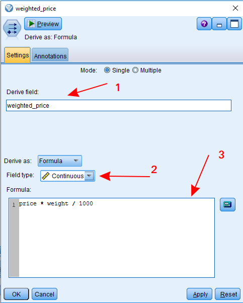
  
- Click **Preview** button to check results. You should be able to see the **weighted_price** column.

  
  
- Close the **Preview** window and click **Ok** to save changes.

## Calculate Weighted Inflation per Year

- Select **Record Ops** tab, choose **Aggregate** shape and add it to the stream

  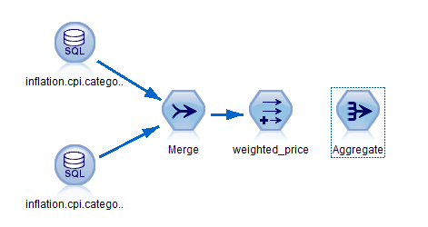
  
- Connect **Derive** (weighted_price) and **Aggregate** shapes

  
  
- Right click on the **Aggregate** shape and select **Edit...**
  - Add `datetime` in **Key fields**
  - Disable **Include record count in field** checkbox. 

  
  
- In **Aggregate expressions** table, enter field name `value` and click **Launch expression builder**

  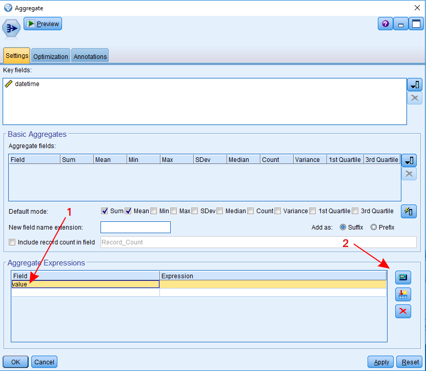
  
- In Expression Builder window, enter formula `SUM('weighted_price')` and click **OK**

  
  
- Click **Preview** button to check results

  

- Close the preview table and click **OK** to save changes.

## Add Entity Field

- Select **Field Ops** tab, choose **Derive** shape and
add it to the stream

  
  
- Connect **Aggregate** and **Derive** shapes

  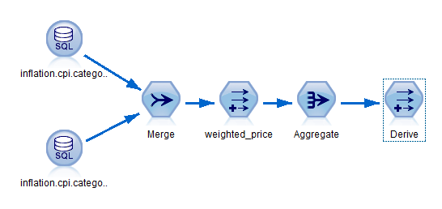
  
- Right click on the **Derive** shape and select **Edit...**
  - Set **Derive field** to **entity**
  - Set field type to **Categorical**
  - Add formula **"bls.gov"**

  
  
- Click **Preview** button to check results. **entity** column should be added.

  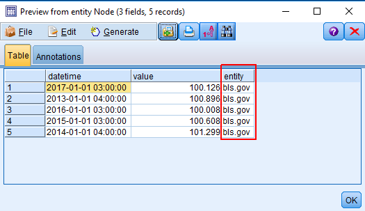
  
- Close the preview table and click **OK** to save changes.

## Export Results

- Select **Export** tab, choose **Database** shape and
add it to the stream

  
  
- Connect **Derive** (entity) and **Database** shapes

  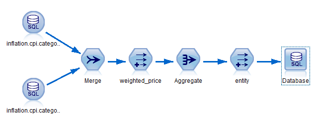
  
- Right click on the **Database** shape and select **Edit...**
  - Choose **Data source**
  - Type `inflation.cpi.composite.price` in **Table name**. This would be the name of the new metric inserted into ATSD.
  - Select **Insert into table** option
  - Set **Quote table and column names** to **Never**

  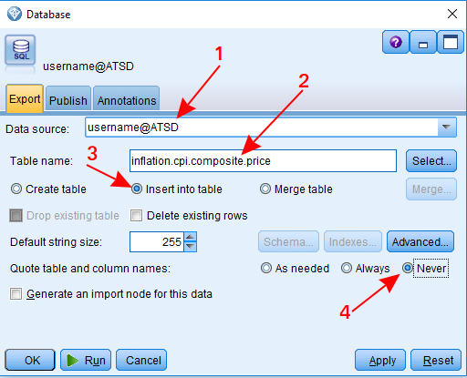
  
- Click **Advanced...** button

  
  
- In Advanced Options window set **Use bulk loading** to **Via ODBC** and **Use binding** to
**Row-wise**. Click **OK** to save and exit.

  
  
- Click **Run** to export data into ATSD

  

## Verify Insertion

To check that data is successfully exported to ATSD go to ATSD web interface, click **SQL** and execute
following query

```sql
SELECT entity, datetime, value 
  FROM 'inflation.cpi.composite.price'
```

  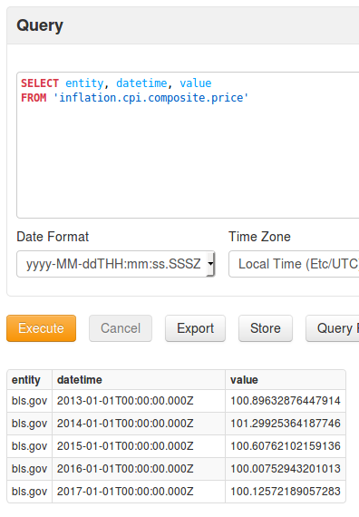
  
## Stream File

Download the [stream file](resources/Stream.str) used for this guide for review in your own IBM SPSS Modeler installation.
