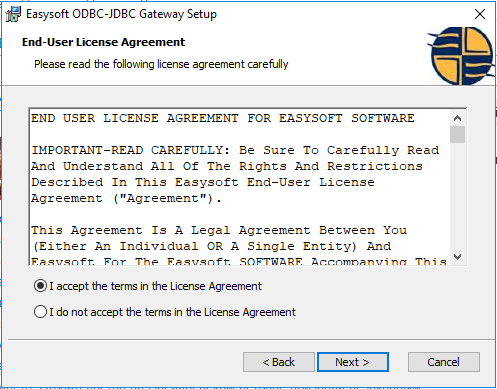
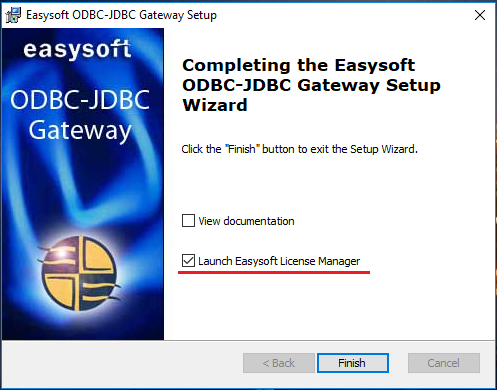
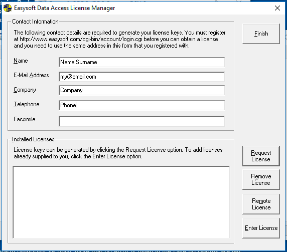
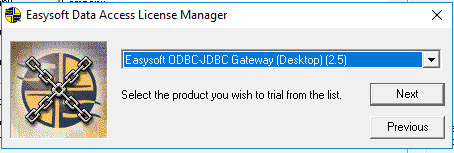
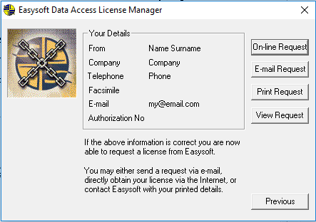
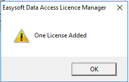
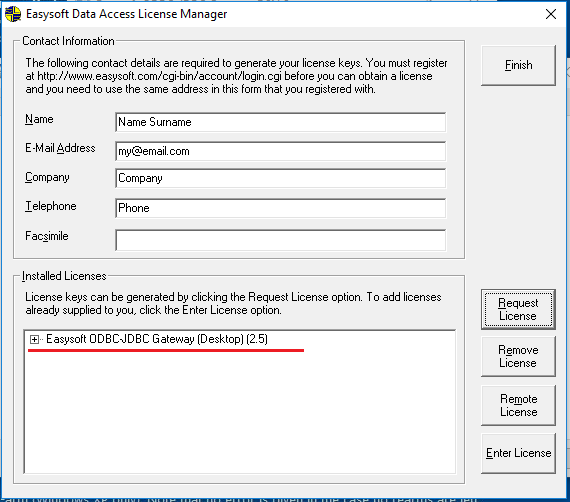
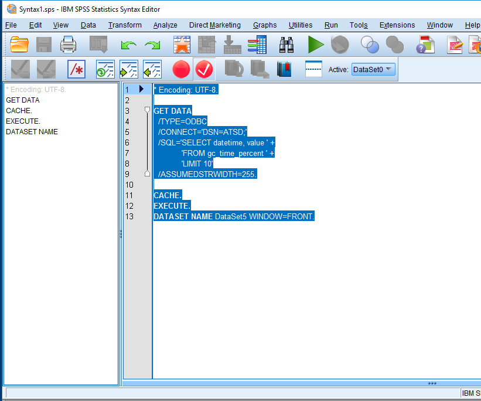

**Windows / Easysoft**

1) Install JRE 8
2) Register an Easysoft account here http://www.easysoft.com/cgi-bin/account/register.cgi . This account will be used further during trial activation process.
3) Download trial version of Easysoft ODBC JDBC Bridge from here http://www.easysoft.com/products/data_access/odbc_jdbc_gateway/#section=tab-1
4) Download ATSD JDBC driver from here, with DEPS https://github.com/axibase/atsd-jdbc/releases
5) Install and activate Easysoft 

Run installer as administrator


Skip welcom page


Accept license agreement



Choose install path


Confirm install


After installation ends check **Launch Easysoft license manager** checkbox and finish



License manager window appear after exit from install wizard (if it don't go to **Start** and search for **License Manager**). In this widow fill all fields same as in registered account from previous step and click **Request License**



Choose **Trial**, click Next


Choose **ODBC JDBC Gateway**, click Next



Click **Online request**



If activation succeeds, popup window will appear



Also in License Manager window should appear new license



6) Add new ODBC data source

Go to **Start** , type ODBC and launch ODBC Data source manager as administrator


Go to **System DSN** tab and click **Add...**


Choose **Easysoft ODBC-JDBC Gateway**, click Finish


In DSN Setup window enter following settings

```
DSN: ATSD
User name: <atsd login>
Password: <atsd password>
Driver class: com.axibase.tsd.driver.jdbc.AtsdDriver
Class Path: <path to ATSD JDBC Driver, for example C:\atsd-jdbc-1.2.22-SNAPSHOT-DEPS.jar>
URL: <ATSD URL, for example jdbc:axibase:atsd:https://atsd_host:atsd_port/api/sql;trustServerCertificate=true>
```

ATSD JDBC URL format and parametres decribed here https://github.com/axibase/atsd-jdbc#jdbc-connection-properties-supported-by-driver


Click Test to check your settings. If result is OK, save settings. After this in System DSN tab should appear new data source


For using this datasource in SPSS Statistics, open attached script (Syntax1.sps)



```
* Encoding: UTF-8.

GET DATA
  /TYPE=ODBC
  /CONNECT='DSN=ATSD;'
  /SQL='SELECT datetime, value FROM gc_time_percent LIMIT 10'
  /ASSUMEDSTRWIDTH=255.

CACHE.
EXECUTE.
DATASET NAME DataSet5 WINDOW=FRONT.
```

In this script CONNECT='DSN=ATSD' is DSN of created connection, SQL is query. Select all statements and run them. Some dataset should be returned


