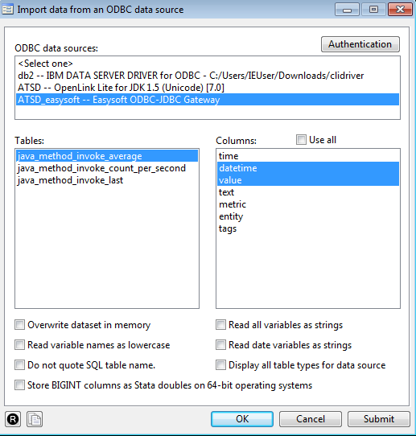
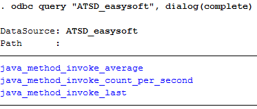
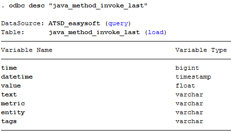
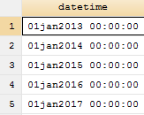
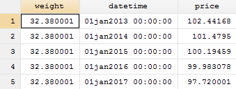
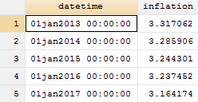
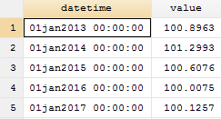
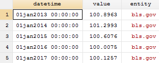

# STATA

- [Prerequisites](#prerequisites)
- [View Schema](#view-schema)
- [Load Data](#load-data)
- [Write Data](#write-data)
- [Calculate Derived Series](#calculate-derived-series)
- [Reference](#reference)

## Prerequisites

### Install Stata

- Install [Stata](http://www.stata.com/order/) 15

### Install ODBC-JDBC Gateway

- Install [ODBC-JDBC Gateway](../odbc/README.md)

Remember to choose some table (specify a JDBC URL `TABLE_NAME_FILTER` parameter).
> `TABLE_NAME_FILTER` is a list of comma-separated metrics or metric expressions to be displayed as tables.
> `TABLE_NAME_FILTER` examples:
>  - `*java*` for metrics that contains word `java`
>  - `custom.metric*` for metrics whose name starts with `custom.metric`
>  - `*2017` for metrics whose name ends with `2017`

## View Schema

### View Schema via Import Wizard

- Click on File -> Import -> ODBC data source
- Click on your ATSD connection in `ODBC data sources`
- Click on table in `Tables` list
- Choose columns from `Columns` list
- Click `OK` to import these columns into Stata

Example of Import Wizard:



### View Schema via Stata Console

- Type `odbc list` in Stata Console.
- Click on Data Source Name (DSN) that you have configured with ODBC-JDBC Gateway

> List of metrics whose name satisfy TABLE_NAME_FILTER will be showed below like in example:



- Click on any metric name from that list to see table description:



- Click on `load` to load whole table as a dataset
- Click on `query` to re-load list of metrics again.

## Load Data

You have 3 ways of loading data from ATSD:
- Load metric via [Import Wizard](#view-schema-via-import-wizard)
- Load metric via [Schema in Stata Console](#view-schema-via-stata-console)
- Load SQL query resulset

Example of Stata command to load SQL query results:
`odbc load, exec("SELECT value, tags.name FROM 'java_method_invoke_last' ORDER BY datetime")`

## Write Data

### Write Data via Export Wizard

- Click on File -> Export -> ODBC data source
- Click on your ATSD connection in `ODBC data sources`
- Type metric name into `Tables` field (into that metric dataset will be exported)
- Choose exported variables in `Variables` dropdown list
- Type column names from resulted metric according to variables chosen at previous step
- Choose `Append data into existing table` in `Insertion options`
- Check `Use block inserts` option
- Click `OK` to export these variables into Stata

### Write Data via Stata Console

Use command `odbc insert var1 var2 var3, as("entity datetime value") dsn("ATSD") table("metric_name") block` to insert data from STATA into ATSD.

> - `var1 var2 var3` is a list of variables from im-memory dataset in STATA
> - `as("entity datetime value")` is a list of columns in ATSD metric. That list should be sorted according to list of variables
> - `dsn("ATSD")` is a name of ODBC connection to ATSD
> - `table("metric_name")` is a name of metric which will contain exported dataset
> - `block` is a parameter to force using block inserts

## Calculate Derived Series

To calculate the category-weighted consumer price index (CPI) for each year, the CPI value for a given category must be multiplied by its weight and divided by 1000 since its weights are stored as units of 1000 (not 100). The resulting products are summed as the weighted CPI for the given year.

### Load and Save prices dataset

```
odbc load, exec("SELECT value as price, tags.category as category, datetime FROM 'inflation.cpi.categories.price' ORDER BY datetime, category") dsn("ODBC_JDBC_SAMPLE")
save prices
```

> We need to save dataset to use it later

`prices` preview:


### Load and Save datetimes dataset

```
clear
odbc load, exec("SELECT datetime FROM 'inflation.cpi.categories.price' GROUP BY datetime ORDER BY datetime") dsn("ODBC_JDBC_SAMPLE")
save datetimes
```

`datetimes` preview:



### Load weights dataset and cross join with datetimes

Since the `Weights` are available for only one year, we will assume that the category weights are constant through the timespan and therefore can be repeated for each year from 2013 to 2017.

```
clear
odbc load, exec("SELECT tags.category as category, value as weight FROM 'inflation.cpi.categories.weight' ORDER BY datetime, category") dsn("ODBC_JDBC_SAMPLE")
cross using datetimes
```

Crossed dataset preview:


### Merge current dataset with prices dataset

In this step we will append two tables to perform calculations inside one table. This table will have a unique row identifier (pair `datetime - category`) so we can join them with the INNER JOIN operation.

```
merge 1:1 category datetime using prices
drop category _merge
```

Merged dataset preview:



### Generate new variable

Multiply two columns element-wise:

```
generate inflation = weight * price / 1000
drop weight price
```

Dataset with generated variable:



### Group by datetime and aggregate SUM

Group rows by `datetime` and sum weighted price values for each year.

```
bysort datetime : egen value = total(inflation)
sort datetime value
by datetime value :  gen dup = cond(_N==1,0,_n)
drop if dup>1
drop dup inflation
```

> The operation will group records by datetime and calculate the sum of `inflation` values for each group.

Dataset after grouping:



### Add entity constant

The entity column is required to store computed metrics back in ATSD.

```
generate entity = "bls.gov"
```

> This operation will add a new column `entity` that has the value `bls.gov` in each row.

Dataset after constant addition:



### Insert data into ATSD

#### datetime as NUMBER

```
replace datetime = datetime - tC(01jan1970 00:00:00)
set odbcdriver ansi
odbc insert entity datetime value, as("entity datetime value") table("inflation.cpi.composite.price") dsn("ODBC_JDBC_SAMPLE") block
```

#### datetime as STRING

```
generate datetime_str = string(datetime, "%tcCCYY-NN-DD!THH:MM:SS.sss!Z")
set odbcdriver ansi
odbc insert entity datetime_str value, as("entity datetime value") table("inflation.cpi.composite.price") dsn("ODBC_JDBC_SAMPLE") block
```

### Check Results

Log in to ATSD and execute the following query in the SQL tab to verify the results:

```sql
SELECT entity, datetime, value FROM 'inflation.cpi.composite.price'
```

```ls
| entity  | datetime                 | value              |
|---------|--------------------------|--------------------|
| bls.gov | 2013-01-01T00:00:00.000Z | 100.89632897771745 |
| bls.gov | 2014-01-01T00:00:00.000Z | 101.29925299205442 |
| bls.gov | 2015-01-01T00:00:00.000Z | 100.60762066801131 |
| bls.gov | 2016-01-01T00:00:00.000Z | 100.00753061641115 |
| bls.gov | 2017-01-01T00:00:00.000Z | 100.12572021999999 |
```

## Reference

STATA commands used in this example:

- [adbc](http://www.stata.com/manuals13/dodbc.pdf)
- [save](http://www.stata.com/manuals13/dsave.pdf)
- [clear](http://www.stata.com/manuals13/dclear.pdf)
- [cross](http://www.stata.com/manuals13/dcross.pdf)
- [merge](http://www.stata.com/manuals13/dmerge.pdf)
- [drop](http://www.stata.com/manuals13/ddrop.pdf)
- [generate](http://www.stata.com/manuals13/dgenerate.pdf)
- [by / bysort](http://www.stata.com/help.cgi?bysort)
- [egen](http://www.stata.com/manuals13/degen.pdf)
- [sort](http://www.stata.com/manuals13/dsort.pdf)
