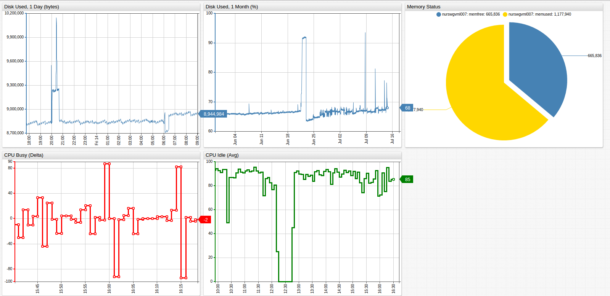
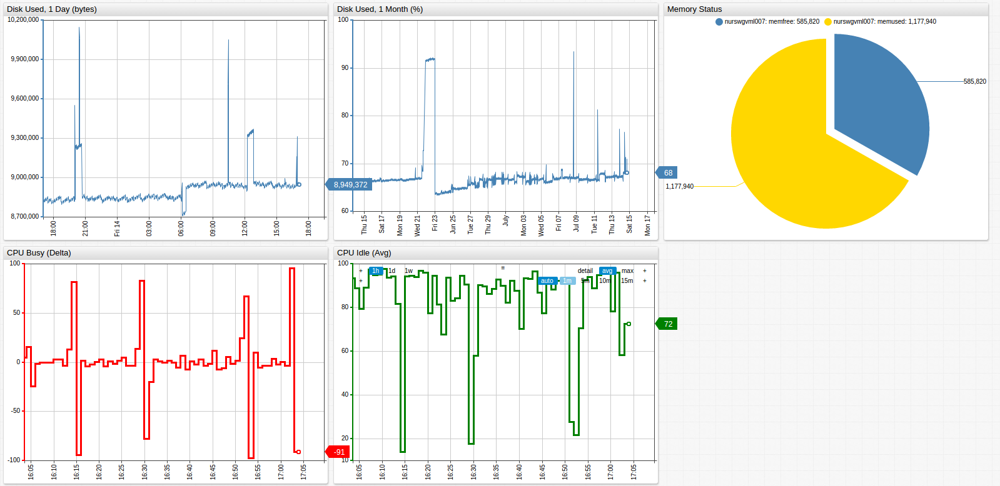
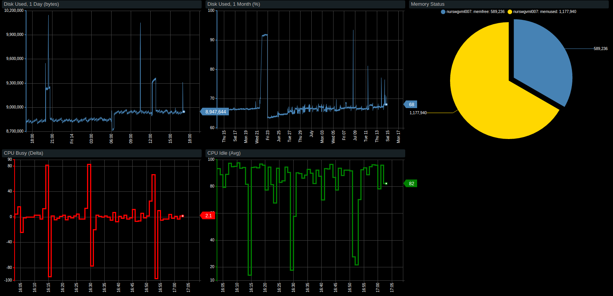

# Creating a New Portal

## Overview

Portal is a collection of time-series [widgets](https://axibase.com/products/axibase-time-series-database/visualization/widgets/) created usign the Charts syntax and presented in a [**grid** layout](portal-settings.md).

## Creating Portal

- Open the **Configuration > Portals** page, click **Create**.
- Specify new portal properties.

| **Property** | **Description** |
|---|---|
| Name | User-friendly portal name.|
| Enabled | Portal status. Disabled portals are not visible to users. |
| Template | Portal type: regular or template. See type descriptions below.  |
| Display Index | Applicable to template portals. The order in which portals are assigned to an entity are listed in the portals toolbar. |
| Theme | Select a graphics style to render the widgets: Default or Black. Custom themes can be installed as described below.|
| Content | Portal [configuration](portal-settings.md) text specified using the Charts syntax. |


## Portal Configuration  

### Syntax

The portal is configured using the Charts syntax which is a domain-specific language implemented in ATSD to assemble visualizations in a declarative manner. The basic components of the syntax are **sections** and **settings**.

* **Section** is enclosed in square brackets, for example, `[widget]`. The section may include the nested sections and settings. The section terminates when another section is specified.
* **Setting** includes name and value, separated by equal sign, for example, `type = treemap`.

```ls
# this is a section named [widget]
[widget]
  # this is a setting that belongs to section [widget]
  timespan = 1 hour
```

### Layout

Widgets are positioned on the portal page using a **grid** layout. The dimensions of the grid are specified under the `[configuration]` tag using the `width-units` and `height-units` settings. Each widgets occupies 1 horizontal and 1 vertical unit by default.

The following example creates a grid containing 6 units, with 3 widgets placed in the first row and 2 placed in the second.

```ls
[configuration]
  width-units = 3
  height-units = 2
  # portal-level settings
  # shared widget settings
[group]
  [widget]
     # widget settings  
     type = chart
     [series]
       # series settings
       metric = view_count
       entity = axibase.com
       [tags]
         page_name = index.htm
  [widget]
  [widget]
[group]
  [widget]
  [widget]
```



### Reference

* [Portal Settings](https://axibase.com/products/axibase-time-series-database/visualization/widgets/portal-settings/)

* [Generic Widget Settings](https://axibase.com/products/axibase-time-series-database/visualization/widgets/configuring-the-widgets/)

* [Widgets](https://axibase.com/products/axibase-time-series-database/visualization/widgets/)

## Portal Types

Two types of portals are supported:

1. Regular portals. 
2. Template portals. 

### Regular Portals

The regular portal doesn't depend on external parameters and can be rendered as is.

* Sample Link for a Regular Portal

```
https://ATSD_HOSTNAME:8443/portal/4.xhtml
```

Regular portals are listed under the `[Portals]` tab in the top menu.


### Template Portals

The template portals exist so that the same generic portal can be accessed for all entities of the same type. It requires an entity name to be passed as a request parameter.

* Sample Link for a Template Portal

```
https://ATSD_HOSTNAME:8443/portal/111.xhtml?entity=nurswgvml013
```

The above link passes the `entity` parameter to a template portal which substitutes all `${entity}` placeholders in the portal configuration text. 

```ls
[widget]
  type = chart
  [series]
    metric = jmx.derby.hitcount
    entity = ${entity}
```

The actual configuration displayed contains the specific entity name as follows:

```ls
[widget]
  type = chart
  [series]
    metric = jmx.derby.hitcount
    entity = nurswgvml013
```

To open a template portal directly in the browser address bar, substibute the `${portal_id}` below with Portal identifier displayed on the **Configuration > Portals** page and specify a valid entity name in the `${entity}` request parameter.

```
https://ATSD_HOSTNAME:8443/portal/${portal_id}.xhtml?entity=${entity}
```

Alternatively, assign an entity group to the template portal so that the link to this portal is available on the [Entities] tab for all entities that are members of the entity group.

* Open **Configuration > Portals** page.
* Locate the template portal that you'd like to assign.
* Open the portal editor, click on the **Assign** link below.
* Select entity groups to which the portal will be assigned.
* Click **Save** at the bottom of the page.


* Open **Entities** tab
* Select an entity group in the drop-down filter
* Click on the 'portals' icon for an entity and verify that the portal was assigned.


## Portal Themes

| Default Theme| Black Theme |
|---|---|
|  |  |

You can install your own themes by modifying the default files and uploading theme css files to `/opt/atsd/conf/portal/themes/` directory. After you upload your custom theme, it will appear in the list of available themes in the portal editor.
