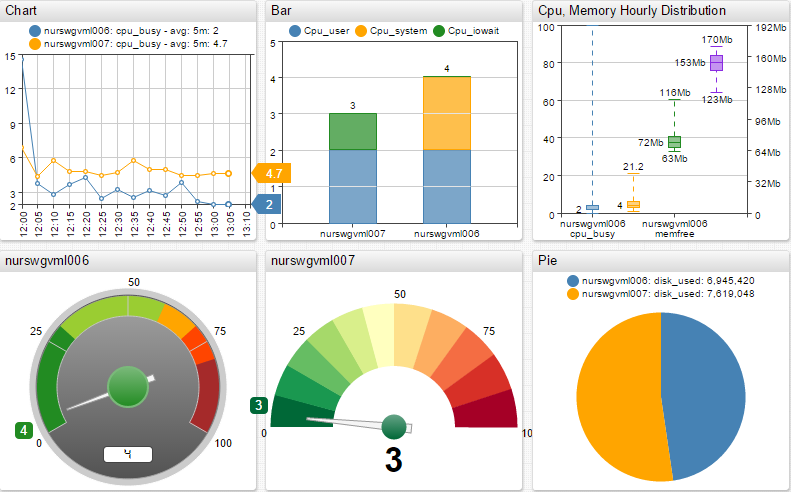
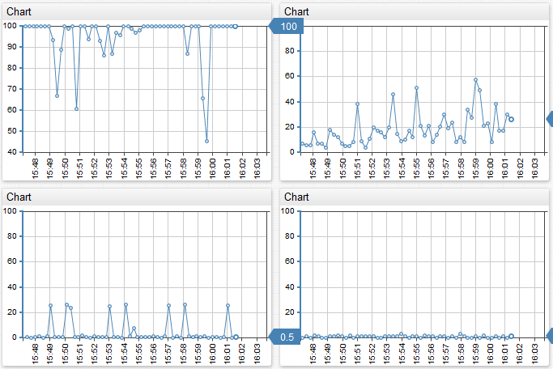

# Portal Layout

Widget are positioned on the portal page using a **grid** layout. The dimensions of the grid are specified under the `[configuration]` tag.

```
[configuration]
  width-units = 3
  height-units = 2
```

In this example, the page is split into 3 columns and 2 rows.

The default grid dimensions are 6×4. The default widget size is 1×1 and can be adjusted with the `width-units` and `height-units` settings.

To display multiple widgets on one row, group them using the `[group]` tag.

```
[configuration]
  width-units = 3
  height-units = 2
 
#1st line
[group]
  [widget]
  [widget]
  [widget]
 
#2nd line
[group]
  [widget]
  [widget]
  [widget]
```

As an alternative to creating groups for each row, add the `widgets-per-row` setting under the `[group]` tag.

```
[configuration]
  width-units = 3
  height-units = 2
 
[group]
  widgets-per-row = 3
  [widget]
  [widget]
  [widget]
  [widget]
  [widget]
  [widget]
```


[2x3 Group Layout (per row grouping)](http://apps.axibase.com/chartlab/adfe0fe2)


[3x2 Grid Layout (manual grouping)](http://apps.axibase.com/chartlab/adfe0fe2/18/)



#### [configuration] Settings

| Name | Example | Description | Chart Lab | 
| --- | --- | --- | --- | 
|  title  |  `title = CPU Busy Portal`  |  Name of the portal.  |  | 
|  width-units   |  `width-units = 2`  |  Amount of horizontal blocks (9 by default).  |  [View](http://apps.axibase.com/chartlab/808e5846)  | 
|  height-units  |  `height-units = 2`  |  	Amount of vertical blocks (4 by default).  |  [View](http://apps.axibase.com/chartlab/808e5846/2/)  | 
|  offset-right  |  `offset-right = 50`  |  Determines the margin on the portal.<br>`offset-` can be used with: top, right, bottom, left.<br>Values specified in px.  |  [View](http://apps.axibase.com/chartlab/808e5846/10/)  | 
|  url  |  `url = http://hostname:port`  |  Link to ATSD server.  |  | 
|  url-parameters  |  `url-parameters = db=12&adapter=7`  |  Extra connection configurations.  |  | 
|  path  |  `path =`  |  Default path is `api/v1/series`.  |  | 
|  update-interval  |  `update-interval = 5 minute`  |  Polling interval at which new data is requested from the server by all widgets on the portal.<br>For example `update-interval = 5 minute`.<br>The default value is 1 minute.<br>The setting can be overridden for each widget separately.  |  [View](http://apps.axibase.com/chartlab/808e5846/3/)  | 
|  batch-update  |  `batch-update = true`  |  Sending series to the server in packets (false by default).<br>If equal to true, then the series, if during the last request to the server there was an error, will be sent one by one.  |  [View](http://apps.axibase.com/chartlab/808e5846/4/)  | 
|  batch-size  |  `batch-size = 1`  |  Maximum amount of series in one request to the server (8 by default).<br>If 0 is indicated, then the limit for the amount is not set.<br>Only accepted when the batch-update is equal to true.  |  [View](http://apps.axibase.com/chartlab/808e5846/5/)  | 
|  timespan  |  `timespan = 2 hour`  |  Allows to adjust the time-span that the whole portal displays, i.e. 1 hour, 1 day, all etc.<br>This can be set for the whole portal or for every widget individually.  |  [View](http://apps.axibase.com/chartlab/808e5846/6/)  | 
|  starttime  |  `starttime = 2015-04-01`  |  Specifies the date and time from which the values for the series are loaded.<br>This can be set for the whole portal or for every widget individually.<br>Syntax is shared with `endtime`.<br>NOTE: `starttime` is inclusive and `endtime` is exclusive.<br>This means that `startime = 2015-09-14 10:00:00` will include data points that occurred exactly at `10:00:00` and later.<br>`Endtime = 2015-09-14 11:00:00` will include data points that occurred up to `10:59:59`, excluding points that occurred at `11:00:00` and later.<br>Possible values described on the [End Time](https://axibase.com/products/axibase-time-series-database/visualization/end-time/) page.  |  [View](http://apps.axibase.com/chartlab/ca5669c8)  | 
|  endtime  |  `endtime = previous_working_day`  |  Specifies the date and time until which the values for the series are loaded.<br>This can be set for the whole portal or for every widget individually.<br>NOTE: `starttime` is inclusive and `endtime` is exclusive.<br>Meaning that `startime = 2015-09-14 10:00:00` will include data points that occurred exactly at `10:00:00` and later.<br>`Endtime = 2015-09-14 11:00:00` will include data points that occurred up to `10:59:59`, excluding points that occurred at `11:00:00` and later.<br>Possible values described on the [End Time](../products/axibase-time-series-database/visualization/end-time/) page.  |  [View](http://apps.axibase.com/chartlab/808e5846/7/)  | 
|  timezone  |  `timezone = UTC`  |  Set the timezone for the data being loaded into the portal.<br>If UTC is not set, then the portal is displayed in the local time zone.<br>Possible values: UTC.  |  [View](http://apps.axibase.com/chartlab/808e5846/8/)  | 
|  dialog-maximize  |  `dialog-maximize = true`  |  If set to true, the dialog window will open full-screen.<br>Dialog window can be opened by clicking on the widget title.<br>Possible values: true, false.<br>Default value: true.  |  [View](http://apps.axibase.com/chartlab/808e5846/14/)  | 
|  display-panels  |  `display-panels = true`  |  Display the controls of the widget.<br>Possible values: true, false, hover.  |  [View](http://apps.axibase.com/chartlab/808e5846/16/)  | 
|  expand-panels  |  `expand-panels = compact`  |  Expands the controls of the widget.<br>Possible values: all, compact, none.  |  [View](http://apps.axibase.com/chartlab/808e5846/18/)  | 
|  periods  |  `periods = 20 minute, 4 hour`  |  Add custom aggregation periods to aggregation controls in the top-right corner of the widget.  |  [View](http://apps.axibase.com/chartlab/fedaa42e/45/)  | 
|  buttons  |  `buttons = update`  |  Add buttons to the widget title (header), visible only on mouse-over.<br>Possible values: update, reset.<br>`update` stops/resumes the loading of fresh data into the widget.<br>Reset is only available for table widgets. Resets the sorting of columns.  |  [View](http://apps.axibase.com/chartlab/808e5846/12/)  | 
|  script  |  `script = defaultChartConfig.colors = ['olive']`  |  JavaScript code. Evaluated before the addition of widgets into the DOM of the browser.<br>Allows to reallocate the style of elements, and gives meaning by default for certain types of widgets or change to a certain widget.<br>If you show this parameter in the tag `[widget]`, then the argument widget will be given, being itself the main object of this widget and containing the main methods.  |  [View](http://apps.axibase.com/chartlab/808e5846/11/)  | 


Freemarker expressions are supported when creating portals. [Learn how to use freemarker expressions in ATSD.](freemarker.md)

#### Configuration Example:

```
[configuration]
title = Title
width-units = 6
height-units = 3
url = http://atsd_server:port
url-parameters = db=12&adapter=7
```

#### Comments

**Single-line comments**

Single line comment starts with `#`. Text after `#` will be ignored.

```
[widget]
        type = chart   
        #metric field will be inherited by all series in the widget
	metric = nmon.cpu_total.busy%
```

Hash symbol in the middle of the line (preceded by any character other than tab or whitespace) is escaped and treated as regular text.

```
[widget]
        type = chart   
        #next line does not contain any comments because hash is preceded by characters other than tab or whitespace.
	title = Hello # World
```

**Multi-line comments**

Multi-line comments start with /* and end with */.

Any text between /* and */ will be ignored.

```
[widget]
        type = chart
    /*   
     type = bar
     title = Hello
    */  
	metric = nmon.cpu_total.busy%
```

#### Placeholders

You can insert placeholders into the configuration text to populate it with values of the request parameters. Placeholders have the `{placeholderName}` format. The value of the placeholder is parsed from the query string from any parameter starting with `p_`, i.e. `p_placeholderName`.

```
[series]
entity = {id}
metric = cpu_busy
```

Invoked with `?p_id=nurswgvml002`, the above configuration is converted into the following text:

```
[series]
entity = nurswgvml002
metric = cpu_busy
```

#### Script parameter in `[configuration]` tag

Script parameter can be used for a variety of purposes. It is recommended for advanced users.

Adding styles to a class:

```
script = d3.select('head').append('style').html('.axi-chart-series-alert{ stroke: red; stroke-width: 1.5; }')
```

To display no more than 5 elements for the control of all Time Charts, open the dialog box:

```
defaultDialogChart.script = widget.chart.panels.expand(5)
```

To hide the Stack button for all Bar Charts, which are not open in the dialog box:

```
defaultBarConfig.script = if (!dialog) widget.panels[0].destroy()
```
