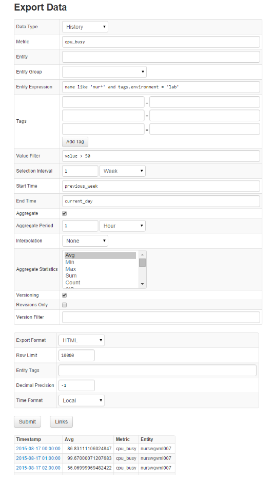

# Ad hoc Exporting

Ad hoc exporting provides an interactive interface for exporting historical data and forecasts in CSV and HTML formats.

#### Ad hoc Export Settings

| Setting | Description |
| --- | --- |
|  Export Type  |  Data type – Historical or Forecast.  |
|  Metric  |  Metric name for which data will be exported. Data can be exported for one metric at a time.  |
|  Entity  |  If selected, exported data will be limited to the specified entity. Supersedes Entity Group selector.  |
|  Entity Group  |  If selected, exported data will be limited to entities contained in the specified entity group. Supersedes Entity Expression field.  |
|  Entity Expression  |  An expression to filter selected data by entity name and entity tags. For example: `name like 'nur*' AND tags.environment = 'prod'`.  |
|  Tags  |  An optional set of series tag pairs. For example, `file_system = /` for the `disk_used_percent` metric. Note that series tags are inserted along with value, and are therefore different from entity and metric tags. Wildcard symbols `*` and `?` are supported in tag values.  |
|  Value Filter  |  Expression to fetch only detailed samples that satisfy a condition. For example, `value != 0`. Value Filter is applied before aggregation and therefore impacts aggregated statistics values. To filter deleted values, use the Double.isNaN(`value`) syntax.  |
|  Selection Interval  |  Time frame of exported data. End of the Selection Interval can be optionally specified in the End Time field. Otherwise it is set to current time. The Selection Interval setting is ignored if both the Start Time and End Time fields are set.  |
|  Start Time  |  Start time of the selection interval. This field supports [End Time](../end-time-syntax.md) syntax. For example 'previous_day'. If Start Time is not defined, it is set to End Time minus the Selection Interval.  |
|  End Time  |  End time of the selection interval. This field supports [End Time](../end-time-syntax.md) syntax. For example 'next_day'. If End Time is not defined, it is set to Start Time plus the Selection Interval. If Start Time is not defined, the End Time is set to current time.  |
|  Aggregate  |  Enable period aggregations based on the selected detailed samples, after the optional Value Filter is applied.  |
|  Aggregation Period  |  Period of time over which the detailed samples are aggregated.  |
|  Interpolation  |  Insert missing periods in aggregated results. The period is considered missing if it contains no detailed samples. Supported options: `STEP` – value of missing period equals value of the previous period; `LINEAR` – value is linearly interpolated between previous and next available value; `NONE` – missing periods are not inserted.   |
|  Aggregate Statistics  |  One or multiple aggregation functions: average, minimum, maximum, sum, count, standard deviation, weighted average, weighted time average, median (percentile 50), first, last, percentile 50/75/90/95/99/99.5/99.9, MinValueTime, MaxValueTime.  | 
|  Versioning  |  Display value history for metric that is enabled for Versioning. Versioning is displayed only for detailed, non-aggregated samples.  |
|  Revisions Only  |  Filters displayed versions only for samples with values changes. Excludes samples without versions.  |
|  Version Filter  |  Expression to filter value history (versions) by version status, source, or time. For example: `version_status = 'Deleted' or version_source LIKE '*user*'`. To filter by version time, use the `date()` function. For example, `version_time > date('2015-08-11T16:00:00Z') or version_time > date('current_day')`. The `date()` function accepts [End Time](../end-time-syntax.md) syntax.  |
|  Export Format  |  Export format – CSV or HTML. If HTML is selected, number of rows can be limited with Row Limit.  |
|  Row Limit  |  Maximum Number of Rows displayed in HTML format. Tables with greater than 10000 rows are not recommended for viewing in HTML format.  |
|  Entity Tags  |  List of entity tags included as columns in the exported file/table.  |
|  Decimal Precision  |  Number of fractional digits displayed. If a negative value such as -1 is specified, stored numbers are displayed 'as is' without any formatting.  |
|  Time Format  |  Format for displaying series sample timestamps: Local Time (server timezone) or ISO (UTC time). Local = `yyyy-MM-dd HH:mm:ss` ISO = `yyyy-MM-dd'T'HH:mm:ss'Z'`  |

