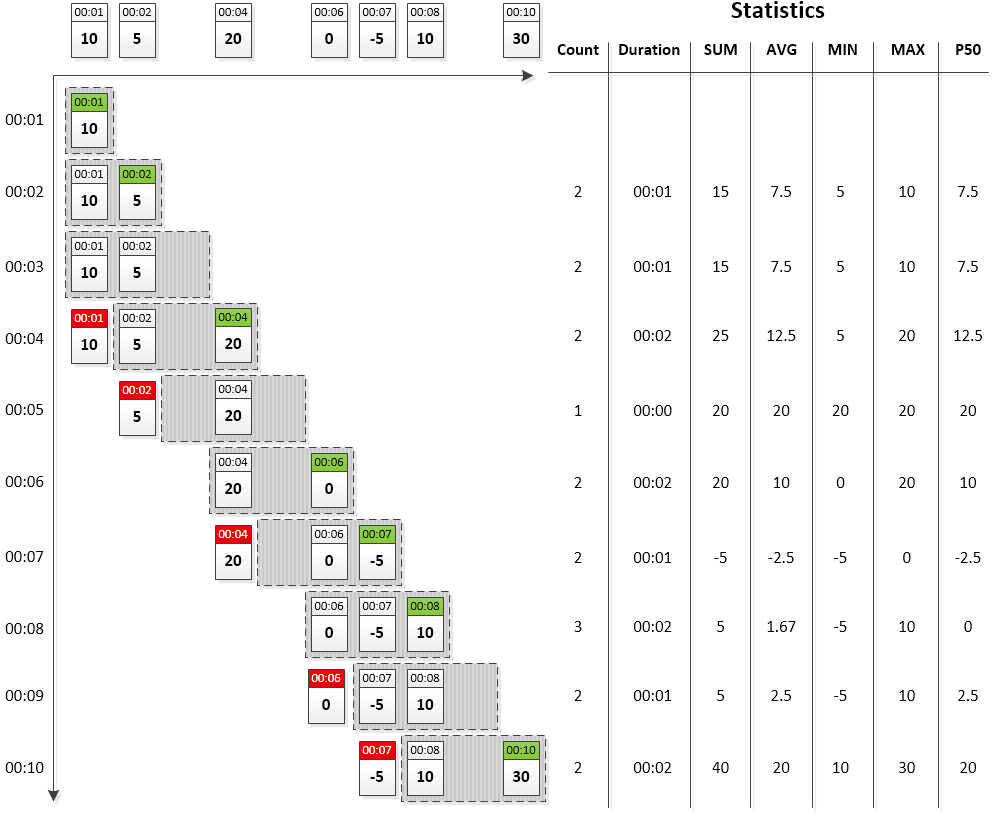
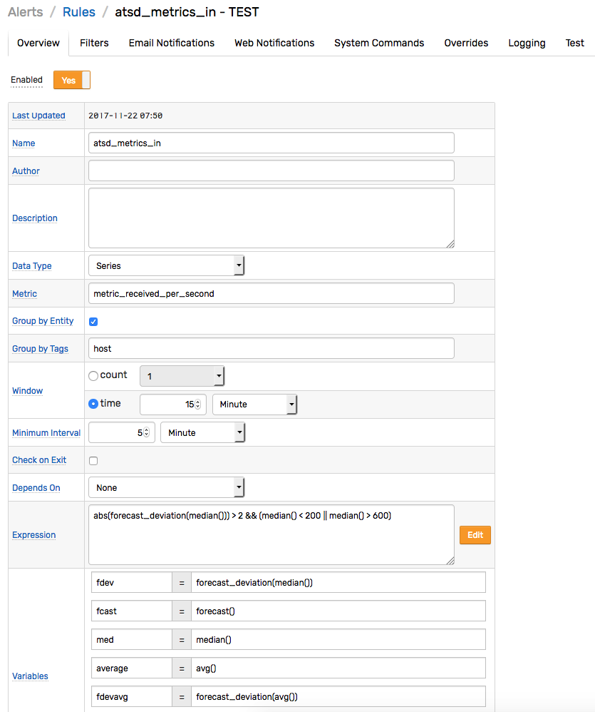

# Rule Engine

## Overview

The Rule Engine enables automation of repetitive tasks based on the analysis of incoming data. Such tasks may include invoking a script to resolve a problem,  
[sending an
email](email-action.md),
or raising a ticket in a service desk.

The rule engine evaluates a set of `IF-THEN` expressions on incoming data:

```javascript
    IF condition == true THEN action
```

If the condition specified in the rule evaluates to `true`, one or multiple automation procedures are triggered, for instance:

```javascript
    IF avg() > 75 THEN create_ticket
```

The condition can operate on values for one metric as well as correlation multiple metrics using the [`db_last`](functions-db.md#db_last-function) and [`db_statistic`](functions-db.md#db_statistic-function) functions.

## References

* [Expressions](expression.md)
* [Filters](filters.md)
* [Functions](functions.md)
* [Placeholders](placeholders.md)
* [Overrides](overrides.md)
* [Web Notifications](web-notifications.md)
* [Email Notifications](email-action.md)
* [Editor](editor.md)

## In-Memory Processing

The incoming data is processed by the rule engine in-memory, before the data is stored on disk.


## Processing Stages

### Filtering

The incoming data samples are processed by a chain of filters prior to reaching the grouping stage. Such filters include:

* **Input Filter**. All samples are discarded if the **Admin:Input Settings > Rule Engine** option is disabled.

* **Status Filter**. Samples are discarded for metrics and entities that are disabled.

* [Rule Filters](filters.md) ignore samples that do not match a specific metric, entity, or filter expression.

### Grouping

Once the sample passes through the chain of filters, it is added to matching
windows grouped by metric, entity, and optional tags. Each window maintains its own array of data samples.

> If the 'Disable Entity Grouping' option is checked, the window is grouped only by metric and optional tags.

### Evaluation

Windows are continuously updated as new samples are added and old samples are
removed to maintain the size of the given window at a constant interval length or sample count.

When a window is updated, the rule engine evaluates the expression that returns a boolean value:

```javascript
    percentile(95) > 80 && stdev() < 10
```

The window changes its status once the expression returns a boolean value different from the previous iteration.

## Window Status

Windows are stateful. Once the expression for a given window evaluates
to `TRUE`, it is maintained in memory with status `OPEN`. On subsequent `TRUE`
evaluations for the same window, the status is changed to `REPEAT`. When the expression
finally changes to `FALSE`, the status is set to `CANCEL`. The window state is
not stored in the database and windows are recreated with new data if
ATSD is restarted. Maintaining the status in memory while the condition
is `TRUE` enables de-duplication and improves throughput.

## Actions

Actions can be programmed to execute on window status changes, for example on `OPEN`
status or on every n-th `REPEAT` status occurrence.

## Window Types

Windows can be count-based or time-based. A count-based window maintains
an ordered array of elements. Once the array reaches the specified
length, new elements begin to replace older elements chronologically. A time-based window
includes all elements that are timestamped within a time interval that
ends with the current time and starts with the current time minus a specified
interval. For example, a 5-minute time-based window includes all
elements that arrived over the last 5 minutes. As the current time
increases, the start time is incremented accordingly, as if the window is
sliding along a timeline.

## Correlation

Each rule evaluates data received for only one specified metric. In order to create conditions that check values for multiple metrics, use [database](functions-db.md) and [rule](functions-rules.md) functions.

* Database functions:

```javascript
    percentile(95) > 80 && db_statistic('max', '1 hour', 'metric2') < 10*1024
```

* Rule functions:

```javascript
    percentile(95) > 80 && rule_open('inside_temperature_check')
```

## Developing Rules

Rules are typically developed by system engineers with specialized
knowledge of the application domain. Rules are often
created post-mortem to prevent newly discovered problems from
re-occurring. Rules usually cover a small subset of key metrics to minimize the maintenance effort.

In order to minimize the number of rules with manual thresholds, the
rule engine provides the following capabilities:

-   Automated thresholds determined by the `forecast()` function.
-   Expression [overrides](overrides.md).

###   Automated Thresholds

Thresholds specified in expressions can be set manually or using the
`forecast` function. For example, the following rule fires if the observed
moving average deviates from the expected forecast value by more than 25% in any direction.

```javascript
    abs(avg() - forecast()) > 25
```

Alternatively, the `forecast_deviation` function can be utilized to
compare actual and expected values as a ration of standard deviation
specific for each time series:

```javascript
    abs(forecast_deviation(avg())) > 2
```

### Overrides

The default expression can be superseded for a given entity or
an entity group by adding an entry to the [Overrides](overrides.md) table. The
override rule can also be created by clicking on the `Override` link under the Alerts tab or on the corresponding link in the email notification message.

In the example below, an alert will be created when
the `avg` of the `nur-entities-name` entity name is greater than 90.


## Sliding Windows

The Rule Engine supports two types of windows:

* COUNT-based
* TIME-based


### Count Based Windows – 3 Event Window Example

Count based windows analyze the last N sample regardless
of when they occurred. The count window holds up to N samples, to which
aggregate function such as `avg()` or `max()` can be applied as part of an expression. When the
COUNT-based window becomes full, the oldest data sample is replaced with an incoming sample.


### Time Based Windows – 3 Second Window Example

Time based windows analyze data samples that were recorded in the last N
seconds, minutes, or hours. The time window doesn't limit how many samples can be held by the window. It automatically removes data samples that move
outside of the time interval as time passes.



## Alert Logging

Alerts can be [logged](alert-logging.md) in the database as well as in log files for automation and audit.

## Alert Severity

The severity of alerts raised by the rule engine is specified on the 'Logging' tab in the rule editor.

If an alert is raised by an expression defined in the Overrides table, its severity supersedes the severity specified on the 'Logging' tab.

> For rules operating on 'message' commands, the alert severity can be inherited from the underlying message.
To enable this behavior, set Severity on the 'Logging' tab to 'unknown'.

## Rule Editor

The rules can be created and maintained using the built-in [Rule Editor](editor.md).

## Rule Configuration Example

In this example, the expression refers to forecasts generated for the `metric_received_per_second` metric.

```javascript
abs(forecast_deviation(wavg())) > 2
```

The expression evaluates to `true` when the forecast deviates from the
15 minute weighted average by more than 2 standard deviations for the given series.

## Examples

* Open Alerts


* Rule Editor


