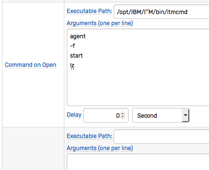
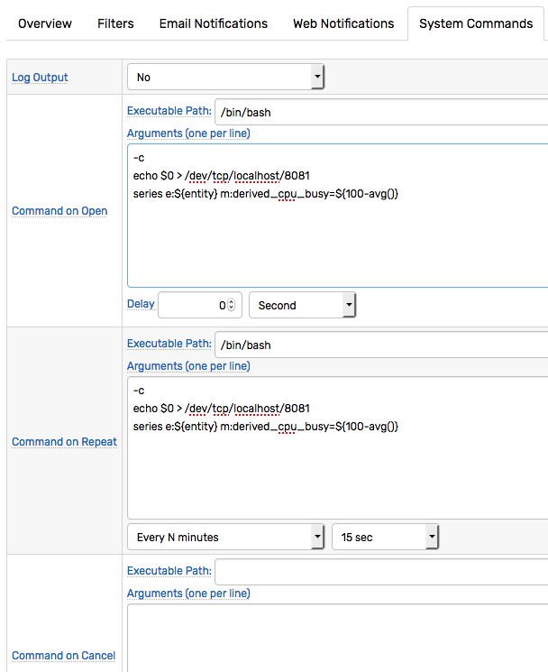

# Commands

## Overview

The command action allows executing system commands on the server where the ATSD process is running. The action can be used to react to incoming data and analytical rules by triggering complex processing tasks, connecting to web services using `curl` and integrating with external systems using their native command line tools such as [IBM ITM `itmcmd`](https://www.ibm.com/support/knowledgecenter/en/SSTFXA_6.2.1/com.ibm.itm.doc_6.2.1/itm_cmdref113.htm) or [AWS CLI](https://aws.amazon.com/cli/).

## Configuration

The command can be executed on `OPEN`, `CANCEL` and `REPEAT` status changes. To execute the command, enter a valid executable path. Arguments are optional. If the executable path is empty, it means that the command will not be executed for this status change.

Only **one** command can be executed for each status change.

### Path

The executable file must exist at the specified absolute path. The executable file should have the execution permission set.

### Arguments

The executable program may accept arguments which should be specified one argument per line.

The arguments may include [placeholders](placeholders.md) using `${name}` syntax, for example `${entity}`. If the placeholder is not found, it is resolved to an empty string.

Arguments that require quoting (for example if the value contains whitespace) will be quoted automatically.

## Security

The commands are executed under the `axibase` user.

## Logging

When 'Log Output' option is enabled, both `system.out` and `system.err` outputs will be logged to the `atsd.log` file for each command execution.

## Example: `itmcmd`

Input command: `/opt/IBM/ITM/bin/itmcmd agent -f start hd`

Executable: `/opt/IBM/ITM/bin/itmcmd`

Arguments (one per line):

```sh
agent
-f
start
hd
```



## Example: derived command

Input command: `/bin/bash -c echo $0 > /dev/tcp/localhost/8081 series e:${entity} m:derived_cpu_busy=${100-avg()}`

Executable: `/bin/bash`

Arguments (one per line):

```sh
-c
echo $0 > /dev/tcp/localhost/8081
series e:${entity} m:derived_cpu_busy=${100-avg()}
```


