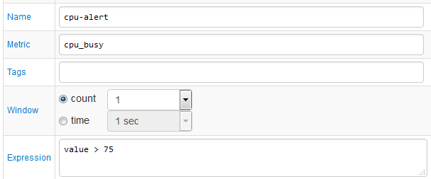
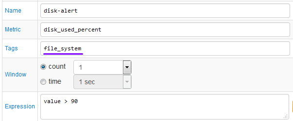

# Email Action

Email Action enables delivery of email messages to one or multiple
subscribers on window state changes based on incoming data.

## Window State

The email notifications are triggered on window state events.

A [window](window.md) is an in-memory object created by the rule engine for each unique combination of metric, entity, and tags extracted from incoming commands.

As the new data is received and old data is removed from the window, the rule engine re-evaluates the expression which can cause the state of the current window to change, triggering an email.

### Initial State

New windows are created based on incoming data and no historical data is loaded from the database.

The window for the given metric/entity/tags is created only when the first command for this series is received by the rule engine.

The new windows are assigned initial state of `CANCEL` which is then updated based on results of the boolean expression (`true` or `false`).

### Window Lifecycle

All windows for the current rule are deleted from memory if the rule is deleted or modified and saved in the editor.

### Triggers

The email notification can be triggered whenever the window changes its state as well as at scheduled intervals when the state is `REPEAT`.

### State Events

| Previous State | New State | Previous Expression Value | New Expression Value | Trigger Supported |
| --- | --- | --- | --- | --- |
| `CANCEL` | `OPEN` | `false` | `true` | Yes |
| `OPEN`  | `REPEAT` | `true` | `true` | Yes |
| `REPEAT` | `REPEAT` | `true` | `true` | Yes |
| `OPEN` | `CANCEL` | `true` | `false` | Yes |
| `REPEAT` | `CANCEL` | `true` | `false` | Yes |
| `CANCEL` | `CANCEL` | `false` | `false` | No |

### `OPEN` State

The `OPEN` state is assigned to the window when the expression changes value from `false` to `true`.

### `REPEAT` State

The `REPEAT` state is assigned to an `OPEN` window when the expression returns `true` based on the second received command.

When the window is in `REPEAT` state, the email can be sent with the frequency specified in the rule editor.

### `CANCEL` State

`CANCEL` is the initial state assigned to new windows. It is also assigned to the window when the the boolean expression changes from `true` to `false` or when the window is deleted on rule modification.

Triggering a repeat email notification in `CANCEL` state is not supported. Such behavior can be emulated by creating a separate rule with a negated expression which returns `true` instead of `false` for the same condition.

## Creating a Rule

To enable email notifications for a metric of interest, open the **Alerts > Rules** page and create a new rule.

Specify the rule name, metric name, and an expression to evaluate incoming
series samples. To receive an email message if a value exceeds the
threshold, set window type to `count=1` and enter `value > {threshold}`
as the expression.

Once the rule is active, you can verify its configuration by reviewing
records listed on the **Alerts > Open** page. If the expected alerts are missing, verify that
the data has been received and check the expression.

## Grouping Windows by Tag

By default, windows are grouped by metric and entity, which means that email
notifications will be generated for each entity separately.

If the underlying metric collects data with tags, specify their names in
the Tags field to group windows by entity and tags. Otherwise, the
same window will be updated with series samples related to different
tags.

## Configuring Notifications

To enable notifications for the selected rule, open the Email Notifications
tab, assign a name to the new configuration, and specify one or multiple
email addresses.

Enter Subject text and click 'Enabled' for each state change (`OPEN`,
`REPEAT`, `CANCEL`) that you would like to receive. Additionally, to enable
notifications on `REPEAT` state, set the 'Repeat Interval' to the desired
notification frequency, for example, every 10th sample or every 5 minutes.

The default Subject text is
`Rule ${rule}. Status ${status}. Entity: for ${entity}. Metric: ${metric}. Tags: ${tags}`.

## Email Notification Settings

| Setting | Description |
| --- | --- |
| Enabled | Enable or disable the configuration. |
| Name | User-defined email configuration name. Each rule can have multiple configurations which are executed independently based on state changes. |
| Recipients | One or multiple email subscribers receiving the message. Use a comma or semi-colon to separate multiple addresses. |
| Use In Overrides Only | If set to yes, the configuration will be activated only for override expressions specified under the Overrides tab. |
| Delay on Open | Delay interval for sending notification for `OPEN` state. If the window changes to `CANCEL` state within the specified delay interval, no `OPEN` state email will be sent. Set this interval to prevent emails on short-lived spikes. |
| Repeat Interval | Interval for sending `REPEAT` state notifications. If the Repeat Interval is set in time units, the exact interval may vary because the `REPEAT` notifications are triggered by incoming data. In particular, `REPEAT` notifications will not be sent if the data stops flowing in. |
| Merge Messages | Merge multiple notifications from different rules into one email for the same subscriber to prevent too many emails arriving within a short time span. Note that the message Subject is redefined for merged emails and reflects rule names, metric names, and the total number of merged notifications in the given message. For example: `Alerts(2)-cpu_busy: statistical-time, nmon_cpu`. |
| Priority | Message priority field to differentiate messages in common email clients: `Low`, `Normal`, `High`. |
| Message: Subject | Custom subject text for each status separately. List of supported placeholders is provided below. In addition to built-in placeholders you can use expressions containing built-in functions, for example: `${round(threshold_linear_time(99))/60}` or `${round(avg())}` |
| Message: Details | Embed a table containing series statistics and action links into the message text. |
| Message: Text | Custom message text for each status separately. List of supported placeholders is provided below. In addition to built-in placeholders, you can use expressions containing built-in functions. For example: `${round(threshold_linear_time(99))/60}` or `${round(avg())}`. |
| Message: Screenshot | Attach a time chart displaying the data relevant to the window.  |

## Email Message Placeholders

* Supported [placeholders](placeholders.md)

## Email Alert Content Example

> An alert exception can be created using the 'Exception' link received in email notifications:

