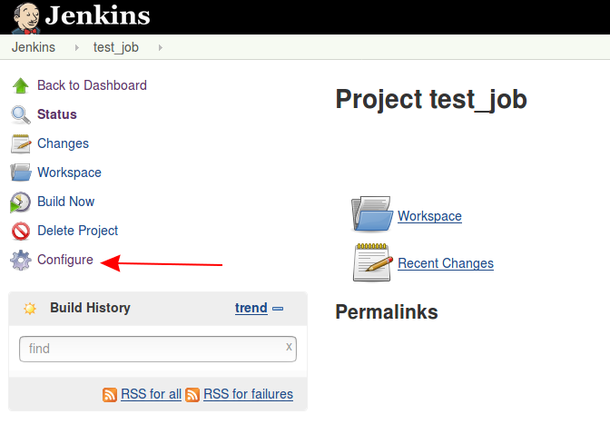

# Jenkins Integration

## Overview

The following example demonstrates how to trigger a [Jenkins](https://jenkins.io/) job using a [`CUSTOM`](custom.md) web notification in the ATSD rule engine.

The integration relies on the following [Jenkins API](https://wiki.jenkins.io/display/JENKINS/Remote+access+API) methods:

* `'Job with parameters'` method.
* `'Jobs without parameters'` method.

## Configuration

Create a new `CUSTOM` web notification from scratch or import the following [template](resources/custom-jenkins-notification.xml), used in this example.

To import the XML template file, open the **Alerts > Web Notifications** page, select **Import** in the multi-action button located below the table and follow the prompts.

To create a new notification, open the **Alerts > Web Notifications** page and click **Create**.

### Parameters

Enter a name and specify the following parameters:

| **Name** | **Value** |
| :--- | :--- |
| Method | `POST` |
| Content Type | `application/x-www-form-urlencoded` |
| Authentication | `Basic` |
| Username | `<JENKINS_USER_NAME>` |
| Password | `<JENKINS_USER_TOKEN>` |
| Endpoint URL | `https://jenkins.example.org/job/${job_name}/buildWithParameters` |

If the Jenkins job is not parameterized, use the `https://jenkins.example.org/job/${job_name}/build` url.

Replace `jenkins.example.org` in the `Endpoint URL` parameter with the actual Jenkins address. 

Keep the `${job_name}` placeholder in the URL path so that one can customize it in the rule editor. This would allow you to trigger different jobs using the same web notification.

Enter the Jenkins user name into the `Username` field and the User API token into the `Password` field.

The API token can be located on the `User Configuration` page in the Jenkins web interface.


Click `Show API Token` button.


Your token is displayed in the `API Token` field.


### Payload

If your Jenkins job is parameterized, you can send the additional parameters in the request payload. 

To inspect which parameters are exposed by the project, open the job configuration page in Jenkins.



The parameters will be displayed if `This project is parametrized` checkbox is enabled.


The web notification can be configured to send a `x-www-form-urlencoded` data to the Jenkins server in order to pass extended parameters.

In this case, add parameters names to the `Parameters` and enable their checkboxes in order to customize them in the rule editor.


Leave the `Parameters` table empty for non-parameterized jobs.

## Rule

Create a new rule or import the [rule template](resources/custom-jenkins-rule.xml) used in this example. To import the XML template file, open the **Alerts > Rules** page, select **Import** in the multi-action button located below the table and follow the prompts.

To create a new rule, open the **Alerts > Rules** page and click **Create**.

Specify the key settings on the **Overview** tab. 

| **Name** | **Value** |
| :-------- | :---- |
| Status | Enabled |
| Metric | test_m |
| Condition | `value > 1` |


Open the **Web Notifications** tab.

Set **Enabled** to **Yes** and choose the previously created web notification from the **Endpoint** drop-down.

Enable **Open** and **Repeat** triggers. Set the **Repeat Interval** to **All**.

Specify the same settings for the **Open** and **Repeat** triggers:

| **Name** | **Value** |
| :-------- | :---- |
| `job_name`  | atsd-api-test |
| `run_extra_tests`  | false |
| `timezone` | Etc/UTC |


Note that these three parameters are visible in the rule editor because their placeholders are present in the `Endpoint URL` and `Parameters` are marked as editable.

When the notification is executed, all placeholders will be resolved as follows:

`https://jenkins.example.org/job/atsd-api-test/buildWithParameters`

```txt
timezone=Etc/UTC
run_extra_tests=false
```

If the placeholder is not found, it will be replaced with an empty string.

## Test

In order to test the integration, submit sample data for the `test_m` metric into ATSD. For example, open the page **Data > Data Entry** and submit the following command:

```ls
  series e:test_e m:test_m=2
```


The value will cause the condition to evaluate to `true`, which in turn will trigger the notification.
To verify that an alert was raised, open **Alerts > Open Alerts** page and check that an alert for the `test_m` metric is present in the **Alerts** table.


Check the Jenkins user interface to make sure the target build was triggered.


