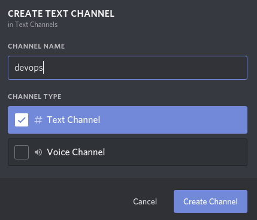
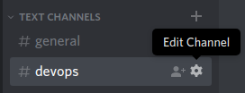

# Discord Notifications

## Overview

The `DISCORD` [notification](../web-notifications.md) allows sending alert messages, alert detail tables, and charts into Discord channels. The integration is based on the [Discord Webhook API](https://discordapp.com/developers/docs/resources/webhook).

## Prerequisites

Install and configure the [Web Driver](README.md#install-web-driver) in order to enable sending chart screenshots into Discord.

## Create Discord Server

Configure a new Discord server, if necessary.

 * Click on the plus icon in the left panel.

     

 * Click on **Create a Server**.

     

 * Specify **Server Name**. Click **Create**.

     

 * Invite new members to the server, click **Done**.

## Create Channel

 * Click on **Create Channel**.

     

 * Specify **Channel name**, check (enable) **Text Channel**, click **Create Channel**.

     

 * Click **Edit channel**.

     

 * Open the **Permissions** tab and review the settings.

     

On the **Invite** tab you can create an invitation link and distribute it to new users.  

To join a server, the user should click **Create new server**, select **Join** and paste the received invitation link.

## Create Webhook

 * Open the **Webhook** tab, click **Create Webhook**, enter a name, select channel.

      

 * Copy the Webhook URL for future reference, click **Save**.

## Create Discord Notification in ATSD

* Open the **Alerts > Web Notifications** page.
* Click on an existing `DISCORD` template, or click the **Create** button below the table and switch the form to `DISCORD` type.
* Enter the `Webhook URL` parameter copied from the Discord client. See parameter descriptions below.

    

* Click **Test**.

   

* Select **Test Portal** to test the screenshot.

      

* Click **Send Screenshot**.

   
   
* If tests are OK, set the status **Enabled** and click **Save**   

## Notification Parameters

|**Parameter**|**Description**|
|---|---|
|Webhook URL|Webhook URL generated on **Webhook** tab in channel settings.|
|Bot Username|Overwrite your bot's user name.|
|Content|Message text to be sent. This field should be left blank so it can be customized in the rule editor.|

## Testing Notification

### Create/import rule

* Create a new rule or import an existing rule for a built-in metric as described below.
* Download the file [rules.xml](resources/rules.xml).
* Open the **Alerts > Rules > Import** page.
* Check (enable) **Auto-enable New Rules**, attach the `rules.xml` file, click **Import**.

### Configure notification

* Open **Alerts > Rules** page and select a rule.
* Open the **Web Notifications** tab.
* Select Discord from the **Endpoint** drop-down.
* Enable the `OPEN`, `REPEAT`, and `CANCEL` triggers.
* Customize the alert message using [placeholders](../placeholders.md) as necessary, for example:

```ls
    OPEN = [${status}] ${rule} for ${entity} ${tags}. ${ruleLink}
    REPEAT = [${status}] ${rule} for ${entity} ${tags}. Duration: ${alert_duration_interval}. ${ruleLink}
    CANCEL = [${status}] ${rule} for ${entity} ${tags}. Duration: ${alert_duration_interval}. ${ruleLink}
```

* Save the rule by clicking on the **Save** button.

    
    
* The rule will create new windows based on incoming data. It may take a few seconds for the first commands to arrive and to trigger the notifications. You can open and refresh the **Alerts > Open Alerts** page to verify that an alert is open for your rule.

## Example

   

   Content of _atsd.jvm.low_memory_atsd_open_20171127_1408043.txt_:

   
