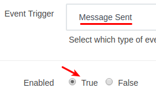
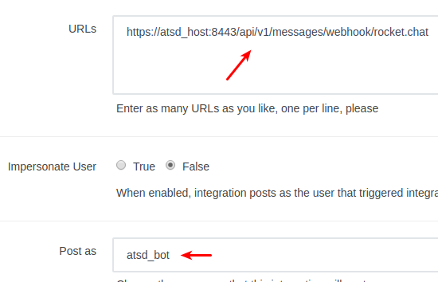

# Rocket.Chat Outgoing Webhook

## Overview

The document describes how to relay messages addressed to a Rocket.Chat Bot into ATSD for subsequent processing. Typical use cases include replying to information requests and executing predefined actions.

The integration relies on the Rocket.Chat Outgoing WebHook [Integration](https://rocket.chat/docs/administrator-guides/integrations/) and on the ATSD [webhook](../../api/data/messages/webhook.md) endpoint to receive HTTP requests from Rocket.Chat server and to convert them into message commands that can be stored and processed by the rule engine.

## Reference

 * [Create Bot](#create-bot)
 * [Outgoing WebHook Integration](#outgoing-webhook-integration)
 * [Test Integration](#test-integration)

## Create Bot

If necessary create a bot user as described [here](rocket.chat.md#create-bot).

## Outgoing WebHook Integration

* Navigate to the **Administration > Integrations**.

* Click on **New Integration**, select **Outgoing WebHook**.

* Fill in the fields:

    * set **Event Trigger** to _Message Sent_
    * check **Enabled**
    * specify **Channel** as bot name, for example, `@atsd_bot`
    * add to **URLs** field webhook url for ATSD instance:
    
        ```elm
        https://atsd_host:8443/api/v1/messages/webhook/rocket.chat
        ```
    * set **Post as** to bot name, for example, `atsd_bot`
    * check **Script Enabled**
    * specify the script, replace `auth` setting with [webhook user](../../api/data/messages/webhook.md#webhook-user-wizard) credentials:
    
        ```javascript
        class Script {
            prepare_outgoing_request({ request }) {
                return {
                   url: request.url + '?message=' + request.data.text + '&exclude=text',
                   method: 'POST',
                   auth: 'user:password',
                   content: request.data
                }
                
            }   
        }
        ```

      
      
      
      
      
      
      

* Click on **Save Changes**.

## Test Integration

### Create/Import Rule

* Create a new rule or import an existing rule as described below.
* Download the file [rules_outgoing_webhook.xml](resources/rules_outgoing_webhook.xml).
* Open the **Alerts > Rules > Import** page.
* Check (enable) **Auto-enable New Rules**, attach the `rules_outgoing_webhook.xml` file, click **Import**.

### Configure Notification

* Open **Alerts > Rules** page and select a rule.
* Open the **Web Notifications** tab.
* Select the notification from the **Endpoint** drop-down.
* Enable the `OPEN`, `REPEAT` triggers.
* Customize the alert message using [placeholders](../placeholders.md) as necessary, for example:

```ls
  User ${tags.alias} /@${tags.user_name} said "${message}"
```

* Save the rule by clicking on the **Save** button.

    

### Verify Webhook Delivery

* Go to the Rocket.Chat and send a direct message to the recently created bot.

    
    
* Open **Settings > Diagnostics > Webhook Requests** page and check that a request from Rocket.Chat server has been received.

    
    
    
    
* If the request is not visible, check **Settings > Diagnostics > Security Incidents** page which will display an error in case the user credentials are mis-configured.

    
    
    

* It may take a few seconds for the commands to arrive and to trigger the notifications. The rule will create new windows based on incoming `message` commands. You can open and refresh the **Alerts > Open Alerts** page to verify that an alert is open for your rule.

    