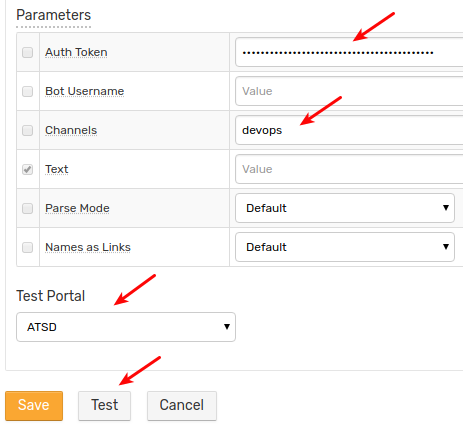
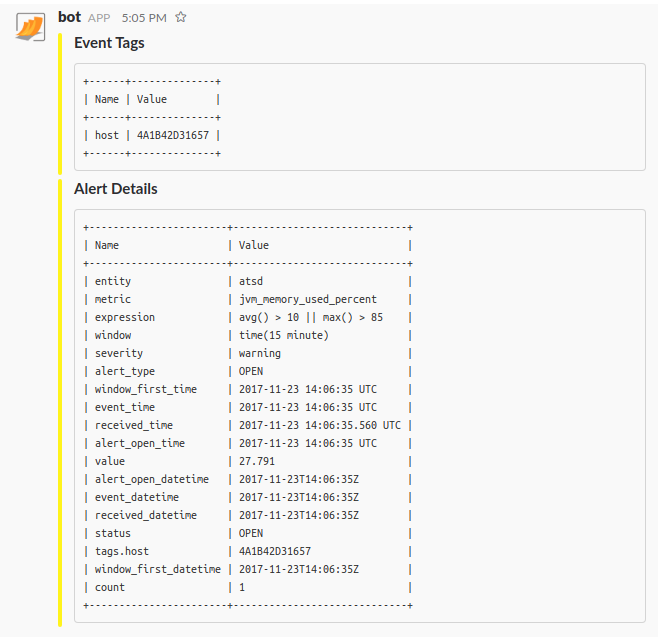

# Slack Notifications

## Overview

`SLACK` [notifications](../web-notifications.md) provide a built-in capability to send alert messages, alert detail tables, and charts into Slack channels. The integration is based on the [Slack Bot API](https://api.slack.com/bot-users).

## Prerequisites

Install and configure the [Web Driver](web-driver.md) in order to send chart screenshots into Slack.

## Create Workspace

If necessary, go to https://slack.com/create and follow the prompts to create a new workspace.

## Create Channel

* Click **Create a channel**

  

* Check (enable) **Private** option to restrict access to the channel.
* Invite users to join the channel in order to receive alerts from the ATSD rule engine

       

* Click **Create Channel**.

## Create ATSD Slack Bot

* Open https://my.slack.com/services/new/bot
* Check Workspace

      

* Specify the username.
* Click **Add bot integration**.

      

* Review the setup instructions.
* Copy the API Token for future reference. Click **Save Integration**.

    

* Invite the bot user to the channel.

    * Go back to https://my.slack.com/
    * Click **Invite others to this private channel**.

    

    * Choose any option for the channel.

    

    * Enter the bot name into the search field.

    

    * Click **Invite**.

## Get Channel Id

 * Click on the target IM/public/private channel to display the channel URL, for example `messages/D822261LK/team/U81D8UY64/`.

     

 * Copy the channel ID, which is specified between the `messages/` and `/team` parts, for example `D822261LK`.

When sending messages to either a public or private channel you can just use the name of the channel instead of its ID, for example `devops` or `general`.

## Create Slack Notification in ATSD

* Open **Alerts > Web Notifications** page.
* Click on an existing `SLACK` template, or click the **Create** button below and select the `SLACK` type.
* Specify the unique `Name` of the notification.

     

* Specify the `Auth Token` and `Channels` parameters. See parameter descriptions below.
* Select **Test Portal** to verify screenshot delivery.

       

* Click **Test**

   

* If test is passed, check **Enable**, then click **Save**.

## Proxy Settings

If the Slack API server is not directly accessible from the ATSD server, open the **Network Settings** and specify [proxy parameters](../web-notifications.md#network-settings).

NGINX API Gateway Path for Slack:

```
  location /api/chat.postMessage {
      proxy_pass https://slack.com/api/chat.postMessage;
  }
  location /api/files.upload {
      proxy_pass https://slack.com/api/files.upload;
  }
```

## Notification Settings

|**Setting**|**Description**|
|---|---|
|Auth Token|Bot API authentication token (see above).|
|Bot Username|Set your bot's user name.|
|Channels|Comma-separated list of channels, private groups, or IM channels to send message to. Each entry can be a name or an encoded ID.|
|Text|Message text to be sent. This field should be left blank so it can be customized in the rule editor.|
|Parse Mode|Change how messages are formatted. See [Basic message formatting](https://api.slack.com/docs/message-formatting) for more information.|
|Names as Links|Find and link channel names and usernames.|

## Reacting to Bot Messages

The bot account can be used both to deliver notifications to end users, as well as to react to messages received by the bot itself. 

/rule-engine/notifications/outgoing-webhook-slack.md

In order to receive incoming messages, configure an [outgoing webhook](outgoing-webhook-slack.md). The [webhook](outgoing-webhook-slack.md) integration requires ATSD server to be reachable from Slack API servers.

## Testing Notification Rule

### Create/import rule

* Create a new rule or import an existing rule for a built-in metric as described below.
* Download the file [rules.xml](resources/rules.xml).
* Open the **Alerts > Rules > Import** page.
* Check (enable) **Auto-enable New Rules**, attach the `rules.xml` file, click **Import**.

### Configure notification

* Open **Alerts > Rules** page and select a rule.
* Open the **Web Notifications** tab.
* Select Slack from the **Endpoint** drop-down.
* Enable the `OPEN`, `REPEAT`, and `CANCEL` triggers.
* Customize the alert message using [placeholders](../placeholders.md) as necessary, for example:

```ls
    OPEN = [${status}] ${rule} for ${entity} ${tags}. ${ruleLink}
    REPEAT = [${status}] ${rule} for ${entity} ${tags}. Duration: ${alert_duration_interval}. ${ruleLink}
    CANCEL = [${status}] ${rule} for ${entity} ${tags}. Duration: ${alert_duration_interval}. ${ruleLink}
```

* Save the rule by clicking on the **Save** button.

  

* The rule will create new windows based on incoming data.
It may take a few seconds for the first commands to arrive and trigger notifications. You can open and refresh the **Alerts > Open Alerts** page to verify that an alert is open for your rule.

## Example




