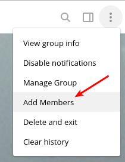
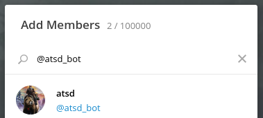
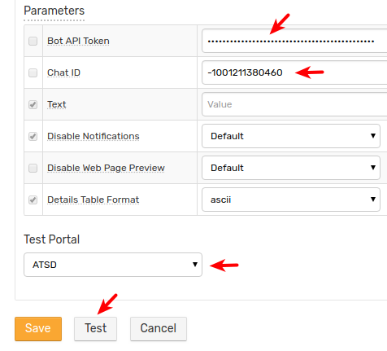
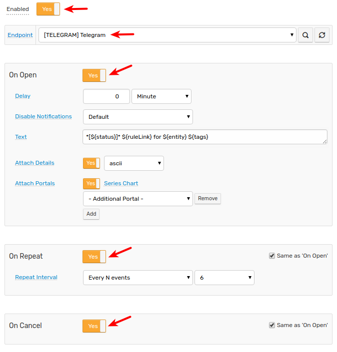

# Telegram Notifications

## Overview

`TELEGRAM` [notifications](../web-notifications.md) provides a built-in capability to send alert messages, alert detail tables, and charts directly to Telegram groups and channels. The integration is based on the [Telegram Bot API](https://core.telegram.org/bots/api).

## Reference

 * [Prerequisites](#prerequisites)
 * [Create Bot](#create-bot)
 * [Add Bot to Group or Channel](#add-bot-to-group-or-channel)
 * [Get Chat Id](#get-chat-id)
 * [Configure Web Notification in ATSD](#configure-web-notification-in-atsd)
 * [Proxy Settings](#proxy-settings)
 * [Notification Settings](#notification-settings)
 * [Reacting to Bot Messages](#reacting-to-bot-messages)
 * [Testing Notification Rule](#testing-notification-rule)
 * [Notifications Examples](#notifications-examples)

## Prerequisites

Install and configure the [Web Driver](web-driver.md) in order to send chart screenshots into Telegram.

## Create Bot

* Search for the `BotFather` user in the Telegram client.
* Start a conversation with the [BotFather](https://telegram.me/botfather) user.

    

* Send the `/newbot` command and follow the prompts to create a bot user and obtain its token. The bot's username must end with `_bot` and cannot contain dash `-` symbol.

```txt
    Use this token to access the HTTP API:
    5555555555:AAHrB1gmYKaSvzsXjhbyDypOJlfu_FgdwrE
```

* Copy the API token for future reference.

## Add Bot to Group or Channel

If necessary, follow the prompts to create a new [group](https://telegram.org/faq#q-how-do-i-create-a-grou) or [channel](https://telegram.org/faq_channels#q-what-39s-a-channel).

### Add Bot to Group

* Click on **Group Settings > Add Members**.

   

* Specify the name of the newly created bot, for example, `@atsd_bot`.

   

* Click on the bot name and click on **Invite**.

To add bot to private/public channel see this [instruction](telegram-add-bot-to-channel.md).

## Get Chat Id

The chat id is required for the Telegram notification to function properly.

There are two options to obtain chat id:

  * [getUpdates API method](#getupdates)
  * [Telegram Web](telegram-get-chat-id.md)

### getUpdates
  
  * Send any message to the channel (for private/public channel) or start conversation with the bot (for direct message chat). No action is required for the group.
  * Go to https://api.telegram.org/botBOT_TOKEN/getUpdates (replace BOT_TOKEN with the actual value).
  * Review the `Chat Object` and copy `id` value.

    

## Configure Web Notification in ATSD

* Open **Alerts > Web Notifications** page.
* Click on an existing `TELEGRAM` template, or click the **Create** button below and select the `TELEGRAM` type.
* Specify the unique `Name` of the notification.

    
    
* Enter the `BOT_TOKEN` value into the `Bot API Token` field.
* Enter the chat id into the `Chat ID` field.
* Select **Test Portal** to verify screenshot delivery.

  

* Click **Test**.    

  

* If the test is passed, check **Enable**, click **Save**.

## Proxy Settings

If the Telegram API server is not directly accessible from the ATSD server, open the **Network Settings** and specify [proxy parameters](../web-notifications.md#network-settings).

NGINX API Gateway Path for Telegram:

```
  location /bot {
      proxy_pass https://api.telegram.org/bot;
  }
```

## Notification Settings

|**Setting**|**Description**|
|---|---|
|Bot API Token|Unique authentication token given to the bot when it is created.|
|Chat ID|Unique identifier for the target chat or the target channel.|
|Text|Message text to be sent. This field should be left blank so it can be customized in the rule editor.|
|Notifications|If enabled, delivers the message with an audio notification.|
|Web Page Preview|If enabled, displays short previews for URLs in the message.|
|Details Table Format|The default format for the alerts detail table.|

> Note parse mode is set to [markdown](https://core.telegram.org/bots/api#markdown-style) by default.

## Reacting to Bot Messages

The bot account can be used both to deliver notifications to end users, as well as to react to messages addressed to the bot itself. 

In order to receive incoming messages, configure an [outgoing webhook](outgoing-webhook-telegram.md) or set **Receive Updates** setting to 'yes' and **Method** to 'Polling'. The [webhook](outgoing-webhook-telegram.md) integration requires ATSD server to be reachable from Telegram API servers.

## Testing Notification Rule

### Create/import rule

* Create a new rule or import an existing rule for a built-in metric as described below.
* Download the file [rules.xml](resources/rules.xml).
* Open the **Alerts > Rules > Import** page.
* Check (enable) **Auto-enable New Rules**, attach the `rules.xml` file, click **Import**.

### Configure notification

* Open **Alerts > Rules** page and select a rule.
* Open the **Web Notifications** tab.
* Select Telegram from the **Endpoint** drop-down.
* Enable the `OPEN`, `REPEAT`, and `CANCEL` triggers.
* Customize the alert message using [placeholders](../placeholders.md) as necessary, for example:

```ls
  *[${status}]* ${ruleLink} for ${entity} ${tags}
```

* Save the rule by clicking on the **Save** button.

  

* The rule will create new windows based on incoming data.
It may take a few seconds for the first commands to arrive and to trigger the notifications. You can open and refresh the **Alerts > Open Alerts** page to verify that an alert is open for your rule.

### Test

* Check channel messages.


Sample alert table file.


## Notifications Examples


