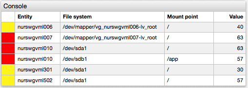

# Overrides

## Overview

The override functionality provides a way to create exception to the default expression logic for particular entities and tags using a tabular structure.

## Creating Overrides

Click on the 'Overrides' tab in the rule editor.

Create one or multiple override tables.

Multiple override tables can be created to trigger different email or web notifications.

## Override Table

The override table contains simple threshold rules that are evaluated from top to bottom. Once the series matches the filter, the processing stops and the rule's expression is applied.

Each threshold rule is programmed in one row.

The rule specifies:

* Numeric field such as last value or average that will be compared with the thresholds.
* Comparator such as `>`, `<`.
* Thresholds for `ERROR` and `WARNING` levels.
* Filter for entity group, entity, and tags to which the rule applies.

## Basic Example

Default Expression

```java
value > 80
```

Override Table


Rule Logic

* Row 1: Since the value cannot be greater than **100%**, this rule effectively disables alerts for disks mounted on '/mnt/u113452'.
* Row 2. Raise `ERROR` alert if disk usage exceeds **50%** for entity 'nurswgvml010'.
* Row 3. Raise `ERROR` alert if disk usage exceeds **60%** for any entity in the 'disk_prod' group. Otherwise, raise `WARNING` alert, if disk usage is greater than **30%** for the same entities.
* Otherwise use the default expression.

> The above rules are equivalent to the expression `value > n`, where `n` is the threshold.

## Alert Severity

When an override rule matches the given entity and tags, the alert is assigned severity level based on which threshold was reached - `ERROR` or `WARNING`.


If the value satisfies both `ERROR` and `WARNING` thresholds, the `ERROR` level takes precedence.



If no override rule matches the window, the alert is assigned the severity level specified on the 'Logging' tab.


## Notifications

If a window changes its state based on an Override rule, the event can trigger a specific notification identified by name. Otherwise, it trigger all notifications except those classified as `Use in Overrides Only`.


