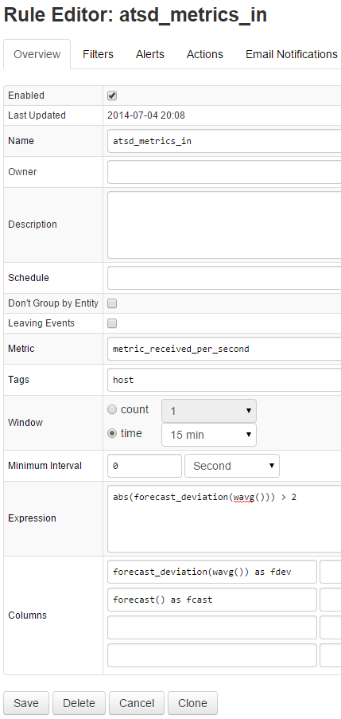
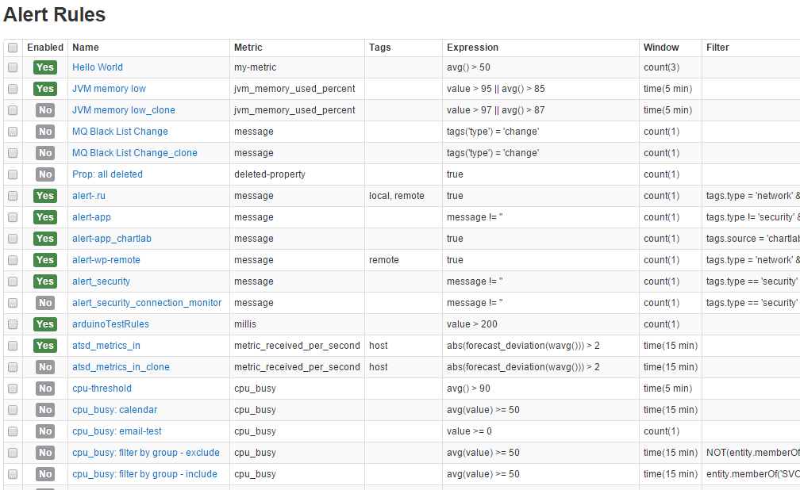

# Rule Engine

Rule Engine enables automation of repetitive tasks based on the analysis of incoming data. Such tasks may include
[sending an
email](email-action.md "Email Action")
or executing a system command to resolve the problem.

In abstract syntax terms, the rule engine evaluates a set of `IF-THEN` statements on incoming data:

```javascript
    IF expression == true THEN action
```

If the expression specified in the rule evaluates to `true`, one or
multiple automation procedures are triggered, for instance:

```javascript
    IF avg() > 75 THEN send_email
```

## In-Memory Processing

The incoming data is processed by the Rule Engine in-memory,
independently of storage, messaging, and replication.


## Processing Stages

### Filtering

The incoming commands are processed by a chain of filters prior to reaching the grouping stage. Such filters include:

* Input Filter. All commands are discarded if the **Admin > Input Settings > Rule Engine** option is disabled.

* Metadata Filter. Commands received for a disabled metric or a disabled entity are discarded.

* [Rule Filters](filters.md) that are specific to each rule.

### Grouping

Once the command passes through the chain of filters, it is added to one or multiple matching
windows grouped by metric, entity, and optional command tags. Each window maintains its own array of data samples.

> If 'Disable Entity Grouping' option is checked, the window is grouped by metric and optional command tags.

### Evaluation

The windows are continuously updated as new commands are added and old commands are
removed to maintain window size at constant interval length or command count.

When the window is updated, the rule engine evaluates the expression that returns a boolean value: `TRUE` or `FALSE`.

```javascript
    percentile(95) > 80 && stdev() < 10
```

The window changes its status once the expression returns a value different from the previous evaluation.

It is recommended to place conditions that do not require command values into filters. This will discard non-matched commands without creating an in-memory window.

## Window Status

Windows are stateful. Once the expression for the given window evaluates
to `TRUE`, it is maintained in memory with status `OPEN`. On subsequent `TRUE`
evaluations for the same window, the status is changed to `REPEAT`. When the expression
finally changes to `FALSE`, the status is set to `CANCEL`. Window state is
not stored in the database and windows are recreated with new data only if
ATSD is restarted. Maintaining the status in memory while the condition
is `TRUE` enables deduplication and supports flexible action programming.
For example, some actions can be configured to execute only on `OPEN`
status, while others can run on every n-th `REPEAT` occurrence.

## Window Types

Windows can be count-based or time-based. A count-based window maintains
an ordered array of elements. Once the array reaches the specified
length, new elements replace the oldest elements. A time-based window
includes all elements that are timestamped within the time interval which
ends with the current time and start with current time minus a specified
window interval. For example, a 5-minute time-based window includes all
elements that arrived over the last 5 minutes. As the current time
increases, the start time is incremented accordingly as if the window is
sliding along the timeline.

## Developing Rules

Rules are typically developed by system engineers with specialized
knowledge of the application domain. Rules are often
created post-mortem to prevent newly discovered problems from
re-occurring. Rules usually cover a small subset of key metrics to minimize the maintenance effort.

In order to minimize the number of rules with manual thresholds, the
rule engine provides the following capabilities:

-   Automated thresholding using the `forecast()` function
-   Override tables with support for wildcards

##   Thresholds

Thresholds specified in expressions can be set manually or using the
`forecast` function. For example, the following rule fires if the observed
moving average deviates from expected forecast value by more than 25
percent in any direction.

```javascript
    abs(avg() - forecast()) > 25
```

If the confidence interval (25% in example above) varies substantially
for different entities, the `forecast_deviation` function can be used to
compare actual and expected values in terms of standard deviation
specific for each time series:

```javascript
    abs(forecast_deviation(avg())) > 2
```

Manually specified thresholds can be made more specific for an entity or
an entity group by adding an exception to the Thresholds table. The
exception can be also added by clicking on the Exception link in the alert
console or email alert. In the image below, an alert will be issued when
the `avg` of the `nur-entities-name` entity name is greater than 90.


## Sliding Windows

ATSD Rule Engine uses two types of windows when ingesting statistics:
count and time. These windows are used to calculate aggregations and
only the statistics present in these windows are analyzed by the Rule
Engine.

### Time Based Windows – 3 Second Window Example

Time based windows analyze statistics that occurred in the last N
seconds. The time windows doesn't limit how many samples can be held in
the list; however it automatically removes data samples that move
outside of the time interval as time passes.


### Count Based Windows – 3 Event Window Example

Count based windows analyze the last N events (data points) regardless
of when they occurred. The count window holds up to N data samples, for which
aggregate calculation (such as average) can be applied. When the
count window becomes full, the oldest (last) data sample is removed to
free up space for a new sample.


## Alert Severity

Severity of alerts raised by the rule engine is specified on the Alerts tab in Rule Editor.

If an alert is raised by an expression defined in the Threshold table, its severity overrides
the default severity configured in the Alert tab.

To inherit alert severity from the `message` severity, set Severity on the Alerts tab to 'unknown'.

## Rule Editor

The rules can be created and maintained using the built-in [Rule Editor](editor.md).

## Rule Configuration Example

In this example, a forecast is generated for the
`metric_received_per_second` metric using built-in Forecasts. Based
on the forecast, a rule is then created with the following expression:

```
abs(forecast_deviation(wavg())) > 2
```
This rule will raise an alert if the absolute forecast deviates from the
15 minute weighted average by more than 2 standard deviations.






Alert exceptions can be created directly in the alerts table.


Alert exceptions can be also created using the 'Exception' link provided in email notifications.

## Reference

* [Expressions](expressions.md)
* [Filters](filters.md)
* [Functions](functions.md)
* [Placeholders](placeholders.md)
