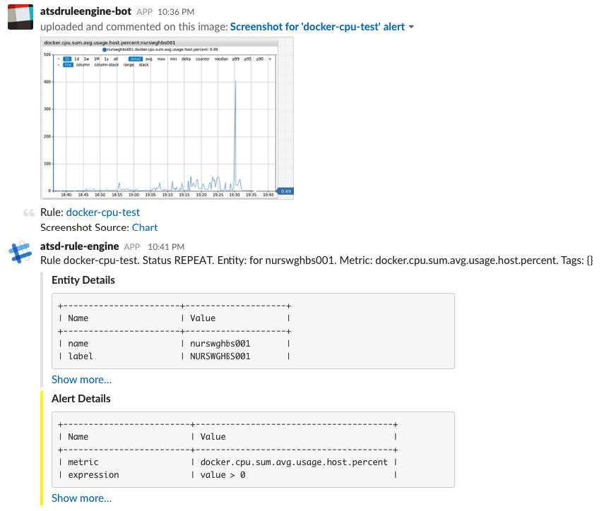
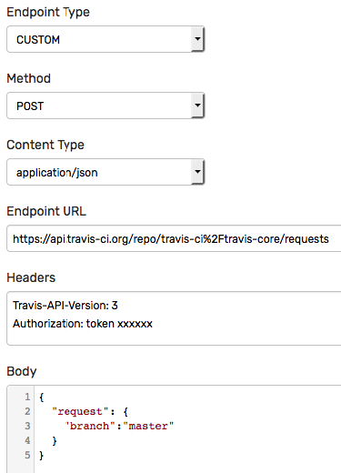
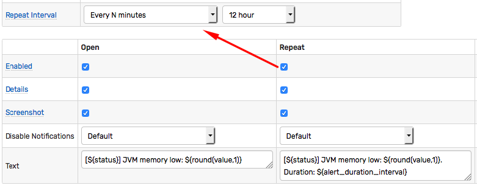

# Web Notifications

## Overview

Web notifications allow the rule engine to intergate with external HTTP services by means of sending custom HTTP requests on window status events.

They can be used to automate tasks such as sending an alert into a Slack channel, updating a bug tracker, starting a CI build, publishing to an AWS SNS topic, or controlling IoT devices.

Example: **Slack Alert**



## Notification Types

The rule engine supports various types of web notification types some of which encapsulate the integration details of the remote web services while [others](notifications/custom.md) provide maximum flexibility.

### Collaboration Services

The built-in notification types for chat and collaboration services deliver alert messages and contextual charts to a channel or group.

| Type | Send Message | Send Chart | Integration Model | Hosting Model |
| --- | --- | --- | --- | --- |
| [SLACK](notifications/slack.md) | Yes | Yes | [Slack Bot API](https://api.slack.com/bot-users) | Cloud |
| [TELEGRAM](notifications/telegram.md) | Yes | Yes | [Telegram Bot API](https://core.telegram.org/bots/api) | Cloud |
| [DISCORD](notifications/discord.md) | Yes | Yes | [Discord API](https://discordapp.com/developers/docs/intro) | Cloud |
| [HIPCHAT](notifications/hipchat.md) | Yes | Yes | [HipChat Data Center API](https://www.hipchat.com/docs/apiv2/) | Self-hosted |

### Integration Services

| Type | Customizable Fields | Description |
| --- | --- | --- |
| [WEBHOOK](notifications/webhook.md) | None | Send pre-defined fields as a JSON document or form to an HTTP endpoint. |
| [CUSTOM](notifications/custom.md) | All | Send any JSON content or form parameters to an HTTP endpoint. |
| [AWS SNS](notifications/aws-sns.md) | Message and Subject | Publish a message to an [AWS SNS](http://docs.aws.amazon.com/sns/latest/api/API_Publish.html) topic. |

## Window Status

The notifications are triggered on window status events.

A [window](window) is an in-memory object created by the rule engine for each unique combination of metric, entity, and tags extracted from incoming commands.

As the new data is received and old data is removed from the window, the rule engine re-evaluates the condition which can cause the status of the current window to change, triggering a notification.

### Initial Status

New windows are created based on incoming data and no historical data is loaded from the database.

The window for the given metric/entity/tags is created only when the first command for this series is received by the rule engine.

The new windows are assigned initial status of `CANCEL` which is then updated based on results of the condition (`true` or `false`).

### Window Lifecycle

All windows for the current rule are deleted from memory if the rule is deleted or modified and saved in the editor.

### Triggers

The web notification can be triggered whenever the window changes its status as well as at scheduled intervals when the status is `REPEAT`.

### Status Events

| Previous Status | New Status | Previous Condition Value | New Condition Value | Trigger Supported |
| --- | --- | --- | --- | --- |
| `CANCEL` | `OPEN` | `false` | `true` | Yes |
| `OPEN`  | `REPEAT` | `true` | `true` | Yes |
| `REPEAT` | `REPEAT` | `true` | `true` | Yes |
| `OPEN` | `CANCEL` | `true` | `false` | Yes |
| `REPEAT` | `CANCEL` | `true` | `false` | Yes |
| `CANCEL` | `CANCEL` | `false` | `false` | No |

### `OPEN` Status

The `OPEN` status is assigned to the window when the condition changes value from `false` to `true`.

### `REPEAT` State

The `REPEAT` status is assigned to an `OPEN` window when the condition returns `true` based on the second received command.

When the window is in `REPEAT` status, the notification can be sent with the frequency specified in the rule editor.

### `CANCEL` State

`CANCEL` is the initial status assigned to new windows. It is also assigned to the window when the the condition changes from `true` to `false` or when the window is deleted on rule modification.

Triggering a repeat notification in `CANCEL` status is not supported. Such behavior can be emulated by creating a separate rule with a negated expression which returns `true` instead of `false` for the same condition.


## Payload

The payload is determined by the notification type. Typically the payload is text content in the form of JSON document or form fields. Some built-in notification types support sending chart screenshots in addition to text content.

* Example: **Travis CI Build**



## Creating Notification

Open **Alerts > Web Notifications** page and click 'Create'.

Select the notification type in the drop-down.

Set the status to 'Enabled'.

Enter a name by which the notification will be listed on the 'Web Notifications' tab in the rule editor.

> If the notification type supports sending charts as images, configure the web driver as described [here](notifications/web-driver.md).

A notification can be re-used by multiple rules.

Each notification has fixed settings that can not be customized in the rule editor, and user-defined settings which can be changed in the rule editor.

The customizable settings are marked with an enabled checkbox.


For example, an API Bot identifier or authentication token is a fixed setting, whereas the text message is customizable and is assembled dynamically based on the window status and placeholder values.

The administrator can specify which settings are fixed and which can be modified in the rule editor.

## Testing Notifications

Fill out the required fields for the given notification type.

Click 'Test' to verify the delivery.

If the notification type supports sending charts, select one of the portals from the 'Test Portal' drop-down and click 'Send Screenshot'.

The notification request is successful if the endpoint returns status `200` (OK).


## Using Notifications in Rules

Open **Alerts > Rules** page.

Select a rule by name, open the 'Web Notifications' tab in the rule editor.

Choose one of the notifications from the 'Endpoint' drop-down.

Configure when the notification are triggered by enabling triggers for different status change events: on `Open`, `Repeat`, and on `Cancel`.


If multiple notifications are triggered for the same event, the order in which the notifications are delivered is not defined.

### Jitter Control

The `Delay on 'OPEN'` setting allows deferring the trigger fired for the `OPEN` status. This is accomplished by deferring an `OPEN` notification and cancelling it in case the window status reverts to `CANCEL` within the specified grace interval.

This setting can be used to reduce alert jitter when the window alternates between the `OPEN` and `CANCEL` status.

### Repeat Alerts

If the window remains in the `REPEAT` status, it can be configured to repetitively trigger the notification with the following frequency:

| Frequency | Description |
| --- | --- |
| All | The notification is triggered each time the window is updated and remains in the `REPEAT` status (expression continues to be `true`). |
| Every N events | The notification is triggered every Nth occurrence of the new data being added to the window. |
| Every N minutes | The notification is triggered when the window is updated but no more frequently than the specified interval. |



### Message Text

The editor displays a Text field where the message can customized with [placeholders](placeholder.md).

Sample alert message with placeholders:

```ls
[${status}] for rule ${rule}. Entity: ${entity}. Tags: ${tags}
```

### Attachments

Sending attachments such as chart screenshots or alert detail tables can be enabled only for specific notification types.

### Multiple Endpoints

In order to update multiple endpoints for the same status change event, create additional notifications, identified by unique name, by adding new configuration sections below.

## Stopping Messages

If the notification status is set to disabled, requests initiated by the rule engine through the notification are ignored.

To temporarily disable sending all messages sent through the given notification, set its status to 'Disabled'.

## Delivery Control

Notification results are recorded in the database as messages and can be viewed under the 'notification' type on the Message Search page.

## Error Handling

The notification request is delivered successfully if the endpoint returns `200` (OK) status code.

No retry is attempted in case of error. In case the notification fails, the rule engine writes an `ERROR` event in the `atsd.log`.

If the error occurs during the chart screenshot preparation, the rule engine falls back to sending a text message containing the chart link and the error message, if available.
