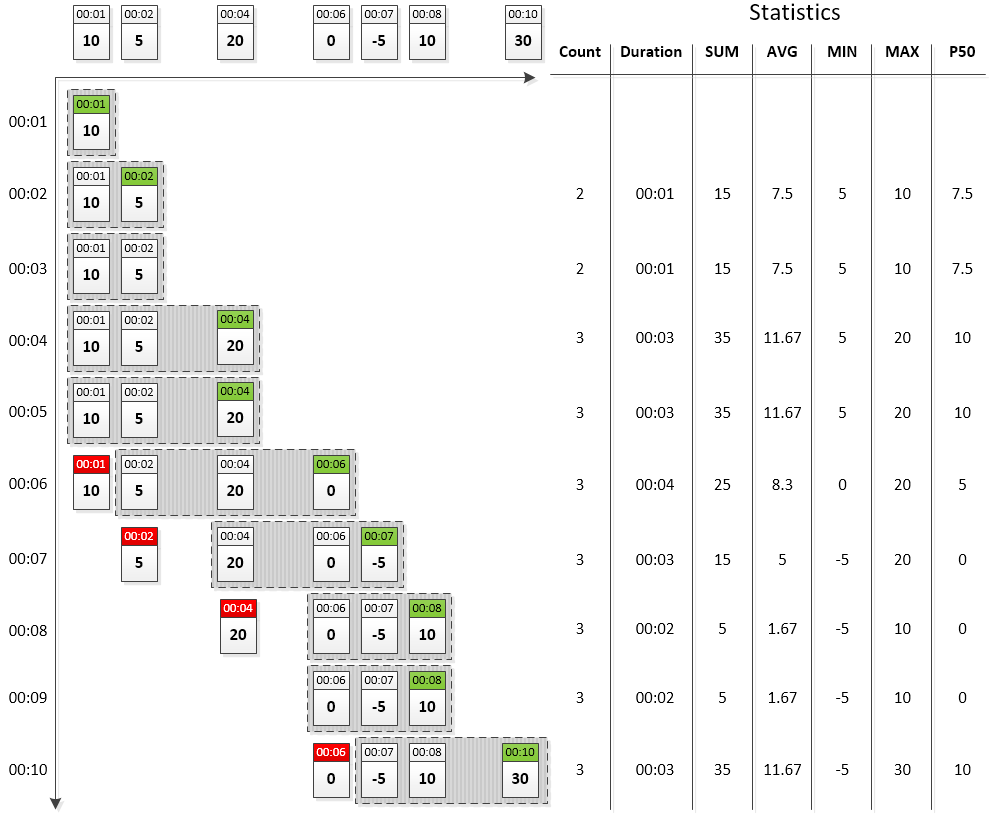

# Window

## Overview

A window is an in-memory structure created by the rule engine for each unique combination of metric, entity, and grouping tags extracted from incoming commands.

Windows are displayed on the **Alerts > Rule Windows** page.

## Window Length

### Count Based Windows

Count-based windows accumulate up to the specified number of samples. The samples are sorted in **order of arrival**, with the most recently received sample placed at the end of the array. When the window is full, the first (oldest by arrival time) sample is removed from the window to free up space at the end of the array for an incoming sample.

### Time Based Windows

Time-based windows store samples that were recorded within the specified interval of time, ending with the current time. The time-based window doesn't limit how many samples are held by the window. Its time range is continuously updated. Old records are automatically removed from the window once they're outside of the time range. Time windows are often called _sliding_ windows.

## Window Status

The response actions are triggered on window status events.

As the new data is received and old data is removed from the window, the rule engine re-evaluates the condition which can cause the status of the current window to change, triggering response actions.

### Initial Status

New windows are created based on incoming data and no historical data is loaded from the database.

The window for the given metric/entity/tags is created when the first command for this series is received by the rule engine.

The new windows are assigned initial status of `CANCEL` which is then updated based on the results of the boolean (`true` or `false`) condition.

### Lifecycle

All windows for the current rule are deleted from memory if the rule is deleted as well as when it's modified and saved in the editor.

### Triggers

The response actions can be triggered whenever the window changes its status as well as at scheduled intervals when the status is `REPEAT`. The triggers for each action type are configured and executed separately.

### Status Events

| Previous State | New Status | Previous Condition Value | New Condition Value | Trigger Supported |
| --- | --- | --- | --- | --- |
| `CANCEL` | `OPEN` | `false` | `true` | Yes |
| `OPEN`  | `REPEAT` | `true` | `true` | Yes |
| `REPEAT` | `REPEAT` | `true` | `true` | Yes |
| `OPEN` | `CANCEL` | `true` | `false` | Yes |
| `REPEAT` | `CANCEL` | `true` | `false` | Yes |
| `CANCEL` | `CANCEL` | `false` | `false` | No |

### `OPEN` Status

The `OPEN` status is assigned to the window when the condition changes value from `false` to `true`.

### `REPEAT` Status

The `REPEAT` status is assigned to an `OPEN` window when the condition returns `true` based on the second received command.

When the window is in `REPEAT` status, the actions can be executed with the frequency specified in the rule editor.

### `CANCEL` Status

`CANCEL` is the initial status assigned to new windows. It is also assigned to the window when the condition changes from `true` to `false` or when the window is destroyed on rule modification.

Windows in `CANCEL` status do not trigger repeat actions. Such behavior can be emulated by creating a rule with a negated expression which returns `true` instead of `false` for the same condition.
